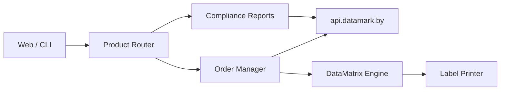

<div align="center">

# UrukhaiMark

**Маркировка товаров из Беларуси — от заказа кодов до экспорта в РФ**

[](docs/ROADMAP.md)
[](docs/README.md)
[](LICENSE)
[](docs/datamatrix-spec.md)

*ГИС «Электронный знак» · datamark.by · GS1 DataMatrix · «Честный знак» РФ*

</div>

---

## О проекте

**UrukhaiMark** — система для белорусских производителей и экспортёров, которая автоматизирует полный цикл маркировки:

| Этап | Что делает |
|------|------------|
| **Заказ кодов** | API [datamark.by](https://datamark.by/) — ГИС «Электронный знак» |
| **Генерация** | GS1 DataMatrix (FNC1, GS-разделители) — не QR |
| **Печать** | Этикетки на термопринтер (ZPL) или PDF |
| **Отчётность** | Маркировка, производство, отгрузки в РФ |

> В разговорной речи коды называют «QR Честного знака», но **стандарт — GS1 DataMatrix** (ECC 200). Форматы несовместимы.

## Целевые товарные группы

```
┌─────────────────────┬──────────────┬─────────────────────────────┐
│ Товар               │ Приоритет    │ Сценарий                    │
├─────────────────────┼──────────────┼─────────────────────────────┤
│ Освежители / аэрозоли│ P0 · MVP    │ Экспорт в РФ (label_type=7) │
│ Пиво                │ P2           │ Продажа в РБ — УКЗ          │
│ Пиво                │ P3           │ Экспорт в РФ — через партнёра│
│ Газовые баллоны     │ P4           │ Классификация по ТН ВЭД     │
└─────────────────────┴──────────────┴─────────────────────────────┘
```

## Архитектура



Подробнее: [архитектура](docs/architecture.md) · [матрица товаров](docs/product-matrix.md)

## Быстрый старт

1. [Глоссарий](docs/glossary.md) — КМ, СИ, УКЗ, DataMatrix
2. [Матрица товаров](docs/product-matrix.md) — режим маркировки для вашего SKU
3. [Регистрация](docs/processes/registration.md) — GS1, ePASS, «Электронный знак»
4. [Экспорт освежителей в РФ](docs/processes/export-rf-cosmetics.md)
5. [Дорожная карта](docs/ROADMAP.md) — фазы и критерии готовности

## Документация

Полный индекс — в [`docs/README.md`](docs/README.md).

| Раздел | Ключевые документы |
|--------|-------------------|
| **Планирование** | [ROADMAP](docs/ROADMAP.md) · [Мастер-план](docs/plan.md) · [Открытые вопросы](docs/open-questions.md) |
| **Предметная область** | [Глоссарий](docs/glossary.md) · [Нормативная база](docs/regulatory.md) · [Матрица SKU](docs/product-matrix.md) |
| **Процессы** | [Регистрация](docs/processes/registration.md) · [Экспорт РФ](docs/processes/export-rf-cosmetics.md) · [Пиво РБ](docs/processes/domestic-rb-beer.md) |
| **Техника** | [DataMatrix](docs/datamatrix-spec.md) · [API Cookbook](docs/api/cookbook.md) · [API Reference](docs/api/reference.md) · [Troubleshooting](docs/troubleshooting.md) |
| **Разработка** | [Архитектура](docs/architecture.md) · [Модель данных](docs/plans/data-model.md) · [План тестирования](docs/plans/testing-plan.md) |

## Дорожная карта

| Фаза | Срок | Цель |
|------|------|------|
| **0** | 1–2 нед. | Регистрация, sandbox API, классификация SKU |
| **1** | 3–4 нед. | MVP: освежители → экспорт РФ (end-to-end) |
| **2** | 2–3 нед. | Продакшен, мониторинг, печать |
| **3** | TBD | Пиво (УКЗ), расширение товарных групп |

Детали: [`docs/ROADMAP.md`](docs/ROADMAP.md)

## Статус

**Greenfield** — документация и планирование завершены, разработка кода не начата.

## Полезные ссылки

| Ресурс | URL |
|--------|-----|
| Оператор маркировки РБ | [datamark.by](https://datamark.by/) |
| База знаний Белбланкавыд | [kb.belblank.by](https://kb.belblank.by/) |
| «Честный знак» РФ | [markirovka.ru](https://markirovka.ru/) |
| True API (ЦРПТ) | [docs.crpt.ru](https://docs.crpt.ru/gismt/True_API/) |
| GS1 Беларусь | [gs1by.by](https://gs1by.by/) |

## Лицензия

Проект распространяется под лицензией [MIT](LICENSE).

---

<div align="center">

*Сделано для автоматизации маркировки белорусского экспорта*

</div>
