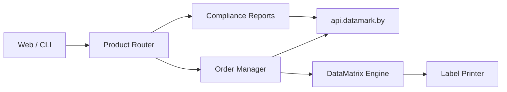

<div align="center">

# UrukhaiMark

**Маркировка товаров из Беларуси — от заказа кодов до экспорта в РФ**

[](docs/planning/roadmap.md)
[](docs/README.md)
[](LICENSE)
[](docs/reference/datamatrix-spec.md)

*ГИС «Электронный знак» · datamark.by · GS1 DataMatrix · «Честный знак» РФ*

</div>

---

## О проекте

**UrukhaiMark** — система для белорусских производителей и экспортёров, которая автоматизирует полный цикл маркировки:

| Этап | Что делает |
|------|------------|
| **Заказ кодов** | API [datamark.by](https://datamark.by/) — ГИС «Электронный знак» |
| **Генерация** | GS1 DataMatrix (FNC1, GS-разделители) — не QR |
| **Печать** | Этикетки на термопринтер (ZPL) или PDF |
| **Отчётность** | Маркировка, производство, отгрузки в РФ |

> В разговорной речи коды называют «QR Честного знака», но **стандарт — GS1 DataMatrix** (ECC 200). Форматы несовместимы.

## Целевые товарные группы

```
┌─────────────────────┬──────────────┬─────────────────────────────┐
│ Товар               │ Приоритет    │ Сценарий                    │
├─────────────────────┼──────────────┼─────────────────────────────┤
│ Освежители / аэрозоли│ P0 · MVP    │ Экспорт в РФ (label_type=7) │
│ Пиво                │ P2           │ Продажа в РБ — УКЗ          │
│ Пиво                │ P3           │ Экспорт в РФ — через партнёра│
│ Газовые баллоны     │ P4           │ Классификация по ТН ВЭД     │
└─────────────────────┴──────────────┴─────────────────────────────┘
```

## Архитектура


```mermaid
flowchart LR
    UI[Web / CLI] --> Router[Product Router]
    Router --> Orders[Order Manager]
    Router --> Reports[Compliance Reports]
    Orders --> EZ[api.datamark.by]
    Orders --> DM[DataMatrix Engine]
    DM --> Print[Label Printer]
    Reports --> EZ
```

Подробнее: [архитектура](docs/explanation/architecture.md) · [матрица товаров](docs/reference/product-matrix.md)

## Быстрый старт

1. [Глоссарий](docs/reference/glossary.md) — КМ, СИ, УКЗ, DataMatrix
2. [Матрица товаров](docs/reference/product-matrix.md) — режим маркировки для SKU
3. [Регистрация](docs/tutorials/registration.md) — GS1, ePASS, «Электронный знак»
4. [Экспорт освежителей в РФ](docs/how-to/export-rf-cosmetics.md)
5. [Дорожная карта](docs/planning/roadmap.md) — capability slices и gates

## Документация

Полный индекс — в [`docs/README.md`](docs/README.md). Документация организована по [Diátaxis](https://diataxis.fr/). Как вносить изменения — [`CONTRIBUTING.md`](CONTRIBUTING.md).

| Раздел | Ключевые документы |
|--------|-------------------|
| **Планирование** | [Roadmap](docs/planning/roadmap.md) · [Validation](docs/planning/architecture-validation.md) · [Открытые вопросы](docs/planning/open-questions.md) |
| **Предметная область** | [Глоссарий](docs/reference/glossary.md) · [Нормативная база](docs/reference/regulatory.md) · [Матрица SKU](docs/reference/product-matrix.md) |
| **Процессы** | [Регистрация](docs/tutorials/registration.md) · [Экспорт РФ](docs/how-to/export-rf-cosmetics.md) · [Пиво РБ](docs/how-to/domestic-rb-beer.md) |
| **Нанесение кодов** | [Промышленное inline](docs/explanation/technology/industrial-marking.md) · [Упаковка](docs/explanation/technology/packaging-carriers.md) · [Оборудование](docs/explanation/technology/equipment.md) · [Качество](docs/how-to/quality-control.md) |
| **Техника** | [DataMatrix](docs/reference/datamatrix-spec.md) · [API Cookbook](docs/reference/api/cookbook.md) · [API Reference](docs/reference/api/reference.md) · [Troubleshooting](docs/how-to/troubleshooting.md) |
| **Разработка** | [Архитектура](docs/explanation/architecture.md) · [Модель данных](docs/reference/data-model.md) · [ADR](docs/decisions/README.md) |

## Дорожная карта

| Slice | Цель |
|-------|------|
| **0** | Architecture validation, доступы и SKU |
| **1** | MVP: cosmetics → РФ, API/compliance |
| **2** | Надёжная печать и production hardening |
| **3** | Одна автоматизированная линия |
| **4–5** | Короба, палеты и склад |
| **6** | Multi-line edge |
| **7** | ERP, ЭДО и дополнительные providers |

Детали: [`docs/planning/roadmap.md`](docs/planning/roadmap.md)

## Статус

**Greenfield** — документация и планирование завершены, разработка кода не начата.

## Полезные ссылки

| Ресурс | URL |
|--------|-----|
| Оператор маркировки РБ | [datamark.by](https://datamark.by/) |
| База знаний Белбланкавыд | [kb.belblank.by](https://kb.belblank.by/) |
| «Честный знак» РФ | [markirovka.ru](https://markirovka.ru/) |
| True API (ЦРПТ) | [docs.crpt.ru](https://docs.crpt.ru/gismt/True_API/) |
| GS1 Беларусь | [gs1by.by](https://gs1by.by/) |

## Лицензия

Проект распространяется под лицензией [CC BY 4.0](LICENSE) (Creative Commons «С указанием авторства»).

Материалы можно свободно использовать, изменять и распространять — в том числе в коммерческих целях — при **обязательном указании авторства**:

```
UrukhaiMark © 2026 Orange-hanter
https://github.com/Orange-hanter/UrukhaiMark
Лицензия: CC BY 4.0
```

---

<div align="center">

*Сделано для автоматизации маркировки белорусского экспорта*

</div>
