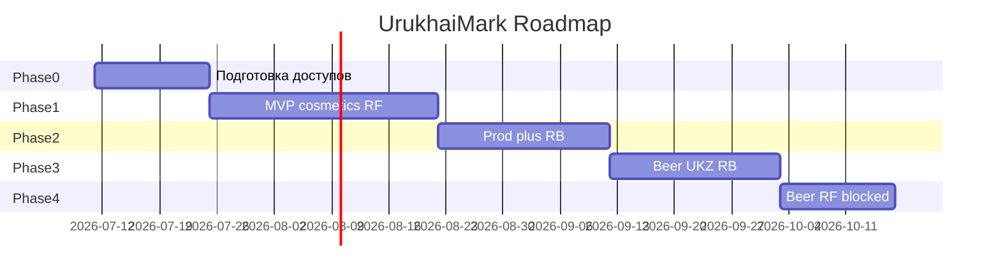

# Дорожная карта UrukhaiMark

## Цель продукта

Автоматизировать полный цикл маркировки для белорусского производителя/экспортёра:

1. Заказ кодов маркировки (API datamark.by)
2. Генерация GS1 DataMatrix и печать этикеток
3. Отчёты о маркировке и производстве
4. Отгрузки в РФ с передачей в «Честный знак»

## Приоритеты по товарам

| Приоритет | Товар | Сценарий | Готовность API datamark |
|-----------|-------|----------|-------------------------|
| P0 | Освежители / аэрозоли | Экспорт в РФ | Готово (`cosmetics`, label_type=7) |
| P1 | Освежители | Продажа в РБ | Уточнить режим |
| P2 | Пиво | Продажа в РБ | УКЗ (отдельный API) |
| P3 | Пиво | Экспорт в РФ | Блокер: коды через контрагента РФ |
| P4 | Газовые баллоны | TBD | Классификация по ТН ВЭД |

---

## Фаза 0 — Подготовка (1–2 недели)

**Цель:** все внешние доступы и классификация SKU до написания кода.

### Задачи

- [ ] **0.1** Собрать ТН ВЭД и ОКПД2 по каждому SKU (пиво, освежители, баллоны)
- [ ] **0.2** Регистрация в GS1 Бел → GCP + GLN
- [ ] **0.3** Описание товаров в ePASS → GTIN (14 цифр)
- [ ] **0.4** Регистрация в ГИС «Электронный знак» + товарные группы (`cosmetics`, `ukz`)
- [ ] **0.5** Заявка на sandbox API → credentials (support@datamark.by)
- [ ] **0.6** Контрагент в РФ зарегистрирован в «Честном знаке»
- [ ] **0.7** Уточнить у support@datamark.by обязательность маркировки освежителей в РБ
- [ ] **0.8** Выбрать модель печати (ZPL термопринтер / PDF)

### Критерии выхода

- Есть sandbox token и хотя бы один тестовый GTIN
- Матрица SKU заполнена в [product-matrix.md](product-matrix.md)
- Контрагент РФ подтвердил готовность к приёмке

---

## Фаза 1 — MVP: освежители → экспорт РФ (3–4 недели)

**Цель:** end-to-end pipeline для `cosmetics` + `label_type=7` в sandbox.

### Milestone 1.1 — Инфраструктура

- [ ] Репозиторий: структура `src/`, конфиг sandbox/prod
- [ ] Модуль auth: `/auth`, refresh token (~20 мин TTL)
- [ ] PostgreSQL: orders, codes, reports, shipments
- [ ] Логирование API-запросов (без паролей)

### Milestone 1.2 — Заказ кодов

- [ ] `POST /v3/orders/add` (label_type=7, gtin, count)
- [ ] Polling `GET /v3/orders/list/{id}` до status=30
- [ ] `POST /v3/orders/downloads` — сохранение КМ **с GS** (`\u001d`)

### Milestone 1.3 — DataMatrix и печать

- [ ] Encoder: KM → GS1 DataMatrix (FNC1, ECC 200)
- [ ] Валидация структуры AI 01/21/91/92
- [ ] Шаблон этикетки (ZPL или PDF)
- [ ] Опционально: `POST /v2/labels` — проверка в API

### Milestone 1.4 — Compliance chain

- [ ] Отчёт о маркировке → status 47
- [ ] `POST /v3/reports/addManufacture` (даты производства/годности)
- [ ] `POST /v3/ships/add` (country=643, сертификаты, ≤30k КМ)

### Milestone 1.5 — UI / CLI MVP

- [ ] Заказ партии кодов по GTIN
- [ ] Предпросмотр DataMatrix
- [ ] Печать этикеток
- [ ] Отправка отчётов и отгрузки

### Критерии выхода

- Успешный прогон в **sandbox**: order → print → mark → manufacture → ship
- КМ не теряют GS при round-trip через БД
- DataMatrix читается приложением «Электронный знак»

---

## Фаза 2 — Продажа в РБ + production hardening (2–3 недели)

**Цель:** промышленный контур, мониторинг, освежители в РБ (если требуется).

- [ ] Переключение prod API + secrets management
- [ ] Запас кодов ≥ 7 дней (алерт при низком остатке)
- [ ] Retry/idempotency для orders и reports
- [ ] Режим маркировки освежителей в РБ (label_type 20 или УКЗ)
- [ ] Интegrация с учётной системой (импорт GTIN/партий) — по необходимости
- [ ] Аудит: связь order_id → km → print_job → report_id → ship_id

### Критерии выхода

- Стабильная работа в prod для cosmetics/RF
- Документированный runbook для оператора

---

## Фаза 3 — Пиво: УКЗ для РБ (2–3 недели)

**Цель:** заказ и учёт унифицированных контрольных знаков.

- [ ] Изучить [API УКЗ](https://datamark.by/wp-content/uploads/gis-markirovki-web-servis-mezhsistemnogo-vzaimodejstviya-speczifikacziya-api-markirovka-tovarov-unificirovannymi-kontrolnymi-znakami.pdf)
- [ ] Модуль `beer-ukz`: заказ знаков, учёт серий/номеров
- [ ] UI: выбор формата знака (17×18 / 17×34)
- [ ] Передача сведений о маркировке до оборота
- [ ] Документация: [processes/domestic-rb-beer.md](processes/domestic-rb-beer.md)

### Критерии выхода

- Заказ УКЗ и регистрация маркировки пива в РБ через приложение

---

## Фаза 4 — Пиво → РФ (зависит от регулятора)

**Блокер:** datamark.by не выдаёт label_type=7 для пива.

**Варианты:**

| Вариант | Действие | Когда |
|---------|----------|-------|
| A | Коды от контрагента РФ (ручной/API CRPT) | Сейчас |
| B | Интеграция True API CRPT от имени партнёра | При наличии юр. схемы |
| C | Ожидание решения ЕЭК + поддержка datamark | Будущее |

- [ ] Спроектировать модуль `beer-rf` (импорт кодов от партнёра)
- [ ] Отслеживать новости Belblank / ЕЭК
- [ ] При появлении API — добавить label_type=7 для пива

---

## Фаза 5 — Качество и расширение

- [ ] Golden tests: эталонные KM → эталонные DataMatrix PNG
- [ ] E2E тесты на sandbox
- [ ] Агрегация (SSCC, label_type=6) — при необходимости
- [ ] Мульти-GTIN групповые заказы (`/v3/orders/addGroupOrders`)
- [ ] Приёмка из РФ (import flow, с 01.07.2025)
- [ ] Газовые баллоны — после классификации

---

## Диаграмма фаз

---

## Метрики успеха

| Метрика | Целевое значение |
|---------|------------------|
| Время order → printable KM | < 5 мин (API) |
| Потеря GS-разделителей | 0% |
| DataMatrix grade | ≥ 1.5 (C) |
| Успешная отгрузка в РФ | 100% в sandbox |
| Простой из-за истечения token | 0 (auto-refresh) |

---

## Риски

| Риск | Вероятность | Митигация |
|------|-------------|-----------|
| Пиво в РФ без API datamark | Высокая | Партнёр + CRPT |
| Освежители в РБ не требуют СИ | Средняя | Запрос в support@datamark.by |
| GS теряется при печати/Excel | Высокая | Только API path, no Excel |
| Sandbox ≠ prod поведение | Средняя | Ранний тест в prod с 1 KM |
