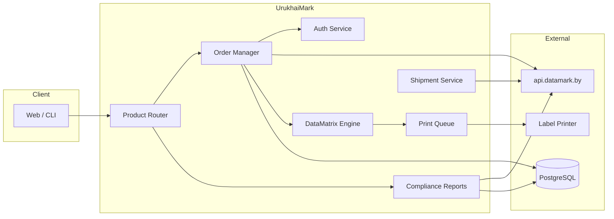

# Архитектура UrukhaiMark

## Обзор



## Структура репозитория

```
UrukhaiMark/
├── README.md
├── docs/                         # Документация
├── src/
│   ├── auth/                     # Token, refresh, sandbox/prod
│   ├── catalog/                  # GTIN, /items, /catalogs
│   ├── orders/                   # label_type routing
│   ├── codes/                    # KM storage, GS integrity
│   ├── datamatrix/               # FNC1 encoder, render
│   ├── reports/                  # mark, manufacture
│   ├── shipments/                # /v3/ships/add
│   ├── products/
│   │   ├── cosmetics/            # label_type=7
│   │   ├── beer-ukz/             # УКЗ API
│   │   └── beer-rf/              # CRPT (future)
│   └── labels/                   # Templates, ZPL/PDF
└── tests/
    ├── fixtures/km-samples.txt
    └── datamatrix-golden/
```

## Product Router

```python
def route(product, destination):
    if product.group == "cosmetics" and destination == "RF":
        return EAEUPipeline(label_type=7)

    if product.tnved.startswith("2203"):
        if destination == "RB":
            return UKZPipeline()
        if destination == "RF":
            return CRPTViaPartnerPipeline()

    raise UnknownProductError(product)
```

## Модули

### auth
- POST `/auth`, cache token, refresh before expiry
- Config: sandbox vs prod credentials

### orders
- POST `/v3/orders/add` with label_type from router
- Poll until status=30
- POST `/v3/orders/downloads`
- Alert when stock < 7 days

### codes
- Store raw KM with GS bytes intact
- Never serialize through CSV/Excel
- Link: order_id → km → gtin → serial

### datamatrix
- Validate structure before encode
- libdmtx or zxing-cpp
- Output formats: PNG, SVG, ZPL

### reports
- Strict ordering: addMark → addManufacture → ships
- Validate status 47/50 before manufacture

### shipments
- Batch up to 30k KM
- Attach certificate_document_data per GTIN

## Стек (рекомендация)

| Слой | Технология |
|------|------------|
| Backend | TypeScript (Node) или Python (FastAPI) |
| DB | PostgreSQL |
| Queue | In-process или Redis для order polling |
| Barcode | libdmtx / zxing-cpp |
| Print | ZPL (Zebra), PDF fallback |

## Безопасность

- Credentials в env / secret store, не в git
- Audit log всех API calls (без password)
- KM — чувствительные данные, access control

## Наблюдаемость

- Structured logs: order_id, gtin, report_id, ship_id
- Metrics: order latency, print success rate, API errors

## См. также

- [ROADMAP.md](ROADMAP.md)
- [datamatrix-spec.md](datamatrix-spec.md)
- [api/cookbook.md](api/cookbook.md)
