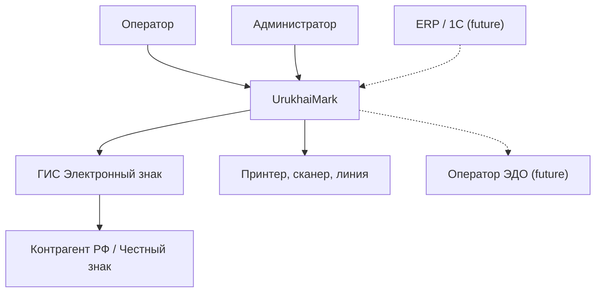
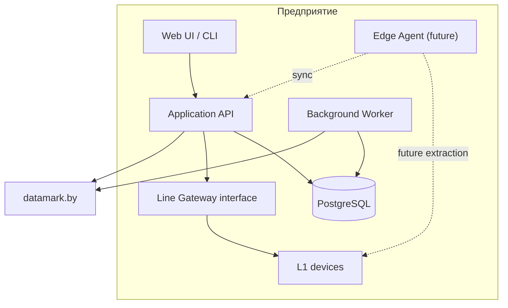
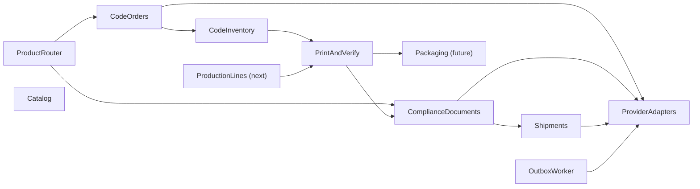
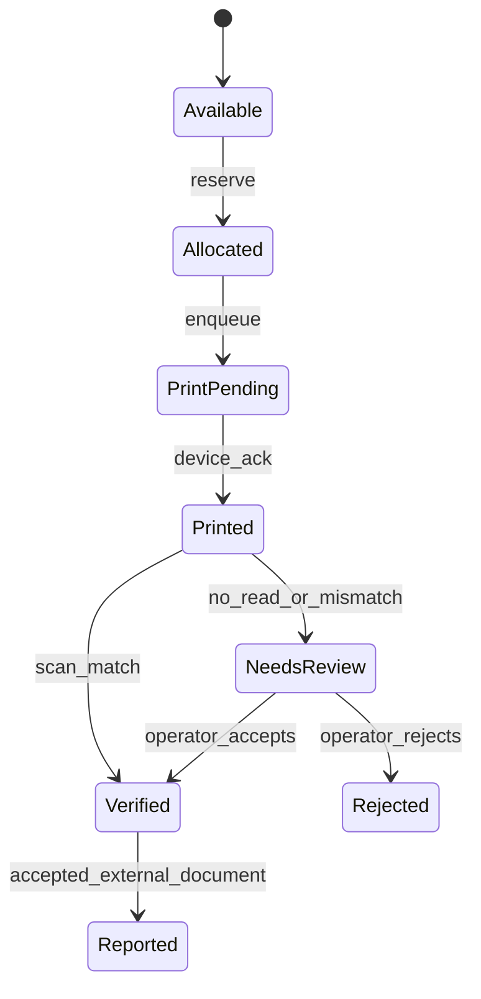
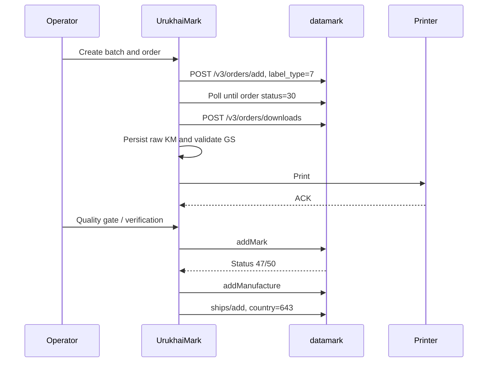

# Итоговая архитектура UrukhaiMark

> Статус: Approved, Living.  
> Область: self-hosted-система одного предприятия. Разные предприятия не образуют
> общий tenant или общий runtime.

## 1. Назначение и границы

UrukhaiMark автоматизирует получение и безопасное использование кодов маркировки,
печать GS1 DataMatrix, регуляторную отчётность и трансграничную отгрузку. Архитектура
эволюционная:

- **MVP** — cosmetics/аэрозоли из РБ в РФ через `datamark.by`, одна print station;
- **Next** — production hardening, контроль качества, одна автоматизированная линия;
- **Future** — агрегация, multi-line edge, UKZ, ERP/ЭДО и CRPT при подтверждённых
  юридических и API-контрактах.

Система не заменяет GS1/ePASS, ГИС «Электронный знак», «Честный знак», ERP, ЭДО или
ПЛК. Она оркестрирует собственный процесс и хранит проверяемую локальную историю.

## 2. Архитектурные принципы

| ID | Принцип | Следствие |
|----|---------|-----------|
| P1 | GS integrity first | КМ хранится byte-for-byte; CSV/Excel запрещены |
| P2 | Provider facts are external | Локальные состояния не выдаются за регуляторные |
| P3 | Capability routing | Pipeline выбирается по SKU, destination и доступностям провайдера |
| P4 | Idempotent by design | Внешние операции и события имеют локальные ключи дедупликации |
| P5 | Audit everything | История append-only от заказа до отгрузки |
| P6 | Human gates are explicit | Контроль качества нельзя скрыть единым `execute()` |
| P7 | Modular monolith first | Распределённость вводится только измеримым требованием |
| P8 | Same artifact, different config | Sandbox/prod используют один build |

## 3. C4 — контекст

Для MVP cosmetics UrukhaiMark не вызывает CRPT напрямую:

`UrukhaiMark → datamark /v3/ships/add → контрагент РФ → приёмка в Честном знаке`.

## 4. C4 — контейнеры и deployment

| Контейнер | Ответственность | Этап |
|-----------|------------------|------|
| UI/CLI | Операторские команды и ручные gates | MVP |
| Application API | Use cases, FSM, RBAC, query API | MVP |
| Worker | Polling, outbox, retry, print queue | MVP; может быть одним процессом |
| PostgreSQL | State, raw KM, документы, audit/outbox | MVP |
| Line Gateway | Порт к принтеру/сканеру без vendor logic в core | MVP |
| Edge Agent | Локальная очередь и L1 orchestration | Future, по ADR-0004 |

Центральный модульный монолит остаётся authority для production orders, code
allocations, документов и упаковочной иерархии. Edge — не второй master.

## 5. Компоненты модульного монолита

| Модуль | Владеет |
|--------|---------|
| Catalog/Product Router | SKU, GTIN, ТН ВЭД/ОКПД2, destination, pipeline selection |
| Code Orders | Заказы провайдеру, polling, download |
| Code Inventory | КМ, allocation lease, локальный lifecycle |
| DataMatrix | Валидация AI/FNC1/GS и rendering |
| Print and Verify | Print jobs/attempts, device ACK, scan/grade, review |
| Compliance Documents | addMark/addManufacture и статусы квитанций |
| Shipments | Отгрузочные документы и состав |
| Production Lines | Линии, устройства, задания, рецепты |
| Packaging | Package hierarchy и aggregation/disaggregation |
| Provider Adapters | Auth, API mapping, capabilities конкретного провайдера |
| Audit/Outbox | Неизменяемые события и гарантированная доставка |

## 6. Routing и provider capabilities

Один «универсальный provider» не должен скрывать несовместимые юридические процессы.
Core выбирает pipeline, а каждый adapter объявляет capabilities:

| Pipeline | Provider | Статус |
|----------|----------|--------|
| `EAEUCosmeticsExport` | datamark, `label_type=7` | MVP |
| `DomesticBeerUkz` | отдельный UKZ API | Future, Phase 3 |
| `BeerRfViaPartner` | импорт КМ/CRPT от имени партнёра | Blocked, Phase 4 |
| `DomesticCosmetics` | TBD | Blocked регуляторной проверкой |

Прямой CRPT, ЭДО, marketplace, серверное подписание и API вывода из оборота не
считаются поддержанными, пока capability не подтверждён и не покрыт contract test.

## 7. Разделённые модели состояния

### 7.1 Локальный lifecycle КМ

`Allocated`, `Printed`, `Verified` и `Rejected` — факты предприятия, не статусы ГИС.
Повторная печать создаёт новый `print_attempt`; она не переписывает историю.

### 7.2 Внешний статус

Сохраняются `provider`, raw code/status, interpreted status, timestamp и source
document. Для MVP известны gate order `30` перед download и КМ `47/50` перед
`addManufacture`. Неизвестное значение сохраняется как raw и не угадывается.

### 7.3 Статус документа

`draft → queued → submitted → accepted | rejected | reconciliation_required`.
Локальный timeout не означает rejection. Повтор разрешён только после status check
или по документированному идемпотентному контракту.

### 7.4 Физическая упаковка

`unit → case → pallet` — отдельный граф состава. Package имеет собственный
identifier (`SSCC` при применимости), state и version. Упаковка не меняет
регуляторный статус вложенных КМ сама по себе.

## 8. MVP compliance flow

Инварианты:

1. КМ не проходит через CSV/Excel и не попадает целиком в logs.
2. `addMark` отправляется только после физического нанесения и quality gate.
3. Внешний документ связывается с точным набором `km_hash`.
4. Каждый переход и ответ API фиксируется в audit.
5. Shipment не смешивает несовместимые provider/group contracts.

## 9. Edge-ready контракт

MVP реализует `LineGateway` внутри центрального процесса. Выделение Edge Agent
разрешено только gate из [architecture-validation](../planning/architecture-validation.md).

Center выдаёт агенту ограниченную allocation lease. Агент публикует at-least-once
events с `event_id`, `agent_sequence`, `allocation_id`, `code_hash`, schema version,
correlation/causation IDs. Center применяет событие и inbox marker в одной
транзакции. Повтор возвращает предыдущий результат.

Edge хранит raw КМ только при необходимости автономной печати, шифрует диск и
удаляет локальную копию после подтверждённой сверки. Разрыв sequence переводит
линию в `reconciliation_required`; он не вызывает автоматическую повторную печать.

## 10. Данные и транзакционные границы

- PostgreSQL — единственный system of record предприятия.
- Raw KM хранится как `BYTEA`; parsed GTIN/serial — производные поля.
- Code allocation выполняется атомарно с `FOR UPDATE SKIP LOCKED`.
- Изменение domain state и запись outbox происходят в одной транзакции.
- Audit append-only; исправление — новое компенсирующее событие.
- Package composition версионируется; физически выполненное действие не удаляется.
- Полная схема — в [data-model.md](../reference/data-model.md).

## 11. Безопасность

| Область | Контроль |
|---------|----------|
| Secrets | Host secret store/Docker secrets, раздельно sandbox/prod |
| Transport | TLS 1.2+ наружу; mTLS/rotating credentials для edge при выделении |
| Access | RBAC: operator, supervisor, admin, auditor |
| KM | Encrypted disk/backup; raw KM не логируется |
| Audit | Append-only, actor/device/correlation ID |
| Edge | Device identity, signed update, least-privilege allocation |
| Recovery | Проверяемые backup/restore; reconciliation перед возобновлением |

## 12. Наблюдаемость и эксплуатация

Обязательные сигналы: order latency, token refresh failures, available KM days,
print ACK/no-read/NOK, documents by state, outbox lag, edge sequence gaps, DB backup
age. Logs структурированы и содержат IDs/хеши, но не raw КМ или credentials.

Baseline SLO/RPO/RTO и gates находятся в
[architecture-validation.md](../planning/architecture-validation.md).

## 13. Эволюция

| Slice | Возможность | Topology |
|-------|-------------|----------|
| 0 | Architecture validation и внешние доступы | Docs/sandbox |
| 1 | Cosmetics RF API/compliance + ручной quality gate | Central |
| 2 | Durable print queue, audit, prod hardening | Central |
| 3 | Одна автоматизированная линия | In-process gateway |
| 4 | Case aggregation | Central + line adapter |
| 5 | Pallet hierarchy и склад | Central + mobile adapter |
| 6 | Multi-line/offline | Edge agents |
| 7 | ERP/ЭДО/CRPT | Capability adapters |

## 14. Решения и открытые вопросы

Принятые решения:

- [ADR-0004](../decisions/0004-deployment-topology.md) — modular monolith + edge-ready;
- [ADR-0005](../decisions/0005-km-storage.md) — binary-safe KM storage.

Runtime, UI и print format остаются Proposed в ADR-0001—0003 и не меняют логическую
архитектуру. Неподтверждённые регуляторные положения ведутся в
[architecture-validation.md](../planning/architecture-validation.md), а бизнес-
блокеры — в [open-questions.md](../planning/open-questions.md).

