# Оборудование для нанесения и считывания кодов

Практический обзор оборудования для маркировки СИ (GS1 DataMatrix) в формате, ориентированном на малые и средние производства. Конкретные модели — ориентиры; перед закупкой проводите тест с реальными КМ из sandbox API.

## Архитектура рабочего места

```mermaid
flowchart TB
    subgraph sw [ПО]
        UM[UrukhaiMark]
        UM --> Encoder[DataMatrix encoder]
        UM --> Queue[Очередь печати]
    end

    subgraph hw [Оборудование]
        Queue --> Printer[Термопринтер]
        Printer --> Labels[Этикетки]
        Scanner[Сканер COM] --> UM
        Mobile[Приложение ЭЗ] --> Verify[Верификация]
    end

    Labels --> Product[Товар]
    Product --> Scanner
    Product --> Mobile
```



---

## Принтеры этикеток

### Настольные термопринтеры (старт)

| Класс | Примеры | Разрешение | Интерфейс | Для UrukhaiMark |
|-------|---------|------------|-----------|-----------------|
| Бюджет | Honeywell PC42t, TSC TE200 | 203 dpi | USB, опц. Ethernet | Тесты, объём < 1 000 этикеток/день |
| **Рекомендовано для MVP** | **Zebra ZT411** (300 dpi) | 300 dpi | USB, RS-232, **Ethernet**, Bluetooth | **Целевой принтер пилота** |
| Повышенное качество | Zebra ZT410/ZT610, TSC MH241 | 300/600 dpi | Ethernet | Мелкий модуль DM, RFID-опции |

> Zebra ZT230, ранее фигурировавший здесь как «рабочая лошадка», — предыдущее поколение линейки; ZT411 — актуальная замена в том же классе. Проверяйте наличие модели у поставщика (shtrih.by, vial.by) перед закупкой.

**Рекомендация:** минимальный модуль DataMatrix для «Электронный знак» / «Честный ЗНАК» — **0.380 мм** (ГОСТ Р ИСО/МЭК 16022-2008; см. [obsidian-kb.md](../../reference/obsidian-kb.md)). При 203 dpi (точка 0.125 мм) код 22×22 получает класс **B** — работает, но без запаса. При **300 dpi** (точка 0.084 мм) класс **A** гарантирован. Грейд деградирует при хранении/транспортировке, а для экспортной партии требуется «Grade ≥ C, рекомендуется B» (см. [packaging-carriers.md](packaging-carriers.md#аэрозольные-баллоны-освежители-тн-вэд-3307)) — поэтому **300 dpi это дефолт для UrukhaiMark, не опция.**

### Параметры выбора

| Параметр | Зачем |
|----------|-------|
| **dpi** | Чем выше — тем мельче читаемый модуль |
| **Ширина печати** | 104 мм покрывает этикетку 50×60 мм с полями |
| **Термотрансфер** | Обязателен для аэрозолей (не direct thermal) |
| **ZPL / EPL** | Целевой адаптер печати — см. [ADR-0003](../../decisions/0003-label-format.md) (`Proposed`) |
| **Ethernet** | Стабильнее USB в цеху |

### Расходные материалы

| Материал | Для аэрозолей |
|----------|---------------|
| Основа этикетки | PP или PET, клей permanent |
| Лента (ribbon) | Resin или wax-resin, ширина = этикетка |
| Рулон | Внутренний диаметр под втулку принтера |

### Промышленные print-and-apply

Для линий > 50 шт./мин: Weber, Herma, Novexx, Videojet Labeljet.

- Печать + наклейка в одном цикле
- Интеграция: сигнал от PLC, очередь КМ по TCP/OPC
- Требует отдельного ТЗ на интеграцию

---

## Сканеры штрихкодов

### Режимы подключения

| Режим | GS/FNC1 передаётся | Применение |
|-------|-------------------|------------|
| **HID (клавиатура)** | Часто **нет** | Розница, инвентаризация EAN |
| **COM / USB-VCP** | **Да** | Верификация КМ, OTK |
| **Ethernet (промышленный)** | Да | Линия, reject-система |

**Для маркировки КМ — только COM или промышленный с полным ASCII.**

### Типы сканеров

| Тип | Примеры | Когда |
|-----|---------|-------|
| Ручной 2D | Zebra DS2208, Honeywell Xenon | ОТК, выборочный контроль |
| Стационарный | Datalogic Matrix 320 | Над конвейером |
| Мобильный ТСД | Zebra TC series | Склад, приёмка |

### Настройка сканера

1. Включить передачу **GS (0x1D)** и спецсимволов
2. Суффикс CR/LF для ввода в приложение
3. Отключить префиксы, ломающие парсинг AI
4. Проверить: скан → Notepad++ → видны символы GS перед 91 и 92

---

## Верификаторы (grade ISO 15415)

Отдельные устройства измеряют **качество печати** DataMatrix, не только читаемость.

| Устройство | Назначение |
|------------|------------|
| Webscan TruCheck | Стол ОТК, отчёт grade A–F |
| Cognex DataMan | Линия + верификация |
| Microscan LVS | Портативная проверка |

**Порог для маркировки:** grade ≥ **1.5 (C)** по ISO/IEC 15415.

Без верификатора на старте: мобильное приложение «Электронный знак» + визуальный контроль первых 3 шт. каждой партии — процедура: [how-to/quality-control.md](../../how-to/quality-control.md#процедура-первые-три).

---

## Промышленная печать на линии

| Класс | Производители | Протокол данных |
|-------|---------------|-----------------|
| CIJ | Videojet, Domino, Markem-Imaje | Zipher, ESC, кастом |
| TIJ | Videojet, Markoprint | JSON/XML по TCP |
| Лазер | FOBA, Trumpf, Videojet | PLC триггер |

> **Вердикт по CIJ для GS1 DataMatrix:** CIJ — компромисс, не гарантия. Класс печати типично **B–C на картоне, C–D на пластике/металле** (наши аэрозольные баллоны 3307 — именно этот случай) из-за меньшей точности позиционирования капли в полёте (±0.15–0.35 мм против ±0.05 мм у термотрансфера). Разобранные конкретные модели: **Linx 8920** — DataMatrix заявлен, но снят с производства (преемник Linx 9920) и требует отдельной настройки для печати скрытых FNC1(232)/GS(29) через протокол; **DOCOD S2000** — DataMatrix не подтверждён (заявлен только «QR/dynamic barcode»), нет данных по FNC1/GS, нет EAC — **не использовать** для КМ без письменного подтверждения поставщика и тестовой печати. Для металла/пластика на линии предпочтителен **лазер** (класс A, без расходников) — см. [industrial-marking.md](industrial-marking.md). CIJ без верификатора на линии — не применять для СИ ни при каких условиях. Подробный разбор: [obsidian-kb.md](../../reference/obsidian-kb.md).

Интеграция с UrukhaiMark (Фаза 2+):

```
Order Manager → codes DB → Line Adapter (TCP) → Printer
                                ↑
                         Camera verify → reject
```

---

## Программное обеспечение

| Компонент | Роль | UrukhaiMark |
|-----------|------|-------------|
| Encoder | FNC1 + GS1 DataMatrix | `src/datamatrix/` — libdmtx / zxing-cpp |
| Драйвер печати | ZPL или PDF (TBD) | `src/labels/` — после [ADR-0003](../../decisions/0003-label-format.md) |
| Очередь | 1 КМ = 1 этикетка | Print Queue |
| Валидация | POST /v2/labels | Опционально перед печатью |

**Не использовать:** онлайн QR-генераторы, Excel, «любой штрихкод-плагин» без FNC1.

---

## Идеальный комплект для задач «Честный ЗНАК» (аэрозоли/cosmetics, экспорт РФ)

Целевой SKU UrukhaiMark на Фазе 1 — освежители/аэрозоли (ТН ВЭД 3307, `group=cosmetics`, `label_type=7`), пилотная схема нанесения — **настольная этикетка**, не inline (см. [product-matrix.md](../../reference/product-matrix.md), [packaging-carriers.md](packaging-carriers.md#аэрозольные-баллоны-освежители-тн-вэд-3307)). Код в итоге читает приёмочный сканер «Честного ЗНАК» в РФ — грейд должен быть с запасом, не «впритык».

| # | Позиция | Модель | CAPEX | Почему именно так |
|---|---------|--------|-------|--------------------|
| 1 | Термопринтер | **Zebra ZT411, 300 dpi, Ethernet** | $780–1 000 | Класс A (§ выше); Ethernet — целевой интерфейс для Print and Verify; формат/протокол — после spike 02 и ADR-0003 |
| 2 | Расходники | PP-этикетка (permanent) + **resin ribbon** | $50–100/мес | Термотрансфер обязателен: аэрозоль = влага/бытовая химия, direct thermal выцветет |
| 3 | Сканер | Zebra DS2208 / Honeywell 1900g, **режим COM/USB-VCP** | $150–300 | HID-режим часто глотает GS (0x1D) — для верификации КМ он не подходит в принципе |
| 4 | Верификатор (со 2-й партии) | Трекмарк В-300 (ISO/IEC 15415) | $1 000–2 000 | До этого — «первые три» ([quality-control.md](../../how-to/quality-control.md#процедура-первые-три)); при регулярном экспорте в РФ штраф за нечитаемый код — конфискация партии, лучше не рисковать |
| 5 | ПК/мини-ПК с UrukhaiMark | — | есть | Хост `Print Service` |
| 6 | Смартфон с «Электронный знак» | — | есть | Резервная проверка |

**Итого пилот:** ~$1 000–1 400 без верификатора, ~$2 000–3 400 с ним.

### Интеграция с системой (как это ложится на архитектуру)

Контур печати и верификации — компонент **Print and Verify** в [architecture.md](../architecture.md#5-компоненты-модульного-монолита) (print jobs, device ACK, scan/grade). **Формат вывода (ZPL vs PDF) не зафиксирован:** [ADR-0003](../../decisions/0003-label-format.md) — `Proposed`; физический прогон — [spike 02](../../../research/validation/02-zpl-print.md) — `Blocked` (нет принтера и carrier).

**Рабочая гипотеза до закрытия spike** (не production-ready):

- Zebra по Ethernet, raw-порт **9100** (JetDirect): Print Service стримит ZPL по TCP без драйвера ОС;
- `src/datamatrix/` (план) — ZPL `^BX` с hex-escape FNC1(232)/GS(29), принцип **P1 «GS integrity first»**;
- PDF — fallback для разработки без железа.

**Обязательный чек-лист перед боевой партией** (протокол spike 02): sandbox КМ → печать на ZT411 → скан COM-сканером → побайтовая сверка GS/FNC1 → grade ≥ C. Без этого брак всплывёт только на стороне «Честного ЗНАК» в РФ.

- Место кода на баллоне — «окно» 25×25 мм под DataMatrix 20×20 мм ([packaging-carriers.md](packaging-carriers.md#зоны-размещения-на-баллоне)).

### Путь апгрейда на объём (когда пилот перестаёт справляться)

Полное дерево решений и все методы — [industrial-marking.md](industrial-marking.md#выбор-метода-аэрозоль-3307-экспорт-рф). Для справки — конкретный сценарий: **5 000–50 000 баллонов/день, своя линия наполнения**:

| Позиция | Выбор | Почему |
|---|---|---|
| Метод | **Print-and-apply** (Weber Marking / Novexx / EPI-Logopak, режим wrap/merge под цилиндр) | Печатающий модуль внутри P&A — тот же класс термотрансфера 300 dpi, что и пилотный ZT411 → класс A сохраняется; не требует уже готовой wrap-around линии, в отличие от TT overprint |
| Ориентатор | Roller/twist orientor перед станцией | Совмещает decor-окно 25×25 мм с точкой аппликации ([packaging-carriers.md](packaging-carriers.md#зоны-размещения-на-баллоне)) |
| Верификация | **100% inline** — Cognex DataMan / Datalogic Matrix | На линии выборочный контроль недостаточен — это industry standard для ЕАЭС на скоростных линиях |
| Отбраковщик | Пневмо reject-gate, синхронизирован с PLC | NOK → продукт в reject, КМ → `waste` (не в `addManufacture`) |
| Интеграция | LineGateway / line adapter (TCP/OPC-UA → PLC) | [Slice 3 — автоматизированная линия](../../planning/roadmap.md#slice-3--одна-автоматизированная-линия): `ProductionLine`, devices, ACK/no-read/reject; контракт адаптера — до закупки ([architecture.md](../architecture.md#9-edge-ready-контракт), [industrial-marking.md](industrial-marking.md)) |
| CAPEX | **€40–70k** | — |

> **Если у вас уже есть wrap-around этикетирование** decor'а на баллоне (а не литография прямо на металле) — дешевле **TT overprint** на существующем аппликаторе (Herma/EPI, €30–50k), а не отдельная P&A-станция.
>
> **Не CIJ** — класс C–D на металле/пластике не даёт нужного запаса для экспортной партии; см. вердикт по CIJ выше.

Обязательно независимо от метода: промышленный коммутатор Ethernet для линии, SOP на смену ribbon/чернил и первые 10 шт. партии — чек-лист внедрения в [industrial-marking.md](industrial-marking.md#чеклист-внедрения-промышленная-линия).

---

## Обслуживание

| Интервал | Действие |
|----------|----------|
| Ежедневно | Тестовая этикетка с КМ из sandbox |
| Еженедельно | Чистка печатающей головки принтера |
| При смене ribbon/рулона | Калибровка (gap sensor) |
| При жалобах на скан | Проверка GS в COM-режиме |

См. [operations-runbook.md](../../how-to/operations-runbook.md).

## См. также

- [application-methods.md](application-methods.md) — методы нанесения
- [quality-control.md](../../how-to/quality-control.md) — приёмка grade
- [datamatrix-spec.md](../../reference/datamatrix-spec.md) — формат кода
- [obsidian-kb.md](../../reference/obsidian-kb.md) — расширенная база знаний в Obsidian: годность CIJ-принтеров, подбор оборудования, требования к конвейерной печати
