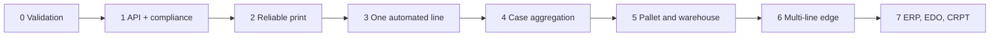

# Дорожная карта UrukhaiMark

> Единственный источник порядка delivery slices. Переход определяется quality gate,
> а не календарной датой.

## Цель

Автоматизировать маркировку белорусского производителя: заказ КМ, GS1 DataMatrix,
печать/проверка, отчёты и трансграничную отгрузку с полной локальной трассировкой.

## Приоритеты товаров

| Приоритет | Товар | Сценарий | Состояние |
|-----------|-------|----------|-----------|
| P0 | Освежители / аэрозоли | Экспорт РФ | MVP: `cosmetics`, `label_type=7` |
| P1 | Освежители | Продажа РБ | Blocked: режим не подтверждён |
| P2 | Пиво | Продажа РБ | Future: отдельный UKZ API |
| P3 | Пиво | Экспорт РФ | Blocked: контрагент/CRPT |
| P4 | Газовые баллоны | TBD | Blocked: классификация ТН ВЭД |

## Порядок capability slices

## Slice 0 — Architecture validation и доступы

- [ ] Заполнить SKU: GTIN, ТН ВЭД, ОКПД2, destination.
- [ ] Получить sandbox credentials и подтвердить `agent` контрагента РФ.
- [ ] Проверить параметры `addMark`, статусы 47/50 и reprint/waste procedure.
- [ ] Закрыть ADR-0001—0003 до затрагиваемых milestones.
- [x] Зафиксировать topology и KM storage в ADR-0004/0005.
- [ ] Выполнить внешне зависимые spikes принтера, сканера и sandbox.

**Gate:** выполнен MVP checklist из
[architecture-validation.md](architecture-validation.md); неизвестные возможности
явно переведены в `future`.

## Slice 1 — MVP cosmetics → РФ

### Infrastructure

- Application API, Worker и PostgreSQL в self-hosted deployment.
- datamark auth с proactive refresh.
- Structured logs без credentials и raw КМ.

### Code order и DataMatrix

- `POST /v3/orders/add`, `label_type=7`, максимум 1 000 КМ на заказ.
- Poll `GET /v3/orders/list/{id}` до status 30.
- `POST /v3/orders/downloads`, binary-safe storage.
- Валидация AI 01/21/91/92, FNC1/GS, PNG и выбранный print adapter.

### Compliance

- Явный quality gate после печати.
- `addMark → status 47/50 → addManufacture → ships/add`.
- `country=643`, подтверждённый `agent`, сертификаты, ≤ 30 000 КМ на shipment.

**Gate:** три последовательных sandbox E2E; 0% потери GS; DataMatrix читается и
соответствует минимум grade C.

## Slice 2 — Надёжная печать и production hardening

- Durable print jobs/attempts и outbox.
- Retry/reconciliation внешних документов без слепого resend.
- Stock alert для запаса КМ ≥ 7 дней.
- RBAC, encrypted backup, restore test, monitoring.
- COM scanner adapter и ручной `needs_review`.
- Prod pilot одной партии и operator runbook.

**Gate:** восстановление после остановки worker/DB не создаёт дублей; каждое действие
прослеживается `order → km_hash → print_attempt → document → shipment`.

## Slice 3 — Одна автоматизированная линия

- `ProductionLine`, devices, recipe и production assignment.
- In-process `LineGateway`; printer/scan ACK, no-read, mismatch, reject.
- Code allocation без двойной выдачи.
- Настраиваемые stop conditions и latency по реальному оборудованию.

**Gate:** тесты на 50/75/100% скорости, согласованные reprint/waste rules и recovery.

Параллельный product track после подтверждения: `DomesticBeerUkz` с отдельным
`UkzClient`; UKZ не использует DataMatrix pipeline.

## Slice 4 — Короба

- Package hierarchy и versioned composition.
- Ручная/потоковая агрегация единиц в case.
- SSCC/`label_type=6` только после contract validation.
- Disaggregation и перепаковка как компенсирующие события.

**Gate:** состав короба восстанавливается из аудита; частичный короб безопасно
возобновляется после сбоя.

## Slice 5 — Палеты и склад

- Case → pallet и прямая палетизация, если подтверждена бизнесом.
- Mixed pallet compatibility rules.
- Mobile/ТСД adapter для ручного сканирования.
- Отгрузка по иерархии без повторного оптического чтения скрытого содержимого.

**Gate:** pallet manifest согласуется с package graph и shipment document.

## Slice 6 — Multi-line edge

- Edge Agent только при измеримом offline/multi-line требовании.
- Allocation leases, local encrypted store, inbox/outbox и event sequence.
- Signed updates, health, rollback и reconciliation.

**Gate:** replay/duplicate/out-of-order tests не создают вторую печать или упаковку;
offline-окно не нарушает регуляторный срок отчёта.

## Slice 7 — ERP, ЭДО и дополнительные providers

- ERP/1С master-data и production-order contract.
- ЭДО и конкретный оператор после выбора юридического сценария.
- `BeerRfViaPartner`/CRPT после договора и УКЭП architecture.
- Marketplace FBO/FBS, API вывода из оборота и weight products — отдельные
  capability gates.

**Gate:** contract tests, ownership matrix и reconciliation для каждой интеграции.

## Метрики

| Метрика | Baseline |
|---------|----------|
| Order → printable | p95 < 5 мин |
| Потеря GS | 0% |
| DataMatrix | минимум 1.5 (C), цель 2.5 (B) |
| Sandbox E2E | 3 успешных последовательных прогона |
| Token expiry downtime | 0 |
| Duplicate allocation/document | 0 |

## Главные блокеры

- незаполненная [матрица SKU](../reference/product-matrix.md);
- sandbox credentials и контрагент РФ;
- неподтверждённые статусы/параметры datamark;
- физические printer/scanner spikes;
- юридическая схема пива → РФ.

