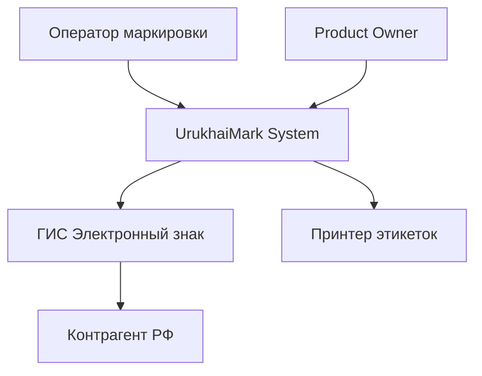
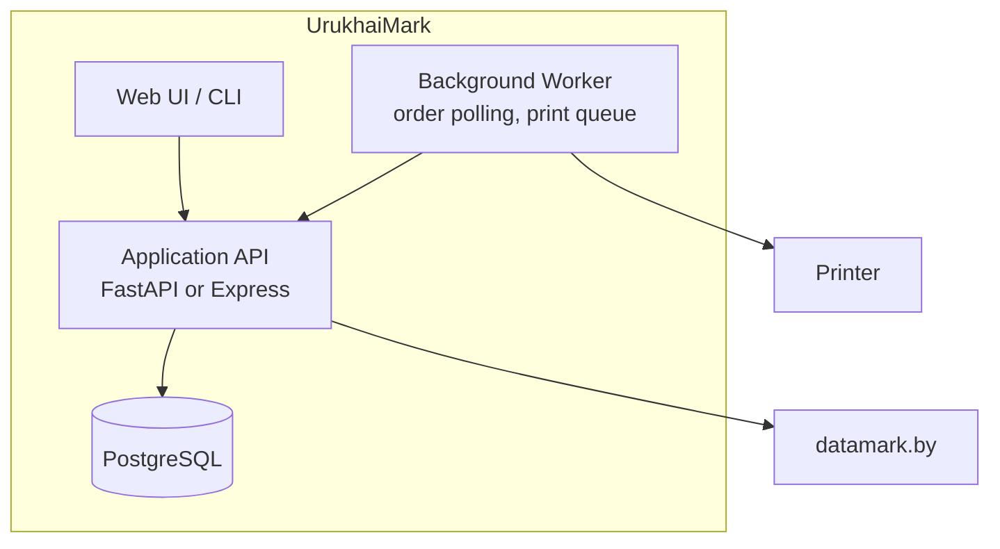
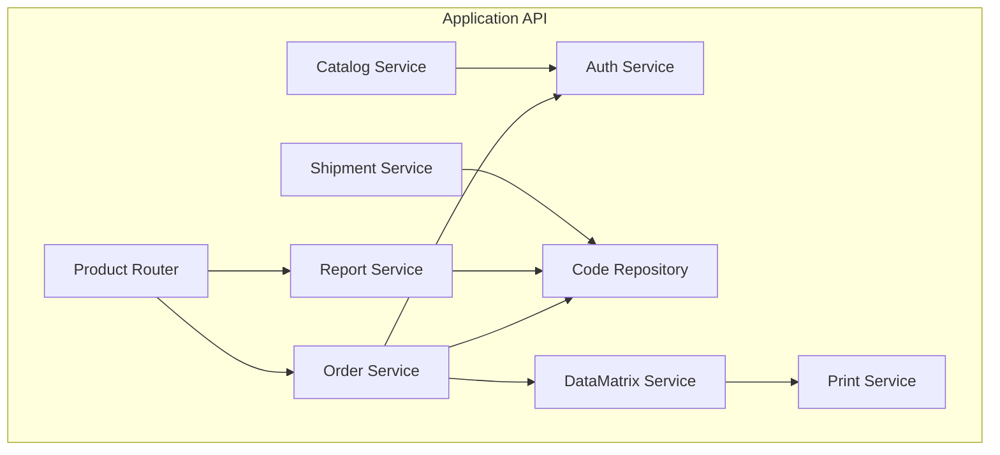
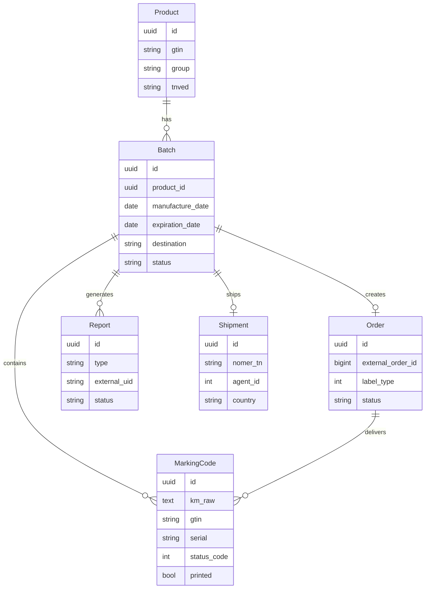
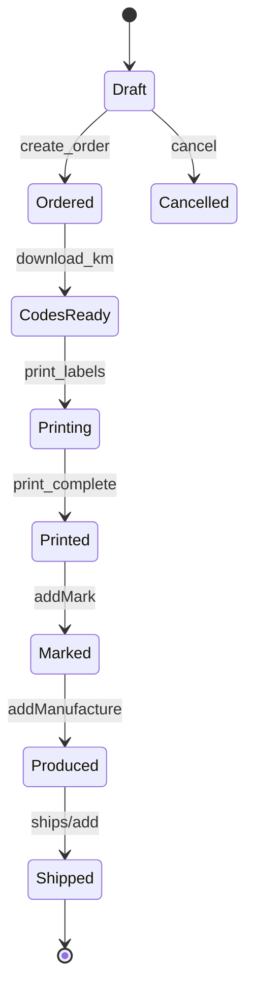

# План архитектуры

> Целевая архитектура UrukhaiMark: слои, домены, данные, безопасность, эволюция.  
> Краткий обзор: [architecture.md](../architecture.md)

## 1. Архитектурные принципы

| # | Прinciple | Rationale |
|---|-----------|-----------|
| P1 | GS integrity first | Потеря GS = брак всей партии |
| P2 | API-first compliance | Все отчёты через datamark API, не дублировать бизнес-логику оператора |
| P3 | Product Router | Разные pipeline для cosmetics/beer/ukz |
| P4 | Idempotent operations | Retry-safe orders and reports |
| P5 | Audit everything | order→km→print→report→ship traceable |
| P6 | Sandbox/prod parity | Same code paths, different config |

## 2. C4 — Context



**Назначение системы:** автоматизация заказа кодов, генерации DataMatrix, compliance-отчётов и отгрузок для белорусского производителя.

## 3. C4 — Containers



| Container | Responsibility | Tech (recommended) |
|-----------|------------------|-------------------|
| Web UI / CLI | Operator workflows | React or Typer CLI |
| Application API | Business logic, orchestration | FastAPI / Express |
| Worker | Poll orders, print queue, retries | Same runtime / Celery/Bull |
| PostgreSQL | State, audit, KM storage | PostgreSQL 15+ |

## 4. C4 — Components (Application API)



### Component specs

| Component | Input | Output | Dependencies |
|-----------|-------|--------|--------------|
| Product Router | product, destination | Pipeline config | product-matrix rules |
| Auth Service | credentials | token, expiry | datamark /auth |
| Catalog Service | gtin | catalog item | /items, /catalogs |
| Order Service | gtin, count, label_type | order_id, kms | /v3/orders/* |
| Code Repository | km[] | persisted codes | PostgreSQL |
| DataMatrix Service | km | png, zpl | libdmtx |
| Report Service | batch_id | report_ids | /v3/reports/* |
| Shipment Service | ship draft | ship_id | /v3/ships/add |
| Print Service | zpl/png | print job status | printer driver |

## 5. Domain model



## 6. State machines

### Batch lifecycle



### MarkingCode status (mirrors datamark)

| Local | Datamark | Transition |
|-------|----------|------------|
| EMITTED | — | After download |
| PRINTED | — | After print job |
| APPLIED | 47 | After addMark |
| MANUFACTURED | — | After addManufacture |
| SHIPPED | — | After ships/add |

## 7. Pipeline pattern

```python
class EAEUPipeline:
    label_type = 7
    group = "cosmetics"

    async def execute(self, batch: Batch):
        order = await self.orders.create(batch)
        kms = await self.orders.wait_and_download(order)
        await self.codes.save(kms)
        await self.print.render_and_print(kms)
        await self.reports.add_mark(batch, kms)
        await self.reports.add_manufacture(batch, kms)
        await self.ships.create(batch, kms)
```

Each step:
- Validates preconditions
- Persists state transition
- Emits audit event
- On failure: stops pipeline, marks batch FAILED with reason

## 8. API layer (internal)

UrukhaiMark exposes REST for UI:

| Method | Path | Description |
|--------|------|-------------|
| POST | /api/batches | Create batch |
| POST | /api/batches/{id}/order | Trigger order |
| POST | /api/batches/{id}/print | Print labels |
| POST | /api/batches/{id}/submit | Mark+Manufacture+Ship |
| GET | /api/batches/{id} | Status + audit trail |
| GET | /api/products | Product catalog |
| GET | /api/codes/stock | Days remaining estimate |

## 9. Configuration

```yaml
# config.example.yaml
environment: sandbox  # sandbox | production
datamark:
  base_url: https://sandbox-api.datamark.by
  username: ${DATAMARK_USER}
  password: ${DATAMARK_PASSWORD}
  token_refresh_margin_sec: 120
database:
  url: ${DATABASE_URL}
printer:
  type: zpl  # zpl | pdf
  host: 192.168.1.100
  port: 9100
products:
  default_destination: RF
```

## 10. Security architecture

| Layer | Control |
|-------|---------|
| Transport | TLS 1.2+ for all external calls |
| Secrets | Env / vault, never git |
| Auth | Single service account for datamark |
| RBAC | operator, admin roles in UI |
| Data | KM at rest in DB, encrypted disk recommended |
| Logging | Log km_sha256, not full KM |
| Audit | Append-only audit_log table |

## 11. Observability

| Signal | Implementation |
|--------|----------------|
| Logs | JSON structured, correlation_id per batch |
| Metrics | order_latency, print_success, api_errors |
| Traces | Optional OpenTelemetry for API calls |
| Dashboards | Grafana or simple admin page |

## 12. Deployment topology

**MVP (single node):**
```
[Operator PC / Server]
  ├── UrukhaiMark API + Worker (Docker)
  ├── PostgreSQL (Docker)
  └── Printer (LAN)
```

**Production (recommended):**
```
[App Server] → PostgreSQL (managed or dedicated)
              → datamark.by (internet)
[Print Station] → Zebra printer (shop floor)
```

## 13. Technology decision (ADR summary)

| Decision | Choice | Alternatives rejected |
|----------|--------|----------------------|
| Runtime | Python FastAPI **or** Node Express | TBD at sprint 0 |
| DB | PostgreSQL | SQLite (no concurrent audit) |
| Barcode | libdmtx / zxing-cpp | QR libraries |
| UI MVP | CLI first, Web second | LK manual only |
| Queue | In-process async | Kafka (overkill MVP) |

Record full ADRs in `docs/plans/adr/`.

## 14. Evolution path

| Version | Scope |
|---------|-------|
| v0.1 | Sandbox E2E cosmetics RF |
| v0.2 | Prod pilot, stock alerts |
| v0.3 | Web UI, multi-user |
| v0.4 | UKZ beer module |
| v0.5 | ERP import, aggregation SSCC |
| v1.0 | CRPT beer-rf (if unblocked) |

## 15. Non-functional requirements

| NFR | Target |
|-----|--------|
| Order→download | < 5 min p95 |
| Print 1000 labels | < 30 min |
| Availability | 99% business hours |
| Recovery | Manual fallback to LK documented |
| Data retention | KM audit 3+ years (regulatory) |
