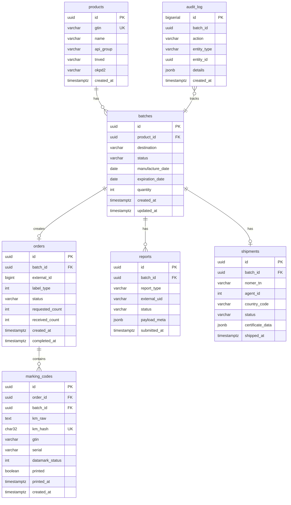

# Модель данных

> Схема PostgreSQL для UrukhaiMark (целевая, MVP).

## 1. ER-диаграмма



## 2. Ключевые инварианты

| Rule | Enforcement |
|------|-------------|
| `km_raw` contains GS (0x1D) when from API | Check on insert |
| `km_hash = sha256(km_raw)` | Unique index |
| One active order per batch | Unique partial index |
| Pipeline order | Application layer FSM |

## 3. Индексы

```sql
CREATE INDEX idx_codes_batch ON marking_codes(batch_id);
CREATE INDEX idx_codes_gtin ON marking_codes(gtin);
CREATE INDEX idx_codes_printed ON marking_codes(batch_id, printed);
CREATE INDEX idx_batches_status ON batches(status);
CREATE INDEX idx_audit_batch ON audit_log(batch_id, created_at);
```

## 4. Batch status enum

| Value | Description |
|-------|-------------|
| draft | Created, not ordered |
| ordered | Order submitted |
| codes_ready | KM downloaded |
| printing | Print in progress |
| printed | All labels printed |
| marked | addMark done |
| produced | addManufacture done |
| shipped | ships/add done |
| failed | Error, see audit_log |
| cancelled | Cancelled |

## 5. Storage notes for KM

**Recommended:** store `km_raw` as `TEXT` with UTF-8, verify byte `\x1d` on write:

```python
assert "\x1d" in km_raw or "\\u001d" not in km_raw  # already decoded
```

Do not use CSV export of this table.

## 6. Migrations policy

- Backward compatible migrations only in prod
- Never delete `marking_codes` rows (soft delete flag if needed)
- Audit log append-only

## 7. Reporting queries (examples)

**Stock estimate (unprinted codes):**
```sql
SELECT p.gtin, COUNT(*) AS unprinted
FROM marking_codes mc
JOIN batches b ON b.id = mc.batch_id
JOIN products p ON p.id = b.product_id
WHERE mc.printed = false AND b.status NOT IN ('failed','cancelled')
GROUP BY p.gtin;
```

**Batch audit trail:**
```sql
SELECT action, details, created_at
FROM audit_log
WHERE batch_id = $1
ORDER BY created_at;
```
