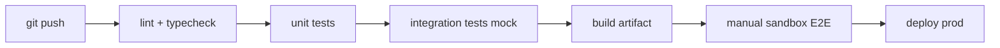

# План развёртывания

> Окружения, CI/CD, конфигурация, prod rollout.

## 1. Окружения

| Env | datamark URL | DB | Purpose |
|-----|--------------|-----|---------|
| local | sandbox | local PostgreSQL | Dev |
| sandbox | sandbox-api.datamark.by | staging DB | E2E, UAT |
| production | api.datamark.by | prod DB | Live marking |

**Rule:** Same Docker image / build artifact across sandbox and prod; only config differs.

## 2. Infrastructure (MVP)

```yaml
# docker-compose.yml (planned)
services:
  app:
    build: .
    env_file: .env
    ports: ["8000:8000"]
    depends_on: [db]
  db:
    image: postgres:16
    volumes: [pgdata:/var/lib/postgresql/data]
  # worker: optional second container
```

## 3. Environment variables

| Variable | Required | Description |
|----------|----------|-------------|
| `DATAMARK_BASE_URL` | Yes | API base |
| `DATAMARK_USER` | Yes | Login email |
| `DATAMARK_PASSWORD` | Yes | Password |
| `DATABASE_URL` | Yes | PostgreSQL DSN |
| `ENVIRONMENT` | Yes | sandbox \| production |
| `PRINTER_HOST` | No | ZPL printer IP |
| `LOG_LEVEL` | No | info \| debug |

## 4. CI/CD pipeline



| Stage | Command (example) | Gate |
|-------|-------------------|------|
| Lint | `ruff check` / `eslint` | Must pass |
| Unit | `pytest tests/unit` | Must pass |
| Integration | `pytest tests/integration` | Must pass |
| Build | `docker build` | Artifact stored |
| E2E | `pytest tests/e2e -m sandbox` | Manual approval |
| Deploy prod | `docker compose up -d` | PO approval |

## 5. Database migrations

- Tool: Alembic (Python) or Prisma migrate (Node)
- Migrations in repo: `migrations/`
- Prod: backup before migrate

**Initial schema:** see [data-model.md](data-model.md)

## 6. Prod rollout procedure

### Pre-deploy

- [ ] UAT complete
- [ ] Prod credentials obtained (separate from sandbox)
- [ ] DB backup strategy defined
- [ ] Rollback plan documented
- [ ] Operator trained (runbook)

### Deploy steps

1. Maintenance window notification (if needed)
2. Backup PostgreSQL
3. Deploy new version
4. Run migrations
5. Smoke test: auth + 1 test order (optional cancel)
6. Monitor logs 1 hour
7. Sign-off

### Rollback

1. Stop app
2. Restore previous Docker tag
3. Rollback DB migration if needed
4. Fallback: manual operations via datamark LK

## 7. Secrets management

| Env | Recommendation |
|-----|----------------|
| Dev | `.env.local` (gitignored) |
| Prod | Docker secrets / host env / vault |

**Never:** commit `.env` with passwords.

## 8. Monitoring post-deploy

- Health endpoint: `GET /health` → DB + datamark auth check
- Log aggregation: file or Loki (optional)
- Alerts: see [integration-plan.md](integration-plan.md) §12

## 9. Backup & retention

| Data | Frequency | Retention |
|------|-----------|-----------|
| PostgreSQL | Daily | 90 days min |
| KM audit | Included in DB | 3+ years |
| Application logs | 30 days | Compliance review |
