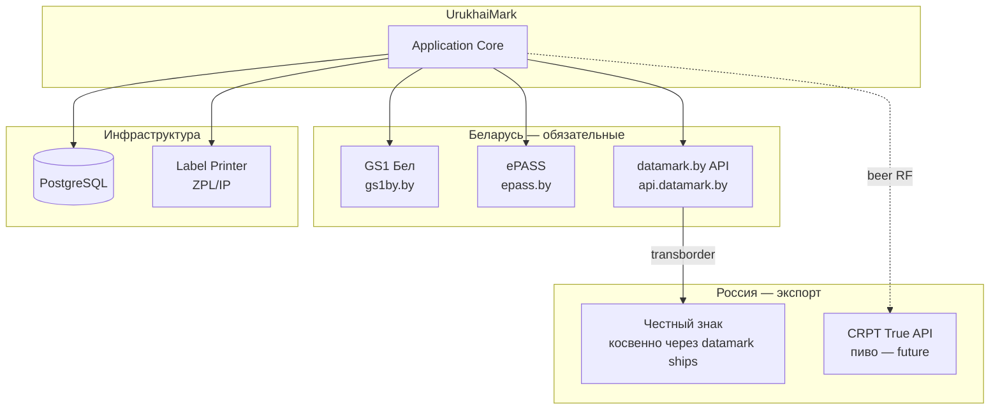

# План интеграции

> Внешние системы, контракты, порядок подключения и обработка ошибок.  
> API-примеры: [api/cookbook.md](../api/cookbook.md)

## 1. Карта интеграций



## 2. Матрица интеграций

| Система | Назначение | Протокол | Контур | Фаза | Критичность |
|---------|------------|----------|--------|------|-------------|
| GS1 Бел | GCP, GLN | Web + договор | Prod | 0 | Блокирующая |
| ePASS | GTIN, описание товара | Web/API | Prod | 0 | Блокирующая |
| datamark.by | КМ, отчёты, отгрузки | HTTPS REST | Sandbox→Prod | 1 | Блокирующая |
| datamark UKZ API | УКЗ для пива | HTTPS REST | Prod | 3 | Средняя |
| Честный знак РФ | Приёмка (контрагент) | Через datamark ships | Prod | 1 | Блокирующая для RF |
| CRPT True API | Пивo РФ | HTTPS + УКЭП | Prod | 4 | Отложена |
| PostgreSQL | Audit, state | TCP | Local/Prod | 1 | Блокирующая |
| Принтер | Этикетки | ZPL/IP или USB | Prod | 1 | Блокирующая |

## 3. datamark.by — основная интеграция

### 3.1 Environments

| Контур | Base URL | Назначение |
|--------|----------|------------|
| Sandbox | `https://sandbox-api.datamark.by` | Dev, E2E, UAT |
| Production | `https://api.datamark.by` | Боевая маркировка |

### 3.2 Authentication

```
POST /auth → token (TTL ~20 min)
All requests: Header Token: {token}
```

**UrukhaiMark Auth Service:**
- Refresh за 2 мин до expiry
- Retry 401 → re-auth once
- Credentials: env vars `DATAMARK_USER`, `DATAMARK_PASSWORD`, `DATAMARK_BASE_URL`

### 3.3 Integration flows (MVP)

| Flow | Methods | Order |
|------|---------|-------|
| Order codes | `/v3/orders/add` → poll → `/v3/orders/downloads` | 1 |
| Mark | `/v3/reports/addMark` | 2 |
| Manufacture | `/v3/reports/addManufacture` | 3 |
| Ship RF | `/v3/ships/add` | 4 |

### 3.4 Idempotency strategy

| Operation | Key | Behavior on retry |
|-----------|-----|-------------------|
| Create order | client_request_id (internal UUID) | Check DB before new order |
| addMark | batch_id + km hashes | Skip if report exists |
| addManufacture | batch_id | Skip if submitted |
| ships/add | nomer_tn + shipping_doc | Reject duplicate in DB |

### 3.5 Error handling

| HTTP | Code/body | Action |
|------|-----------|--------|
| 401 | Token expired | Re-auth, retry once |
| 400 | GTIN not found | Alert: sync catalog |
| 400 | Invalid status | Fix workflow order |
| 429/5xx | Rate limit / server | Exponential backoff, max 3 |
| Timeout | Network | Retry with same idempotency key |

### 3.6 Rate limits & batching

| Limit | Value | Strategy |
|-------|-------|----------|
| Codes per order | 1000 | Split large batches |
| Manufacture report | 10000 KM | Chunk reports |
| Shipment EAEU | 30000 KM | Multiple ships |
| Token TTL | ~20 min | Proactive refresh |

### 3.7 GS integrity contract

**Critical:** KM must preserve ASCII 29 (`\u001d`) end-to-end.

```
API response → DB BYTEA/text with escapes → Reports API → DataMatrix encoder
```

Forbidden: CSV export, Excel paste, trim(), strip control chars.

## 4. ePASS / GS1 — справочная интеграция

На MVP — **ручная синхронизация** + периодический import GTIN:

| Phase | Approach |
|-------|----------|
| MVP | Operator creates GTIN in ePASS; dev adds to catalog via API `/items` |
| Phase 2 | Scheduled job: validate GTIN exists in datamark catalog |
| Future | Direct ePASS API if available |

## 5. Честный знак РФ — трансграничная интеграция

**MVP:** UrukhaiMark **не** вызывает CRPT напрямую для cosmetics.

```
UrukhaiMark → datamark /v3/ships/add → автоматическая передача → ЛК контрагента РФ
```

**Requirements:**
- `agent` = ID контрагента из `/contracts`
- `country` = 643
- `certificate_document_data` заполнен
- Контрагент выполняет приёмку в «Честном знаке»

## 6. CRPT True API — пиво (Фаза 4, отложено)

| Aspect | Detail |
|--------|--------|
| Trigger | Экспорт пива в РФ |
| Blocker | datamark не выдаёт label_type=7 для пива |
| Options | (A) Partner orders codes (B) Direct CRPT with RF entity |
| Auth | УКЭП, JWT via /auth/simpleSignIn |
| Docs | [docs.crpt.ru/gismt/True_API](https://docs.crpt.ru/gismt/True_API/) |

**Design:** `beer-rf` module as adapter behind `CRPTViaPartnerPipeline`.

## 7. UKZ API — пиво РБ (Фаза 3)

| Aspect | Detail |
|--------|--------|
| Spec | [API УКЗ PDF](https://datamark.by/wp-content/uploads/gis-markirovki-web-servis-mezhsistemnogo-vzaimodejstviya-speczifikacziya-api-markirovka-tovarov-unificirovannymi-kontrolnymi-znakami.pdf) |
| Separate client | `UkzClient` — not mixed with SI client |
| No DataMatrix on product | Physical sign tracking only |

## 8. Printer integration

| Mode | Protocol | MVP |
|------|----------|-----|
| Zebra thermal | ZPL over TCP/IP | Recommended |
| PDF | OS print dialog | Fallback |
| USB HID scanner | COM mode for verification | Optional |

**Print pipeline:**
```
KM → DataMatrix PNG → Label template → ZPL → Printer
```

## 9. ERP / 1С (Phase 2+, optional)

| Data | Direction | Format |
|------|-----------|--------|
| GTIN catalog | ERP → UrukhaiMark | CSV/API |
| Production batch | ERP → UrukhaiMark | manufacture_date, qty |
| Shipment confirm | UrukhaiMark → ERP | ship_id, KM count |

**MVP:** manual entry in UI.

## 10. План подключения по фазам

| Phase | Integrations to enable |
|-------|------------------------|
| 0 | GS1, ePASS, datamark sandbox |
| 1 | datamark sandbox full pipeline, PostgreSQL, printer |
| 2 | datamark prod, contracts/agents |
| 3 | UKZ API |
| 4 | CRPT (if unblocked) |

## 11. Integration testing strategy

| Layer | Tool | Scope |
|-------|------|-------|
| Contract tests | Mock HTTP (nock/wiremock) | Request shape, GS in body |
| Sandbox E2E | Real sandbox API | Full pipeline 1× per release |
| Printer test | Physical sample | 10 labels, scan verify |
| Regression | Golden KM files | DataMatrix decode |

## 12. Monitoring & alerts

| Metric | Alert threshold |
|--------|-----------------|
| Token refresh failures | > 2 in 1h |
| Order stuck (not status 30) | > 30 min |
| KM stock days remaining | < 7 |
| API 5xx rate | > 5% in 15 min |
| Print failure rate | > 2% batch |

## 13. Rollback plan

| Scenario | Action |
|----------|--------|
| Bad batch printed | Do not submit addMark; destroy codes via API if needed |
| Wrong ship submitted | Contact support@datamark.by; document in incident log |
| Prod API broken | Fallback to manual LK operations (runbook) |

## 14. Security checklist

- [ ] Credentials only in env/secrets manager
- [ ] No KM in application logs (log hashes only)
- [ ] TLS verify enabled for all HTTP clients
- [ ] RBAC for operator vs admin in UI
- [ ] Audit table immutable (append-only)
