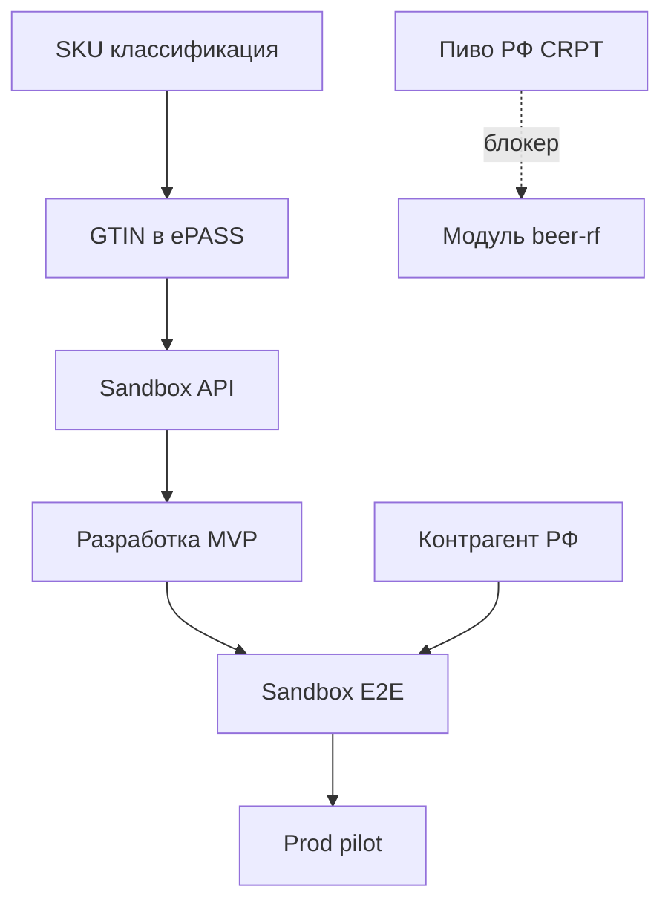

# План выполнения работ

> WBS, этапы, deliverables, роли и контрольные точки проекта UrukhaiMark.  
> Связанные документы: [ROADMAP.md](../ROADMAP.md), [integration-plan.md](integration-plan.md), [architecture-plan.md](architecture-plan.md)

## 1. Цели проекта

| ID | Цель | KPI |
|----|------|-----|
| G1 | End-to-end маркировка освежителей для экспорта в РФ | Успешный sandbox-прогон order→ship |
| G2 | Генерация валидного GS1 DataMatrix | Чтение приложением «Электронный знак» |
| G3 | Снижение ручных операций в ЛК datamark | ≥ 90% операций через API |
| G4 | Поддержка пива (РБ) и расширение | UKZ-модуль в prod |
| G5 | Готовность к промышленной эксплуатации | Runbook + мониторинг |

## 2. Роли и ответственность (RACI)

| Активность | Product Owner | Dev | QA | Оператор маркировки | Бухгалтерия/ERP |
|------------|:-------------:|:---:|:--:|:-------------------:|:---------------:|
| Классификация SKU (ТН ВЭД) | A | C | — | R | C |
| Регистрация GS1/ePASS/datamark | C | C | — | R | — |
| Разработка UrukhaiMark | A | R | C | I | I |
| Sandbox E2E тест | C | R | R | R | — |
| Prod rollout | A | R | R | R | I |
| Ежедневная маркировка | I | C | — | R | I |
| Отгрузки в РФ | C | C | — | R | C |

**R** — исполнитель, **A** — accountable, **C** — consulted, **I** — informed

## 3. WBS — иерархия работ

```
UrukhaiMark
├── 1. Инициация
│   ├── 1.1 Классификация SKU
│   ├── 1.2 Регистрация во внешних системах
│   └── 1.3 Утвержение scope MVP
├── 2. Проектирование
│   ├── 2.1 Архитектура (architecture-plan.md)
│   ├── 2.2 План интеграции
│   ├── 2.3 Модель данных
│   └── 2.4 UI/UX потоки оператора
├── 3. Разработка MVP (cosmetics → RF)
│   ├── 3.1 Инфраструктура + auth
│   ├── 3.2 Orders + codes
│   ├── 3.3 DataMatrix + print
│   ├── 3.4 Reports + shipments
│   └── 3.5 UI/CLI
├── 4. Тестирование и приёмка
│   ├── 4.1 Unit + integration tests
│   ├── 4.2 Sandbox E2E
│   └── 4.3 UAT с оператором
├── 5. Prod rollout
│   ├── 5.1 Prod credentials
│   ├── 5.2 Pilot партия
│   └── 5.3 Runbook + обучение
├── 6. Расширение
│   ├── 6.1 Освежители РБ
│   ├── 6.2 Пиво УКЗ
│   └── 6.3 Пиво РФ (CRPT)
└── 7. Сопровождение
    ├── 7.1 Мониторинг
    ├── 7.2 Обновление API spec
    └── 7.3 Техподдержка
```

## 4. Этапы и сроки

| Этап | Недели | Deliverables | Gate (критерий перехода) |
|------|--------|--------------|--------------------------|
| **E0 Инициаация** | 1–2 | Заполненная product-matrix, sandbox access | GTIN + token получены |
| **E1 Проектирование** | 1 | ADR, data model, integration contracts | Architecture review OK |
| **E2 MVP Dev** | 3–4 | Рабочий sandbox pipeline | E2E sandbox pass |
| **E3 QA/UAT** | 1 | Test report, bugfix | UAT signed off |
| **E4 Prod Pilot** | 1–2 | Prod deploy, 1 реальная партия | Успешная отгрузка в РФ |
| **E5 Расширение** | 4+ | UKZ, RB domestic | По приоритетам ROADMAP |

## 5. Детальный план по спринтам (MVP)

### Спринт 0 (1 нед) — Подготовка

| ID | Задача | Часы (оценка) | Зависимости |
|----|--------|---------------|-------------|
| W0.1 | Сбор ТН ВЭД/ОКПД2 по SKU | 4 | — |
| W0.2 | Заявки GS1, ePASS, datamark, API | 8 | — |
| W0.3 | Scaffold репозитория (src/, config) | 8 | — |
| W0.4 | ADR: выбор стека (Node/Python) | 4 | — |

### Спринт 1 (2 нед) — Core API

| ID | Задача | Часы | Зависимости |
|----|--------|------|-------------|
| W1.1 | Auth client + token refresh | 16 | W0.3, sandbox |
| W1.2 | Catalog sync (/items) | 8 | GTIN |
| W1.3 | Order create + poll + download | 24 | W1.1 |
| W1.4 | KM storage (GS-safe) | 16 | W1.3 |
| W1.5 | Integration tests (mock/sandbox) | 16 | W1.3 |

### Спринт 2 (2 нед) — DataMatrix + Compliance

| ID | Задача | Часы | Зависимости |
|----|--------|------|-------------|
| W2.1 | DataMatrix encoder | 24 | W1.4 |
| W2.2 | Label template ZPL/PDF | 16 | W2.1 |
| W2.3 | Reports: addMark | 12 | W1.4 |
| W2.4 | Reports: addManufacture | 12 | W2.3 |
| W2.5 | Shipments: /v3/ships/add | 16 | W2.4 |
| W2.6 | Golden tests DataMatrix | 8 | W2.1 |

### Спринт 3 (1–2 нед) — UI + E2E

| ID | Задача | Часы | Зависимости |
|----|--------|------|-------------|
| W3.1 | CLI или Web UI: заказ + печать | 24 | W2.* |
| W3.2 | Sandbox E2E сценарий | 16 | W2.5 |
| W3.3 | UAT с оператором | 8 | W3.2 |
| W3.4 | Runbook v1 | 8 | W3.2 |
| W3.5 | Prod deploy | 8 | UAT OK |

**Итого MVP (оценка):** ~200–220 ч (~5–6 недель при 1 FTE dev)

## 6. Deliverables по этапам

| Deliverable | Формат | Этап |
|-------------|--------|------|
| Product matrix (SKU) | docs/product-matrix.md | E0 |
| Architecture decision records | docs/plans/adr/ | E1 |
| Integration test suite | tests/integration/ | E2 |
| DataMatrix golden images | tests/datamatrix-golden/ | E2 |
| Operator runbook | docs/plans/operations-runbook.md | E4 |
| Prod deployment guide | docs/plans/deployment-plan.md | E4 |

## 7. Зависимости и блокеры



| Блокер | Влияние | Mitigation |
|--------|---------|------------|
| Нет sandbox API | Stop dev | Заявка support@datamark.by |
| Нет GTIN | Stop orders | ePASS |
| Пиво → РФ | Фаза 4 отложена | Контрагент CRPT |
| Нет контрагента РФ | Stop ship | Договор с импортёром |

## 8. Риски проекта

| Риск | P | I | Mitigation |
|------|---|---|------------|
| Потеря GS в КМ | H | H | Binary storage, no Excel |
| API datamark changes | M | M | Versioned client, spec monitoring |
| Неверный label_type | M | H | Product Router + validation |
| Принтер низкого качества | M | H | Grade check, тестовая печать |
| Регulatory change | L | H | Мониторинг Belblank/kb |

## 9. Коммуникации

| Событие | Частота | Участники |
|---------|---------|-----------|
| Standup | ежедневно (dev) | Dev, PO |
| Sprint review | 2 нед | Dev, PO, QA, Operator |
| Статус с Belblank | по необходимости | PO, Operator |
| Регulatory check | ежемесячно | PO |

## 10. Definition of Done (DoD)

Задача считается выполненной, если:

- [ ] Код в main, проходит lint/test
- [ ] Integration test для API-вызовов (sandbox или mock)
- [ ] Документация обновлена (если меняется контракт)
- [ ] Нет регрессии GS-целостности КМ
- [ ] Code review (если команда > 1)

## 11. Definition of Ready (DoR) для спринта

- [ ] Sandbox/prod credentials доступны
- [ ] GTIN для тестовых SKU есть
- [ ] Acceptance criteria записаны
- [ ] Блокеры эскалированы

## 12. Чеклист старта разработки

- [ ] product-matrix.md заполнен
- [ ] open-questions.md — критичные закрыты
- [ ] architecture-plan.md согласован
- [ ] integration-plan.md — контракты API
- [ ] Репозиторий scaffold
- [ ] CI pipeline (lint + test)
