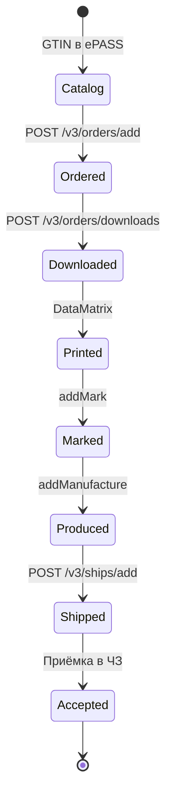

# Экспорт освежителей в РФ (cosmetics, label_type=7)

## Предусловия

- [Регистрация](registration.md) завершена
- GTIN в каталоге, группа `cosmetics`
- Контрагент в РФ в «Честном знаке»

## Поток



## Шаги

| # | Действие | API | Лимит |
|---|----------|-----|-------|
| 1 | Заказ КМ | `POST /v3/orders/add` | ≤ 1000/заказ |
| 2 | Ожидание | `GET /v3/orders/list/{id}` | status=30 |
| 3 | Скачивание | `POST /v3/orders/downloads` | GS = `\u001d` |
| 4 | Печать | UrukhaiMark encoder | grade ≥ 1.5 (C) |
| 5 | Маркировка | `POST /v3/reports/addMark` | report_type=1 |
| 6 | Производство | `POST /v3/reports/addManufacture` | ≤ 10 000 КМ |
| 7 | Отгрузка | `POST /v3/ships/add` | ≤ 30 000 КМ |

## Параметры заказа

```json
{
  "label_type": 7,
  "count": 100,
  "gtin": "04810012345678",
  "comment": "Освежитель, партия YYYY-MM"
}
```

## Отчёт о производстве

КМ должны быть в status **47** (Нанесён) или **50** (Промаркирован).

```json
{
  "group": "cosmetics",
  "labels": ["010481001234567821ABC...\u001d91...\u001d92..."],
  "params": {
    "manufacture_date": "2026-07-01",
    "expiration_date": "2028-07-01"
  }
}
```

## Отгрузка в РФ

```json
{
  "shipping_doc": "tnttn",
  "nomer_tn": "ТТН-001234",
  "agent": 18413,
  "count": 100,
  "country": "643",
  "operation_date": "2026-07-11",
  "labels": ["..."],
  "eas_products": {
    "04810012345678": {
      "certificate_document_data": [{
        "certificate_type": "...",
        "certificate_number": "ЕАЭС BY/...",
        "certificate_date": "2025-01-15"
      }]
    }
  }
}
```

## После отгрузки

1. Контрагент видит поставку в ЛК «Честного знака»
2. Выполняет приёмку
3. Статус СИ в РФ: «Экспортирован в ЕАЭС» → «В обороте»

## См. также

- [api/cookbook.md](../api/cookbook.md)
- [datamatrix-spec.md](../datamatrix-spec.md)
- [troubleshooting.md](../troubleshooting.md)
