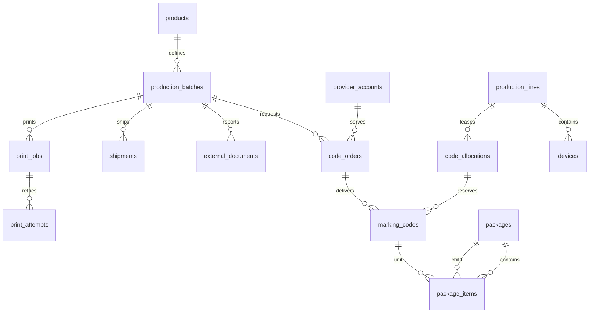

# Целевая модель данных

> PostgreSQL — system of record одной self-hosted-инсталляции.  
> Scope каждой таблицы: `MVP`, `Next` или `Future`.

## 1. Разделение состояний

Нельзя хранить один `status`, одновременно означающий производство, регуляторный
статус и состояние документа.

| Ось | Пример | Источник истины |
|-----|--------|-----------------|
| Batch | `draft`, `codes_ready`, `quality_gate`, `completed` | UrukhaiMark |
| Code lifecycle | `available`, `allocated`, `printed`, `verified`, `rejected` | UrukhaiMark |
| Provider status | raw `30`, `47`, `50` + interpretation | Внешний provider |
| Document | `draft`, `queued`, `submitted`, `accepted`, `rejected` | Квитанция provider |
| Package | `open`, `closed`, `aggregated`, `disaggregated` | UrukhaiMark |

## 2. Основные сущности



### MVP

| Таблица | Ключевые поля |
|---------|---------------|
| `products` | `id`, `gtin`, `name`, `api_group`, `tnved`, `okpd2` |
| `production_batches` | `id`, `product_id`, `destination`, dates, quantity, `batch_status` |
| `provider_accounts` | `id`, provider, environment, secret reference, capabilities |
| `code_orders` | `id`, batch/provider, client request ID, external ID, label type, raw status |
| `marking_codes` | `id`, order/batch, `km_raw BYTEA`, `km_hash`, parsed GTIN/serial, lifecycle |
| `provider_status_history` | entity, provider, raw status/payload hash, observed time |
| `print_jobs` | batch, adapter, requested count, state |
| `print_attempts` | job/code, attempt number, device ACK, result, reason |
| `external_documents` | type, idempotency key, external ID, state, payload hash, receipt |
| `document_codes` | document ID, code ID |
| `shipments` | batch, document number, agent, country, state, certificates |
| `audit_log` | actor/device, entity, action, correlation, details, timestamp |
| `outbox` | event ID/type/version, payload, attempts, published time |

### Next / Future

| Таблица | Scope | Назначение |
|---------|-------|------------|
| `production_lines` | Next | Линия, recipe и operational state |
| `devices` | Next | Printer/scanner/verifier/PLC adapter config |
| `code_allocations` | Next | Атомарная lease пачки КМ линии |
| `line_events` | Next | Print/scan/NOK и sequence |
| `inbox` | Future edge | Дедупликация входящих event IDs |
| `edge_agents` | Future edge | Identity, version, heartbeat, sequence |
| `packages` | Future packaging | Case/pallet identifier, type, version, state |
| `package_items` | Future packaging | Unit code или дочерняя package |
| `aggregation_documents` | Future packaging | Provider operation и receipt |

## 3. Критические типы и ограничения

```sql
CREATE TABLE marking_codes (
  id uuid PRIMARY KEY,
  order_id uuid NOT NULL REFERENCES code_orders(id),
  batch_id uuid NOT NULL REFERENCES production_batches(id),
  km_raw bytea NOT NULL,
  km_hash bytea NOT NULL UNIQUE CHECK (octet_length(km_hash) = 32),
  gtin varchar(14) NOT NULL,
  serial varchar(32) NOT NULL,
  lifecycle_status varchar(32) NOT NULL,
  created_at timestamptz NOT NULL DEFAULT now()
);
```

Правила:

- `km_hash = sha256(km_raw)` вычисляется в trusted persistence boundary;
- валидатор подтверждает ожидаемые GS перед сохранением;
- `api_group` — каноническое имя поля; domain value object может называться `group`;
- raw provider status никогда не заменяется локальным enum;
- полные КМ запрещены в `audit_log.details`;
- строки КМ не hard-delete; исправления представлены событиями.

## 4. Code allocation

Резервирование выполняется одной транзакцией:

```sql
SELECT id
FROM marking_codes
WHERE lifecycle_status = 'available'
ORDER BY id
FOR UPDATE SKIP LOCKED
LIMIT :count;
```

Затем те же записи переводятся в `allocated` и связываются с lease. Unique partial
index допускает только одну активную allocation на код. Истечение lease возвращает
только КМ без подтверждённого print attempt.

## 5. Документы и идемпотентность

| Операция | Локальный ключ |
|----------|----------------|
| Order | provider account + `client_request_id` |
| addMark | batch + отсортированный digest набора КМ |
| addManufacture | batch + payload version |
| Shipment | provider + shipping doc type/number |
| Edge event | глобальный `event_id` |

Timeout сохраняет документ как `reconciliation_required`; он не создаёт автоматический
повтор с новым ID. Domain change и outbox event записываются атомарно.

## 6. Упаковочная иерархия

`package_items` содержит ровно один target: `marking_code_id` либо `child_package_id`.
Циклы запрещены. Закрытая package меняется только через явные disaggregation и новую
версию состава. SSCC — identifier упаковки, а не тип unit КМ.

## 7. Индексы и retention

- `(batch_id, lifecycle_status)` для inventory;
- `(provider_account_id, external_id)` unique для внешних заказов;
- `(state, next_attempt_at)` для worker/outbox;
- `(agent_id, agent_sequence)` unique для edge events;
- `(package_id, active)` для текущего состава;
- audit/provider history — append-only, базовое хранение ≥ 3 лет;
- backup raw KM шифруется и проходит регулярный restore test.

