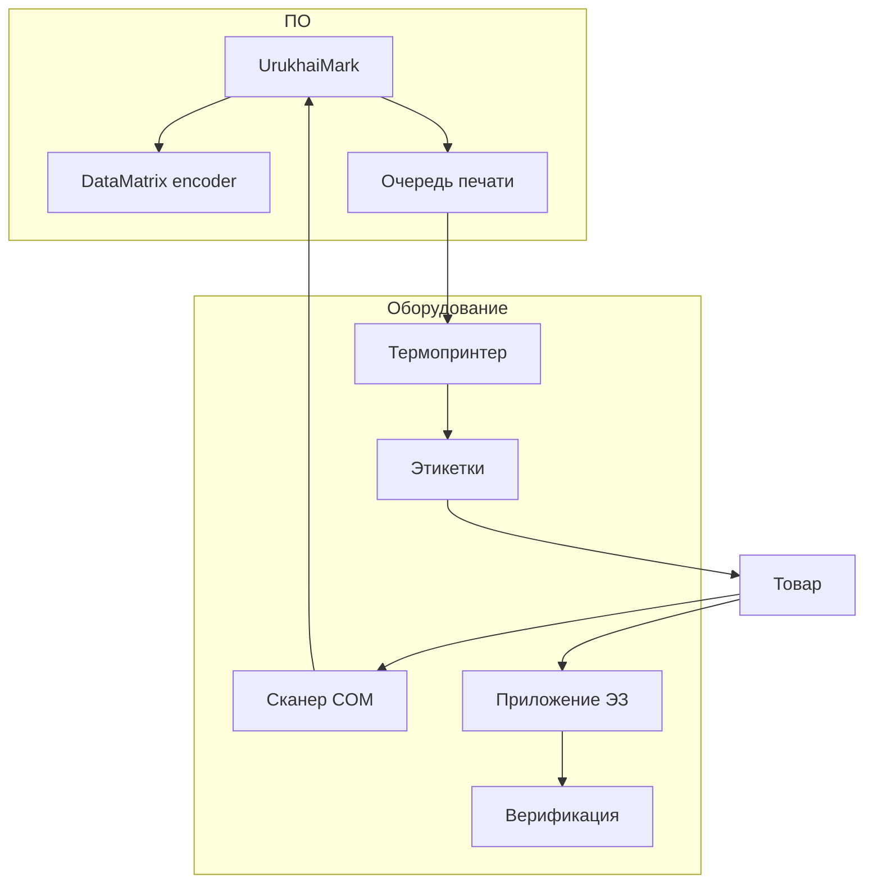

# Оборудование для нанесения и считывания кодов

Практический обзор оборудования для маркировки СИ (GS1 DataMatrix) в формате, ориентированном на малые и средние производства. Конкретные модели — ориентиры; перед закупкой проводите тест с реальными КМ из sandbox API.

## Архитектура рабочего места



---

## Принтеры этикеток

### Настольные термопринтеры (старт)

| Класс | Примеры | Разрешение | Интерфейс | Для UrukhaiMark |
|-------|---------|------------|-----------|-----------------|
| Бюджет | TSC TE200, Zebra ZD220 | 203 dpi | USB, Ethernet | Тесты, малые партии |
| Рабочая лошадка | Zebra ZT230, TSC MB240 | 203/300 dpi | USB, Ethernet | **MVP production** |
| Повышенное качество | Zebra ZT410, TSC MH241 | 300 dpi | Ethernet | Мелкий модуль DM |

**Рекомендация для освежителей:** 203 dpi достаточно при модуле DataMatrix ≥ 0.3 мм; 300 dpi — если этикетка компактная.

### Параметры выбора

| Параметр | Зачем |
|----------|-------|
| **dpi** | Чем выше — тем мельче читаемый модуль |
| **Ширина печати** | 104 мм покрывает этикетку 50×60 мм с полями |
| **Термотрансфер** | Обязателен для аэрозолей (не direct thermal) |
| **ZPL / EPL** | Нативная поддержка в UrukhaiMark Print Queue |
| **Ethernet** | Стабильнее USB в цеху |

### Расходные материалы

| Материал | Для аэрозолей |
|----------|---------------|
| Основа этикетки | PP или PET, клей permanent |
| Лента (ribbon) | Resin или wax-resin, ширина = этикетка |
| Рулон | Внутренний диаметр под втулку принтера |

### Промышленные print-and-apply

Для линий > 50 шт./мин: Weber, Herma, Novexx, Videojet Labeljet.

- Печать + наклейка в одном цикле
- Интеграция: сигнал от PLC, очередь КМ по TCP/OPC
- Требует отдельного ТЗ на интеграцию

---

## Сканеры штрихкодов

### Режимы подключения

| Режим | GS/FNC1 передаётся | Применение |
|-------|-------------------|------------|
| **HID (клавиатура)** | Часто **нет** | Розница, инвентаризация EAN |
| **COM / USB-VCP** | **Да** | Верификация КМ, OTK |
| **Ethernet (промышленный)** | Да | Линия, reject-система |

**Для маркировки КМ — только COM или промышленный с полным ASCII.**

### Типы сканеров

| Тип | Примеры | Когда |
|-----|---------|-------|
| Ручной 2D | Zebra DS2208, Honeywell Xenon | ОТК, выборочный контроль |
| Стационарный | Datalogic Matrix 320 | Над конвейером |
| Мобильный ТСД | Zebra TC series | Склад, приёмка |

### Настройка сканера

1. Включить передачу **GS (0x1D)** и спецсимволов
2. Суффикс CR/LF для ввода в приложение
3. Отключить префиксы, ломающие парсинг AI
4. Проверить: скан → Notepad++ → видны символы GS перед 91 и 92

---

## Верификаторы (grade ISO 15415)

Отдельные устройства измеряют **качество печати** DataMatrix, не только читаемость.

| Устройство | Назначение |
|------------|------------|
| Webscan TruCheck | Стол ОТК, отчёт grade A–F |
| Cognex DataMan | Линия + верификация |
| Microscan LVS | Портативная проверка |

**Порог для маркировки:** grade ≥ **1.5 (C)** по ISO/IEC 15415.

Без верификатора на старте: мобильное приложение «Электронный знак» + визуальный контроль первых 3 шт. каждой партии.

---

## Промышленная печать на линии

| Класс | Производители | Протокол данных |
|-------|---------------|-----------------|
| CIJ | Videojet, Domino, Markem-Imaje | Zipher, ESC, кастом |
| TIJ | Videojet, Markoprint | JSON/XML по TCP |
| Лазер | FOBA, Trumpf, Videojet | PLC триггер |

Интеграция с UrukhaiMark (Фаза 2+):

```
Order Manager → codes DB → Line Adapter (TCP) → Printer
                                ↑
                         Camera verify → reject
```

---

## Программное обеспечение

| Компонент | Роль | UrukhaiMark |
|-----------|------|-------------|
| Encoder | FNC1 + GS1 DataMatrix | `src/datamatrix/` — libdmtx / zxing-cpp |
| Драйвер печати | ZPL generation | `src/labels/` |
| Очередь | 1 КМ = 1 этикетка | Print Queue |
| Валидация | POST /v2/labels | Опционально перед печатью |

**Не использовать:** онлайн QR-генераторы, Excel, «любой штрихкод-плагин» без FNC1.

---

## Минимальный комплект для MVP

| # | Позиция | Ориентир CAPEX |
|---|---------|----------------|
| 1 | Термопринтер 203 dpi (Zebra ZT230 или аналог) | $500–900 |
| 2 | Рулоны PP-этикеток + resin ribbon | $50–100/мес |
| 3 | Сканер 2D в COM-режиме | $150–300 |
| 4 | ПК / мини-ПК с UrukhaiMark | есть |
| 5 | Смартфон с приложением «Электронный знак» | есть |

### Расширенный комплект (линия)

- Print-and-apply аппликатор
- Стационарный сканер + reject
- Верификатор Webscan / Cognex
- Промышленный коммутатор Ethernet

---

## Обслуживание

| Интервал | Действие |
|----------|----------|
| Ежедневно | Тестовая этикетка с КМ из sandbox |
| Еженедельно | Чистка печатающей головки принтера |
| При смене ribbon/рулона | Калибровка (gap sensor) |
| При жалобах на скан | Проверка GS в COM-режиме |

См. [operations-runbook.md](../plans/operations-runbook.md).

## См. также

- [application-methods.md](application-methods.md) — методы нанесения
- [quality-control.md](quality-control.md) — приёмка grade
- [datamatrix-spec.md](../datamatrix-spec.md) — формат кода
