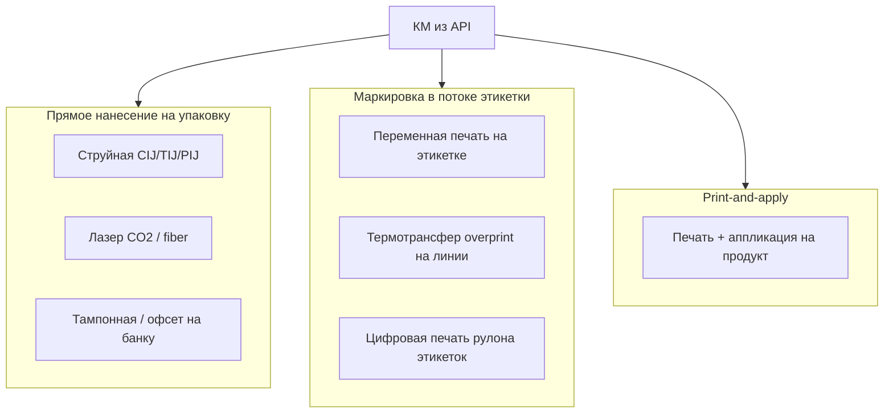
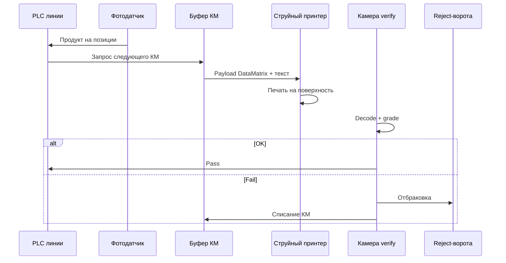
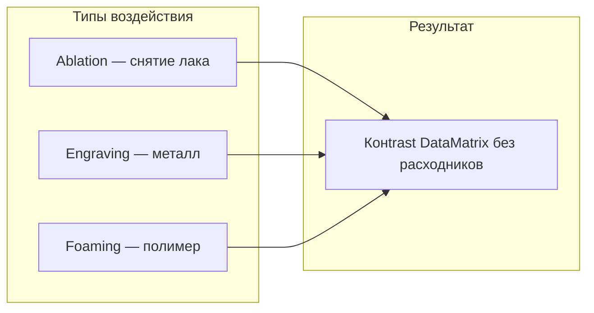
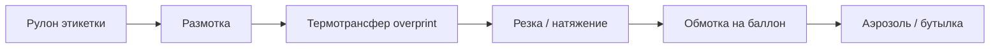
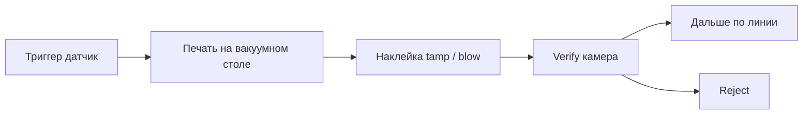
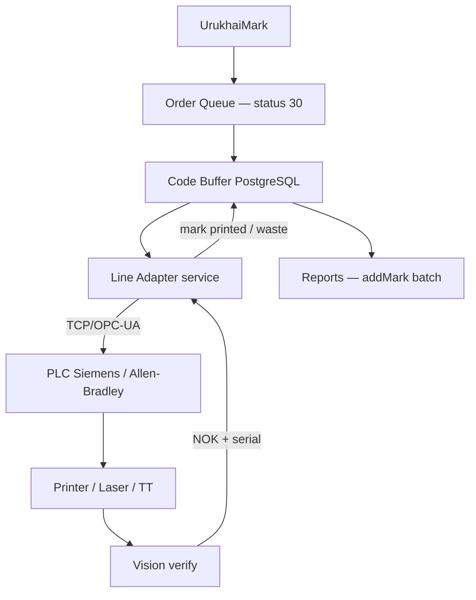
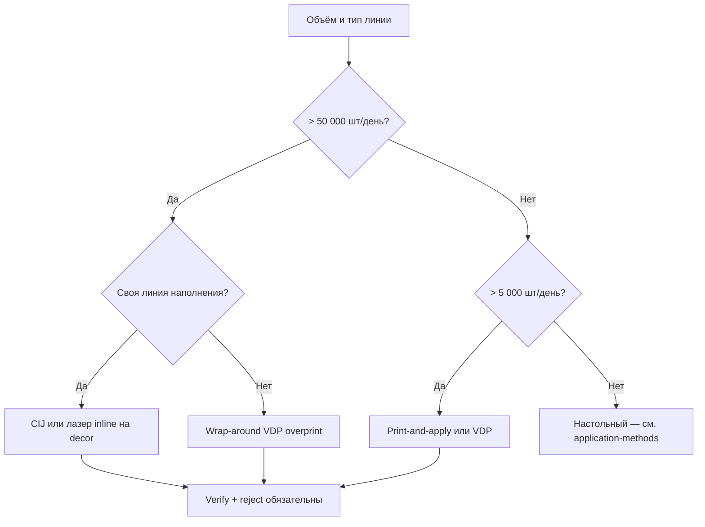

# Промышленное нанесение кода на упаковку

> Inline-маркировка, прямая печать на материал упаковки, лазер, переменная печать на линии — без отдельных наклеек «на столе».
> Обновлено: 14.07.2026

Документ для технолога, инженера упаковочной линии и интегратора. Фокус — **нанесение GS1 DataMatrix непосредственно на упаковку** или на этикетку **в потоке линии**, с верификацией и отбраковкой.

Для ручных наклеек и настольных принтеров см. краткий раздел в [application-methods.md](application-methods.md#настольные-этикетки-кратко).

---

## Классификация промышленных методов

| Метод | Куда наносится | Скорость линии | CAPEX | Аэрозоль | ПЭТ/HDPE | Картон |
|-------|----------------|----------------|-------|----------|----------|--------|
| CIJ inkjet | Металл, лак, пластик | до 600+ шт/мин | €30–80k | **Да*** | Да | Редко |
| TIJ / PIJ | Пластик, этикетка, картон | 50–300 шт/мин | €15–50k | Да | **Да** | **Да** |
| Лазер fiber/CO2 | Металл, PP, PET, лак | 100–500 шт/мин | €40–120k | Да** | Да | Да |
| Термотрансфер на линии | Этикетка wrap-around | 100–400 шт/мин | €20–60k | **Да** | **Да** | — |
| Цифровая VDP (Inkjet UV) | Рулон этикетки | 30–150 м/мин | €100k+ | **Да** | **Да** | Да |
| Print-and-apply | Готовая этикетка → продукт | 80–200 шт/мин | €25–70k | Да | Да | Да |
| Офсет на банку (decor) | Металл до сборки | 200–800 шт/мин | €500k+ (линия) | **Завод** | — | — |

\* С тестом на лакированной поверхности и grade C  
\** Часто снятие верхнего слоя лака или маркировка в «окне» без лака

---

## 1. Прямая струйная печать (CIJ / TIJ / PIJ)

Код наносится **чернилами или УФ-чернилами прямо на поверхность** упаковки — без промежуточной этикетки.

### Принцип работы на линии

### CIJ (Continuous Inkjet)

**Где применяют:** металлические аэрозольные баллоны, алюминиевые тубы, стекло, твёрдый пластик.

| Параметр | Типичное значение |
|----------|-------------------|
| Производители | Videojet, Domino, Markem-Imaje, Linx |
| Скорость | 150–600 баллонов/мин (зависит от числа головок) |
| Разрешение | Достаточно для module ≥ 0.25 мм при правильной настройке |
| Чернила | Быстросохнущие, MEK/этанол; для металла — пигментные |
| Сушка | Встроенная или туннель; на лаке — УФ-дополнительная сушка |

**Особенности аэрозоля:**

- Печать на **лакированном алюминии** — нужны пигментные чернила + тест на истирание (SIM 4650 / внутренний протокол)
- Зона печати: **плоский участок** между ребрами жёсткости или в «окне» декоративной литографии
- Ориентация баллона: **ориентатор** (twist) перед печатью обязателен
- Высота печати: 1–3 мм от поверхности, автоматическая регулировка при вибрации линии

**Интеграция данных:**

- Протоколы: Zipher/Text Communications (Videojet), Domino RS232/Ethernet, ESC-протоколы OEM
- UrukhaiMark Line Adapter: TCP-сокет → очередь КМ → триггер от PLC
- Каждый отбракованный отпечаток = **списание serial**, не повтор на следующем баллоне без учёта

### TIJ (Thermal Inkjet)

**Где применяют:** картон, гофрокороб, плёнка, этикетка в рулоне, HDPE/ПЭТ (с primer).

| Параметр | Значение |
|----------|----------|
| Производители | Videojet, Markoprint, Domino Gx, HP-based OEM |
| Скорость | 50–200 шт/мин на одну головку |
| Разрешение | 300–600 dpi — **удобно для мелкого DataMatrix** |
| Расходники | Картриджи; для промышленности — bulk-системы |

Плюс TIJ для DataMatrix: стабильный **modulation** grade за счёт высокого dpi. Минус: меньшая стойкость на гладком металле без primer — для аэрозолей чаще CIJ или лазер.

### PIJ (Piezo Inkjet)

Промышленные головки (Kyocera, Xaar) в системах **Domino K-Series, Markem-Imaje UHS** — компромисс между скоростью CIJ и качеством TIJ. Используют на **линиях этикеток** и для **прямой печати на упаковку** в фарме и напитках.

---

## 2. Лазерная маркировка

> Подробный разбор: **[laser-engraving.md](laser-engraving.md)** — ablation, гравировка, annealing, fiber vs CO2, аэрозоль, интеграция.

Луч изменяет поверхность: обугливание, вспенивание полимера, снятие слоя лака/краски (**ablation**).

| Тип лазера | Материал | Применение |
|------------|----------|------------|
| **Fiber** (1064 nm) | Металл, алюминий, лак | Аэрозольные баллоны — маркировка в «окне» |
| **CO2** (10.6 µm) | Бумага, картон, PP, PET | Короба, плёнка, этикетка |
| **UV-laser** | Стекло, некоторые лаки | Премиум-косметика |

### Аэрозоль: лазер на алюминии

Типовая схема крупного завода:

1. **Bodymaker** → литография/лак → **лазерная станция** → наполнение → crimp
2. DataMatrix в зоне **матового** или **снятого лака** — контраст A/B grade
3. Скорость: 200–400 банок/мин, 1–2 лазерные головки

| Плюсы | Минусы |
|-------|--------|
| Нулевые расходники (чернила) | Высокий CAPEX |
| Не стирается, не выцветает | Нужен ТЗ на лак с производителем банки |
| Встроенная traceability на линии | Смена формата = перенастройка оптики |

Производители: FOBA, Videojet Laser, Markem-Imaje SmartLase, Gravotech.

### Верификация лазера

Лазерная маркировка даёт **низкий Symbol Contrast** при неправильном лаке — камера verify обязательна с первого дня. Критерий: grade ≥ C; для экспорта в РФ рекомендуется **B (2.5)** с запасом.

---

## 3. Переменная печать на этикетке линии (VDP)

Этикетка **не печатается заранее в типографии с одним кодом**. Статичный дизайн (логотип, состав) + **переменное поле DataMatrix** наносится на линии.

### Схема wrap-around для цилиндрической упаковки

| Узел | Функция |
|------|---------|
| Рулон pre-print | Статика: бренд, EAN, регламентный текст |
| **Overprint-модуль** | Термотрансфер или TIJ: DataMatrix + serial + дата |
| Ориентатор | Совмещение переменного поля с «окном» макета |
| Аппликатор | Wrap-around, front-and-back, или two-panel |

**Производители labeling + VDP:** Herma, P.E. Labellers, Krones, Sidel (PET), Weiler, EPI.

### Термотрансфер overprint на линии

- Принтер класса **industrial near-line**: Avery Dennison, Videojet 2350, Markem-Imaje 2200 series, Domino M-series
- Устанавливается **между размоткой и аппликатором** или на вакуумном барабане
- Триггер: энкодер + метка на рулоне (registration mark)
- **Registration**: ±0.5 мм — иначе DataMatrix попадает на шов или край

### Цифровая печать рулона (digital label press)

Для средних тиражей с **полностью переменным** макетом:

- **HP Indigo**, **Xeikon**, **Gallus Digital** — печать всего рулона с уникальным КМ на каждой этикетке
- КМ загружаются **до** печати рулона (batch из UrukhaiMark)
- Линия только наклеивает — overprint не нужен
- Минус: lead time на рулон; плюс: максимальное качество DM

---

## 4. Print-and-apply (промышленный)

Отдельный класс: **печать этикетки в момент аппликации** — не pre-printed roll с VDP, а полный цикл на каждый продукт.

| Режим аппликации | Упаковка |
|------------------|----------|
| **Tamp-blow** | Плоские грани короба, верх крышки |
| **Wrap / merge** | Цилиндр — двухсекционная этикетка |
| **Corner wrap** | Короб — код на двух гранях |
| **Swing-arm** | Боковая поверхность на конвейере |

Производители: **Weber Marking**, **Novexx Solutions**, **Herma**, **Videojet Labeljet**, **EPI / Logopak**.

### Для аэрозоля

- Баллон проходит через **роликовый ориентатор** → print-and-apply на **плоскую зону** или **flag label**
- Скорость: 80–150 шт/мин
- Этикетка PP/PET + термотрансфер resin — стойкость к бытовой химии
- **Преимущество перед ручной наклейкой:** 100% verify, reject, привязка serial к PLC

---

## 5. Литография и офсет на металлическую банку (decor printing)

На **крупных заводах аэрозолей** декор наносится офсетом **до** наполнения. DataMatrix может быть:

| Подход | Описание |
|--------|----------|
| **Статичный placeholder** | **Запрещено** — каждый КМ уникален |
| **Окно под VDP** | В макете decor оставлено белое поле → overprint CIJ/лазер/TIJ |
| **Полностью digital decor** | Цифровая печать на банку (редко, дорого) |
| **Hybrid** | Decor офсет + inline лазер/CIJ в зарезервированной зоне 25×25 мм |

Это **уровень OEM-завода**, не contract packing. CAPEX линии bodymaker + decor: €1M+. Для contract manufacturer освежителей реалистичнее **wrap-around VDP** или **print-and-apply**.

---

## 6. УФ-струйная печать (UV inkjet)

Прямая печать **УФ-отверждаемыми** чернилами на пластик, стекло, металл с primer.

- Головки: Xaar, Kyocera в системах **Markem-Imaje**, **Domino**, **Durst**
- Мгновенное отверждение УФ-лампой — подходит для **высокоскоростных линий**
- На аэрозольном лаке: нужен **adhesion promoter** или зона без лака
- Grade: обычно B–A при module ≥ 0.3 мм

Применение растёт в **косметике и бытхимии** там, где лазер нельзя (цветной лак) а CIJ недостаточно контрастен.

---

## 7. Термоусадочная этикетка (sleeve) с переменным кодом

**Shrink sleeve** из ПЭТ/ПВХ с печатным decor + переменный DataMatrix:

1. Цифровая или flexo + **offline** overprint TIJ рулона sleeve
2. Или **надевание sleeve** + **лазер/CIJ поверх** (если зона плоская после usadki)

Минус для аэрозолей: **искажение** DataMatrix на зоне с высокой кривизной. Код размещают на **верхней плоской части** sleeve или на **крышке** (если крышка — часть sleeve).

---

## Интеграция с UrukhaiMark и линией

### Архитектура Line Adapter

### Контракт данных на линию

| Поле | Формат | Примечание |
|------|--------|------------|
| `km_raw` | string с `\u001d` | Не передавать через CSV |
| `datamatrix_payload` | hex / bitmap / printer-native | Зависит от OEM |
| `serial` | AI 21 | Для логов reject |
| `gtin` | AI 01 | Сверка с линией |
| `sequence_id` | int | Идемпотентность при повторе триггера |

### Правила reject

1. **NOK verify** → продукт в reject-bin, КМ → `waste` (не в manufacture)
2. **Дубль триггера** → не выдавать второй КМ на тот же физический продукт
3. **Простой линии > N мин** → pause buffer; при resume — sync count с фактическим выпуском
4. **Смена GTIN** → flush buffer, новый order

---

## Выбор метода: аэрозоль 3307 (экспорт РФ)

| Сценарий | Рекомендуемый метод | Ориентир CAPEX |
|----------|---------------------|----------------|
| Завод, 200+ банок/мин | CIJ multi-head или fiber laser | €80–150k + интеграция |
| Contract pack, 80–150/мин | Print-and-apply (Weber/Novexx) | €40–70k |
| Линия с wrap-around label | TT overprint на Herma/EPI | €30–50k |
| Средний тираж, batch SKU | Digital label roll + applicator | €20–40k + стоимость рулонов |
| Пилот / < 3k/день | Настольный (вне scope этого док.) | — |

---

## Контроль качества на линии (обязательный минимум)

| Узел | Оборудование | Действие при fail |
|------|--------------|-------------------|
| После печати | Cognex DataMan / Datalogic Matrix | Stop или reject |
| Выборочный OQC | Ручной 2D COM-сканер | 1/100 audit |
| Offline | Webscan TruCheck | Калибровка после смены чернил/ribbon |

**100% inline verify** — industry standard для маркировки ЕАЭС на скоростных линиях. Без камеры производитель рискует партией с нечитаемыми кодами после отгрузки в РФ.

Подробнее: [quality-control.md](quality-control.md).

---

## Типовые ошибки промышленного внедрения

| Ошибка | Последствие |
|--------|-------------|
| Печать без ориентатора на цилиндре | Код на ребре, grade F |
| Нет reject при NOK | КМ в отчёте, на банке — брак |
| HID-сканер на линии | «Нет криптохвоста» в логах |
| Один buffer на две линии | Перепутанные serial |
| Статичный DM в decor-файле | Вся партия — один КМ, уголовная ответственность |
| Экономия на primer для TIJ на металле | Отслоение чернил через 2 недели |

---

## Чеклист внедрения (промышленная линия)

- [ ] ТЗ: скорость, материал, температура, влажность цеха
- [ ] Тестовые баллоны/упаковка с КМ из sandbox — grade на **вашем** материале
- [ ] Выбор зоны печати с R&D упаковки (не пересекается с decor)
- [ ] Line Adapter: протокол PLC, idempotency, waste flow
- [ ] 100% camera verify + физический reject
- [ ] SOP: смена ribbon/чернил, калибровка, первые 10 шт. партии
- [ ] Связка `printed_serial` → addMark только после OQC смены
- [ ] Стресс-тест: холод, влага, падение — по [packaging-carriers.md](packaging-carriers.md)

---

## См. также

- [packaging-carriers.md](packaging-carriers.md) — зоны размещения на аэрозолях и флаконах
- [equipment.md](equipment.md) — модели оборудования, протоколы
- [quality-control.md](quality-control.md) — grade ISO 15415
- [datamatrix-spec.md](../datamatrix-spec.md) — формат КМ для encoder
- [architecture.md](../architecture.md) — Line Adapter в UrukhaiMark (план)
