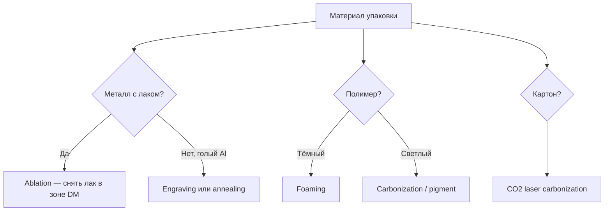
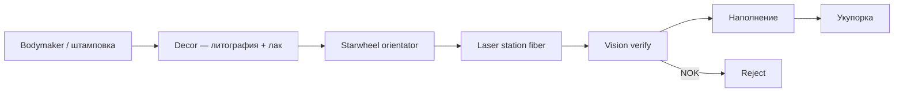
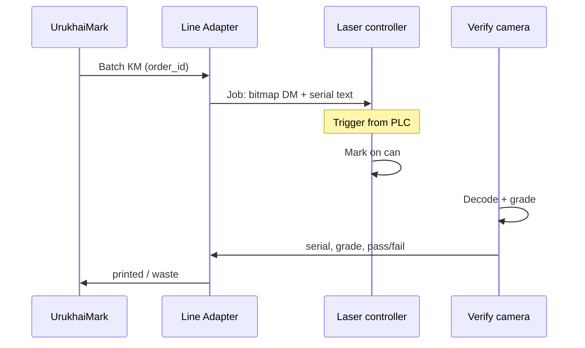

# Лазерная гравировка кодов маркировки

> Промышленное нанесение GS1 DataMatrix лазером: механизмы, материалы, линия, качество.
> Обновлено: 14.07.2026

**Лазерная гравировка** в контексте маркировки — это не художественная резьба, а **программируемое изменение поверхности упаковки** под 2D-символику DataMatrix. Луч формирует матрицу из тёмных и светлых модулей за счёт снятия покрытия, изменения структуры металла или вспенивания полимера.

Связанные документы: [industrial-marking.md](industrial-marking.md) · [packaging-carriers.md](packaging-carriers.md) · [quality-control.md](quality-control.md)

---

## Гравировка vs другие лазерные режимы

В промышленной маркировке используют несколько физических режимов. В быту их все называют «лазерная гравировка», но для DataMatrix важно различать механизм — от него зависят контраст, стойкость и grade.

| Режим | Что происходит | Вид маркировки | Материалы |
|-------|----------------|----------------|-----------|
| **Ablation (абляция)** | Снимается слой лака, краски, anodize | «Выжженный» рисунок на фоне decor | Алюминий с лаком, painted metal |
| **Engraving (гравировка)** | Физическое углубление в металл/полимер | Воронка 10–50 µm | Алюминий без лака, сталь, PP |
| **Annealing (отжиг)** | Оксидный слой на металле без снятия материала | Тёмный код на блестящем металле | Нержавейка, титан (реже — алюминий) |
| **Foaming (вспенивание)** | Микропузыри в полимере → светлый код | Белый DM на тёмном пластике | PET, PP, PE (тёмные) |
| **Carbonization** | Обугливание поверхности | Тёмный код | Картон, бумага, некоторые лаки |



**Для аэрозольных баллонов (3307)** типовой режим — **ablation** в «окне» decor-лака или **engraving** на матовой/не лакированной зоне.

---

## Типы лазеров

| Лазер | Длина волны | Лучше всего для | Скорость DM | CAPEX |
|-------|-------------|-----------------|-------------|-------|
| **Fiber (волоконный)** | 1064 nm | Алюминий, лак, сталь | **Высокая** | €40–100k |
| **CO2** | 10.6 µm | Картон, бумага, PP, PET, стекло | Средняя | €25–60k |
| **UV (diode-pumped)** | 355 nm | Стекло, чувствительный пластик, тонкие лаки | Средняя | €60–120k |
| **Green** | 532 nm | Подложки, отражающие поверхности | Ниже | €80k+ |

### Fiber — основной выбор для металлической тары

- Высокая плотность мощности → ablation лака за микросекунды
- Galvo-сканер: 600–1200 mm/s по полю маркировки
- DataMatrix 20×20 мм: **0.05–0.3 с** на одну банку (зависит от мощности и глубины)
- На линии 200–400 банок/мин — 1–2 головки или высоковаттный (50–100 W) fiber

### CO2 — для вторичной упаковки

- Гофрокороб, этикетка на бумаге, некоторые плёнки
- Не подходит для **голого алюминия** (высокое отражение 1064 nm — fiber нужен)
- DataMatrix на картоне: carbonization, grade A/B при правильной настройке

### UV — нишевые случаи

- Стеклянные флаконы косметики без etching-пасты
- Тонкие лаки, где fiber даёт прожиг
- Медленнее fiber, но меньше теплового воздействия

---

## Аэрозольный баллон: схема на заводе



### Подготовка поверхности (критично)

Лазер **не рисует поверх чёрного лака на чёрном фоне**. Нужен контраст:

| Подход | Описание |
|--------|----------|
| **Окно в decor** | В макете литографии зарезервировано поле 25×25 мм под **светлый/матовый** лак или голый металл |
| **Конtrast lacquer** | Специальный лак, меняющий цвет под лазером (laser-sensitive coating) |
| **Ablation top-coat** | Снимается только верхний слой цветного лака — виден нижний (светлый) |
| **Матовая полоса** | Технологическая зона без глянца — меньше бликов для камеры verify |

ТЗ на decor согласуют **до** закупки лазера: производитель банки + интегратор лазера + R&D упаковки.

### Ориентация цилиндра

Баллон не стоит на месте — его **поворачивают** starwheel или belt-twist:

1. Фотодатчик находит метку orient на decor (точка, notch, штрих)
2. PLC даёт триггер лазеру в момент, когда «окно» в зоне фокуса
3. Допуск по углу: **±1–2°** — иначе искажение DataMatrix и падение Modulation

### Параметры маркировки (ориентиры для fiber 30–50 W)

| Параметр | Типичное значение |
|----------|-------------------|
| Мощность | 30–80% duty (зависит от лака) |
| Скорость galvo | 400–800 mm/s |
| Частота импульсов | 20–100 kHz |
| Глубина ablation | 5–20 µm (не глубже — риск прожига) |
| Размер поля | 30×30 – 50×50 mm |
| Module size DataMatrix | ≥ 0.25 mm (0.3 mm — запас для grade B) |
| Focal distance | 100–200 mm (f-theta lens) |

Настройка — **только на образцах** с последующим grade-отчётом ISO 15415.

---

## DataMatrix лазером: технические нюансы

### Отличие от линейного штрихкода

DataMatrix — **плотная матрица** с finder pattern по периметру. Лазеру нужно:

- Стабильная **мощность по всему полю** (uniformity) — иначе Modulation падает
- Чёткие границы модулей — galvo с минимальным overshoot
- **Quiet zone** — не «догравировать» decor вокруг символа

### FNC1 и GS — только в данных, не на поверхности

Лазер кодирует **bitmap символа**, сгенерированного encoder'ом из КМ. FNC1 и GS — в **логической строке** КМ; на металле видна только матрица. Encoder UrukhaiMark обязан использовать GS1 DataMatrix, не QR.

### Человекочитаемый текст

Рядом с матрицей лазером же гравируют GTIN и serial — экономия на отдельной печати. Шрифт: sans-serif, высота ≥ 1.5 mm, не пересекать quiet zone.

---

## Материалы и режимы

### Алюминий (аэрозоль)

| Состояние поверхности | Режим | Контраст | Стойкость |
|----------------------|-------|----------|-----------|
| Лак + ablation | Fiber | **Высокий** | Отличная — код в структуре поверхности |
| Голый матовый Al | Engraving | Средний | Отличная |
| Глянцевый Al | Annealing | Низкий–средний | Хорошая, но grade риск |
| Толстый цветной лак | Ablation 2 слоя | Зависит от decor | Тест обязателен |

### Пластик (флаконы, крышки)

| Материал | Лазер | Режим |
|----------|-------|-------|
| PP / PE тёмный | CO2 или fiber | Foaming → светлые модули |
| PET прозрачный | CO2 | Engraving на этикетке или sleeve |
| HDPE | Fiber low power | Осторожно — плавление краёв |

### Стекло

- UV-laser или CO2 с coating
- DataMatrix на дне/боку — grade B достижим
- Для маркировки ЕАЭС на стекле чаще **этикетка + VDP**, лазер — premium-сегмент

### Картон

- CO2 carbonization — простой и дешёвый inline
- Скорость до 300 м/мин на гофролинии (один код на короб)

---

## Оборудование

### Производители промышленных laser marking systems

| Производитель | Серии | Заметки |
|---------------|-------|---------|
| **FOBA** | Y-Series, M-Series | Сильны на металле, vision alignment |
| **Videojet** | 3640, 3340 | Интеграция с CIJ-экосистемой |
| **Markem-Imaje** | SmartLase | Линии напитков/аэрозолей |
| **Trumpf** | TruMark | Высокая мощность, automotive |
| **Gravotech** | LW2, Integrated | Маркировка + механика |
| **Han's Laser**, **Sino-Galvo** OEM | — | Бюджетные fiber-станции |

### Состав установки

```
┌─────────────────────────────────────────┐
│  Fiber laser source (20–100 W)          │
│       ↓                                 │
│  Galvo scanner + f-theta lens           │
│       ↓                                 │
│  Controller (Marking software / PLC)    │
│       ↓                                 │
│  Vision (optional): pre-align + verify  │
│       ↓                                 │
│  Exhaust / fume extraction (лак!)       │
└─────────────────────────────────────────┘
```

**Удаление дыма обязательно** — при ablation лака токсичные пары, установка фильтрации по OSHA/локальным нормам.

---

## Лазер vs CIJ на аэрозольной линии

| Критерий | Fiber laser | CIJ inkjet |
|----------|-------------|------------|
| Расходники | Электричество | Чернила, растворитель |
| Стойкость кода | **Максимальная** | Хорошая (пигмент) |
| Зависимость от decor | **Высокая** — нужно «окно» | Средняя — чернила на лак |
| CAPEX | €80–120k | €30–80k |
| Смена SKU | Перенастройка job-файла | Смена макета |
| Grade DataMatrix | A–B при правильном лаке | B–C типично |
| Простой | Мало moving parts | Промывка, обслуживание головок |
| Экология | Фильтрация дыма | VOC от чернил |

**Когда лазер оправдан:**

- Завод с **собственной линией** bodymaker + decor
- Требование **не стираемой** маркировки (истирание, растворители, UV)
- Объём **> 100k банок/день** — окупаемость расходников CIJ
- Decor уже содержит **laser-friendly** окно

**Когда лучше CIJ:**

- Contract packing, разные decor от заказчиков
- Нет контроля над формулой лака
- Бюджет ограничен, линия < 100 шт/мин

---

## Интеграция с UrukhaiMark



| Задача | Реализация |
|--------|------------|
| Генерация bitmap | Encoder → SVG/PNG → laser software (EMF, DXF, native) |
| Один КМ — одна банка | Триггер + idempotency в Line Adapter |
| NOK verify | Reject + `waste` serial в UrukhaiMark |
| Job change по GTIN | Разные шаблоны поля маркировки |

Протоколы laser controller: **EtherNet/IP**, **Profinet**, **TCP** (FOBA, Videojet), **OPC-UA** (новые линии).

---

## Качество и верификация

Лазерная маркировка часто даёт **низкий Symbol Contrast** при:

- Глянцевая поверхность (блики)
- Недостаточная глубина ablation
- Перегрев — «размытые» модули (Fixed Pattern Damage)

| Мера | Эффект |
|------|--------|
| Матовое «окно» в decor | +Contrast |
| 100% inline camera (Cognex DataMan) | Отлов NOK до наполнения |
| Offline Webscan при смене лака | Калибровка параметров |
| Module ≥ 0.3 mm | Запас по Modulation |

**Минимум:** grade C (1.5). **Для экспорта в РФ:** целиться в B (2.5).

Лазерный код **нельзя «переклеить»** — брак = физический reject банки (или списание пустой тары до fill, если reject до наполнения).

---

## Типичные ошибки

| Ошибка | Последствие |
|--------|-------------|
| Лазер на глянцевый лак без теста | Grade F, партия под reject |
| Нет orientator | Код на шве баллона |
| Экономия на exhaust | Безопасность + загрязнение оптики |
| Слишком глубокая гравировка | Прожиг, утечки на линии fill |
| Статичный job без serial | Один код на партию — нарушение закона |
| QR bitmap вместо DataMatrix | Не принимается «Честным знаком» |

---

## Чеклист внедрения лазера

- [ ] Образцы банок с **финальным** decor от поставщика тары
- [ ] Зарезервировано «окно» 25×25 mm в макете decor
- [ ] Тест ablation/engraving → grade ISO 15415 на 50 банках
- [ ] Starwheel orientator с допуском ±1°
- [ ] Fume extraction установлен и сертифицирован
- [ ] Inline verify + reject **до** наполнения (если возможно)
- [ ] Line Adapter: КМ → laser job → waste flow
- [ ] Стресс-тест: истирание, ацетон, холод — по [quality-control.md](quality-control.md)
- [ ] SOP калибровки после смены партии лака

---

## См. также

- [industrial-marking.md](industrial-marking.md) — лазер в контексте всех inline-методов
- [packaging-carriers.md](packaging-carriers.md) — зоны «окна» на аэрозоле
- [datamatrix-spec.md](../datamatrix-spec.md) — формат КМ для encoder
- [equipment.md](equipment.md) — сканеры и верификаторы
