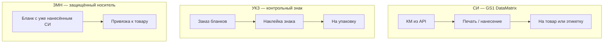
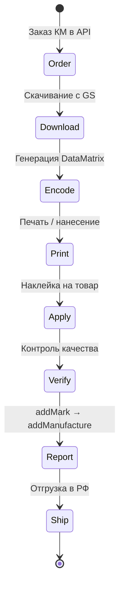
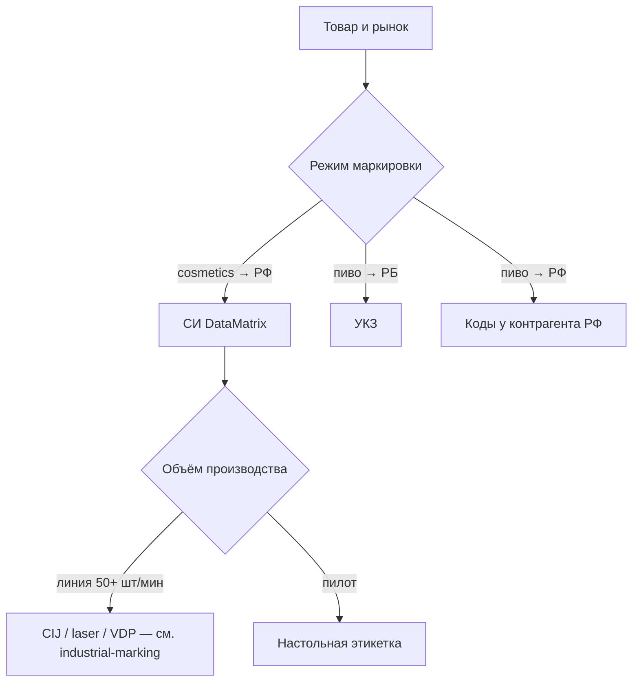

# Обзор: технология нанесения кодов на товары

## Зачем наносить код

Государственная система маркировки требует, чтобы каждая единица товара (или партия — для УКЗ) имела **уникальный идентификатор**, связанный с производителем, датами и цепочкой поставок. Код на упаковке — это не декоративный штрихкод для кассы, а **юридически значимое средство идентификации (СИ)** или **унифицированный контрольный знак (УКЗ)**.

Без физического нанесения код существует только в базе оператора. Пока DataMatrix не прочитан сканером с упаковки и не подтверждён отчётом «Маркировка» — товар **не считается промаркированным**.

## «QR» в быту vs стандарт на практике

| Как говорят | Что на самом деле | Где применяется |
|-------------|-------------------|-----------------|
| «QR-код», «QR Честного знака» | GS1 **DataMatrix** ECC 200 | СИ на косметике, бытхимии, лекарствах и др. |
| «Штрихкод EAN» | EAN-13 / GTIN в линейном виде | Розничная касса (дополнительно к КМ) |
| «Наклейка с буквами» | **УКЗ** — физический бланк | Пиво, табак, обувь (РБ) |

DataMatrix визуально похож на QR: квадрат из чёрно-белых модулей. Отличия критичны для генератора и сканера:

- DataMatrix использует **FNC1** (ASCII 232) в начале строки GS1
- Разделители полей — **GS** (ASCII 29), не видимые в Excel
- Символика **ECC 200**, не QR Code

Подробнее: [datamatrix-spec.md](../datamatrix-spec.md), [glossary.md](../glossary.md).

## Три режима физической маркировки

### 1. СИ (средство идентификации) — DataMatrix

**Основной режим для экспорта освежителей в РФ** (UrukhaiMark MVP).

- Код заказывается через API `datamark.by` (`label_type=7` для РФ)
- Генерируется GS1 DataMatrix с криптохвостом (AI 91, 92)
- Наносится **на каждую единицу товара** до ввода в оборот
- Учёт поэкземплярный: один КМ = одна банка/флакон

### 2. УКЗ (унифицированный контрольный знак)

**Режим для пива в РБ** — не DataMatrix на товаре.

- Заказываются **физические бланки** с защитными элементами
- Наклеиваются на упаковку вручную или полуавтоматом
- Размер зависит от объёма: 17×18 мм (до 1 л), 17×34 мм (свыше 1 л)
- API и процесс отличаются от СИ

См. [domestic-rb-beer.md](../processes/domestic-rb-beer.md).

### 3. ЗМН (защищённый материальный носитель)

Бланк, на котором **уже напечатан** DataMatrix оператором. Используется там, где производитель не печатает код сам (например, импортные товары, отдельные товарные группы). Для целевых SKU UrukhaiMark (освежители, аэрозоли) — **типовой путь через самостоятельную печать СИ**.

## Жизненный цикл: от кода до приёмки

| Этап | Ответственный | Критерий готовности |
|------|---------------|---------------------|
| Заказ КМ | UrukhaiMark / ЛК | status=30, запас ≥ 7 дней |
| Печать | Цех / оператор | Grade ≥ 1.5 (C), читается приложением |
| Нанесение | Упаковочная линия | Код на видимой поверхности, не повреждён |
| Верификация | ОТК | 100% первых 3 шт. + выборочный контроль |
| Отчётность | UrukhaiMark | status 47/50 перед manufacture |

Полный процесс для освежителей: [export-rf-cosmetics.md](../processes/export-rf-cosmetics.md).

## Где размещать код на упаковке

Общие требования операторов ЕАЭС:

1. **Читаемость** — код не перекрыт плёнкой, крышкой, швом этикетки
2. **Контраст** — тёмные модули на светлом фоне (или инверсия, если допускается)
3. **Размер** — достаточный для grade C при типовом расстоянии сканирования (15–30 см)
4. **Зона тишины** — свободное поле вокруг символа (обычно 1 модуль со всех сторон)
5. **Дублирование** — человекочитаемый GTIN и serial рядом с матрицей (рекомендуется)

Детали по типам упаковки: [packaging-carriers.md](packaging-carriers.md).

## Что выбирает производитель

Матрица решений по SKU: [product-matrix.md](../product-matrix.md).  
Промышленное нанесение: [industrial-marking.md](industrial-marking.md).

## Типичные ошибки на старте

| Ошибка | Последствие |
|--------|-------------|
| Генерация QR вместо DataMatrix | Код не принимается ни в РБ, ни в РФ |
| Печать из Excel | Потеря GS-разделителей, «нет криптохвоста» |
| HID-сканер для приёмки | Не передаёт управляющие символы |
| Нанесение на кривую поверхность без теста | Grade ниже C, отказ на таможне/у импортёра |
| Отчёт manufacture до физической маркировки | Нарушение порядка, штрафы |

См. [troubleshooting.md](../troubleshooting.md).

## См. также

- **[industrial-marking.md](industrial-marking.md)** — промышленное inline-нанесение
- [application-methods.md](application-methods.md) — пилотные наклейки
- [equipment.md](equipment.md) — оборудование
- [quality-control.md](quality-control.md) — контроль качества печати
