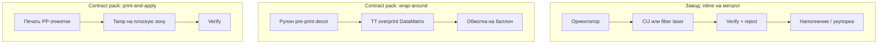

# Упаковка и носители кода

Рекомендации по размещению GS1 DataMatrix и УКЗ в зависимости от типа упаковки. Требования операторов ЕАЭС сформулированы обобщённо; для конкретного SKU сверяйтесь с [product-matrix.md](../product-matrix.md) и базой знаний [kb.belblank.by](https://kb.belblank.by/).

## Принципы размещения

```
┌────────────────────────────────────────────────────────────┐
│  ✓ Плоская или слабо выпуклая зона                        │
│  ✓ Видна покупателю и инспектору без разворота            │
│  ✓ Не пересекается с швом, зигзагом, перфорацией         │
│  ✓ Контраст: тёмный код на светлом фоне (или наоборот)    │
│  ✓ Зона тишины — минимум 1 модуль DataMatrix со всех сторон│
│  ✗ Под термоусадочной плёнкой без теста                   │
│  ✗ На крышке, которую открывают и выбрасывают              │
│  ✗ На донышке (не сканируется на полке)                    │
└────────────────────────────────────────────────────────────┘
```

---

## Аэрозольные баллоны (освежители, ТН ВЭД 3307)

**Целевой SKU UrukhaiMark.**

### Особенности поверхности

| Фактор | Влияние на нанесение |
|--------|----------------------|
| Цилиндрическая форма | Нужен **ориентатор**; CIJ/лазер — только на плоском участке |
| Лак / металл | CIJ пигментные чернила или **лазер ablation** в «окне» decor |
| Влага, бытовая химия | UV-чернила, resin ribbon, или лазер (без расходников) |
| Decor литография | В макете decor — **зарезервированное окно** 25×25 мм под КМ |

### Промышленные схемы (основные)

Подробно: [industrial-marking.md](industrial-marking.md).



| Схема | Куда наносится | Скорость | Типичный CAPEX |
|-------|----------------|----------|----------------|
| **CIJ inline** | Лакированный алюминий, «окно» | 150–400/мин | €50–80k |
| **Fiber laser** | Снятие лака / матовая зона | 200–400/мин | €80–120k |
| **Wrap-around VDP** | Этикетка на линии | 100–200/мин | €30–50k |
| **Print-and-apply** | PP-этикетка на корпус | 80–150/мин | €40–70k |
| Настольная этикетка | Отдельная наклейка | < 500/час | €1–2k (пилот) |

### Зоны размещения на баллоне

```
        ┌─── крышка (не печатать — crimp зона)
        │
   ┌────┴────┐
   │ ░░░░░░░ │  ← decor / литография
   │ ┌─────┐ │
   │ │ DM  │ │  ← «окно» или overprint (верхняя треть)
   │ └─────┘ │
   │         │
   └─────────┘
        ↑
   плоский участок между ребрами — оптимум для CIJ/лазера
```

| Параметр | Промышленная линия | Пилот (наклейка) |
|----------|-------------------|------------------|
| Место | Окно в decor или wrap-label | Боковая поверхность |
| DataMatrix | 18–22 мм, module ≥ 0.25 мм | 20×20 мм |
| Контроль | 100% camera verify | «Первые три» + выборка |

### Контроль

- Стресс-тест на **вашем** лаке и чернилах: холод +24 ч, истирание, падение
- Grade ≥ C (рекомендуется B для экспорта)
- Скан под углом 30° с 15–20 см

---

## Пластиковые флаконы и бутылки (ПЭТ, HDPE)

| Носитель | Метод | Заметки |
|----------|-------|---------|
| ПЭТ-бутылка | Этикетка на линии + термопринтер в зоне VDP | Код в нерастягиваемой зоне макета |
| HDPE-флакон | Отдельная термоэтикетка | HDPE может давать низкий контраст при прямой печати |
| Стекло | Этикетка или термотрансфер | Стекло — хороший контраст при правильной ленте |

Для косметики в РФ (3304, 3305) — те же правила, что для 3307.

---

## Складная картонная упаковка

- Печать на **боковой грани**, не на клапане склейки
- Термотрансфер или струйная печать на линии
- Избегать попадания кода в зону штрихкода EAN, если оба на одной грани — оставить зазор ≥ 5 мм

---

## Групповая упаковка (короб, shrink)

| Ситуация | Правило |
|----------|---------|
| Поштучная маркировка уже есть | На групповой упаковке КМ **не дублируют** (если нет требования агрегации) |
| Агрегация в РФ | Отдельная тема; для экспорта освежителей — поштучный СИ на каждом баллоне |

---

## Пиво: УКЗ, не DataMatrix (РБ)

| Объём | Размер знака | Типичное место |
|-------|--------------|----------------|
| до 1 л | 17×18 мм | Передняя/боковая этикетка, зона без пены |
| св. 1 л | 17×34 мм | Корпус кега/бутылки, плоская зона |

УКЗ — **физический бланк**, не печатается производителем. Хранение и учёт серий обязательны.

---

## Защита от подделки (ЗЗ)

Для отдельных товарных групп оператор может требовать **знак защиты** (голограмма, микротекст) рядом с СИ. Для освежителей 3307 в текущей матрице UrukhaiMark — **стандартный DataMatrix без ЗЗ**; уточняйте при расширении ассортимента.

---

## Матрица: упаковка → носитель → метод

| Упаковка | Промышленный метод | Пилот |
|----------|-------------------|-------|
| Аэрозоль 3307 | [CIJ / laser / VDP / P&A](industrial-marking.md) | Настольная этикетка |
| ПЭТ-флакон | Wrap-around + TT overprint | — |
| Картон | TIJ/CIJ на грань или flexo+VDP | — |
| Пиво РБ | Аппликатор УКЗ | Ручная наклейка |
| Тех. газ (7311) | TBD | Консультация datamark |

---

## Макет этикетки (пример для аэрозоля)

```
┌──────────────────────────────────┐
│  [Логотип / название]            │
│                                  │
│  ┌──────────┐  (01) 04810012345678│
│  │ DataMatrix│  (21) ABC123XYZ   │
│  │  20×20 mm │                   │
│  └──────────┘  Сделано в Беларуси │
│                                  │
│  Состав, объём — по регламенту   │
└──────────────────────────────────┘
```

Шаблоны UrukhaiMark: модуль `src/labels/` (планируется в Фазе 2).

## См. также

- [application-methods.md](application-methods.md) — технологии нанесения
- [quality-control.md](quality-control.md) — проверка читаемости
- [export-rf-cosmetics.md](../processes/export-rf-cosmetics.md) — процесс для освежителей
