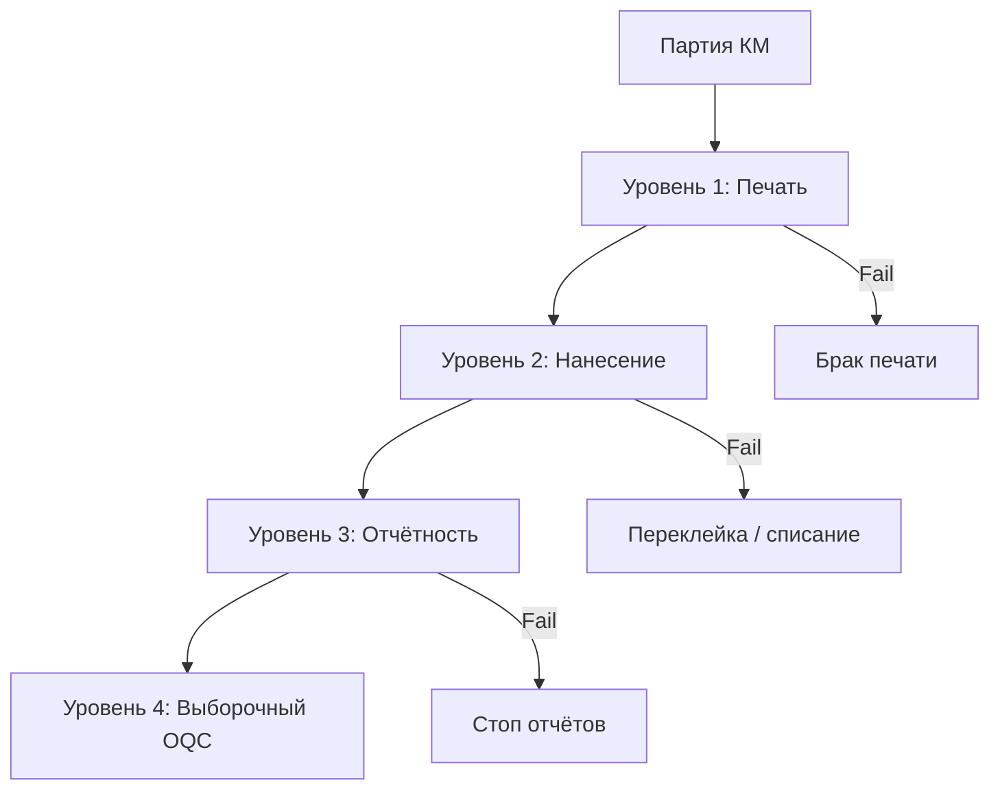

# Контроль качества нанесения кодов

Требования и процедуры проверки физически нанесённого GS1 DataMatrix (СИ). Цель — гарантировать читаемость на всём пути: производство → склад → экспорт → приёмка в «Честном знаке» РФ.

## Нормативные ориентиры

| Стандарт | Содержание |
|----------|------------|
| ISO/IEC 16022 | Символика Data Matrix ECC 200 |
| ISO/IEC 15415 | Оценка качества печати 2D-кодов (grade 4.0–0 = A–F) |
| GS1 General Specifications | Структура AI, FNC1, разделители GS |
| Методические материалы Белбланкавыд | Визуальные требования к СИ |

**Минимальный допустимый grade для маркировки:** ≥ **1.5 (C)**.

Ниже C — код формально существует, но может быть отклонён при инспекции, на таможне или у импортёра.

---

## Уровни контроля



| Уровень | Когда | Что проверяем | Критерий |
|---------|-------|---------------|----------|
| 1. Печать | Каждая этикетка / начало смены | Читаемость, контраст, полнота символа | Grade C, приложение ЭЗ OK |
| 2. Нанесение | После наклейки | Код не смят, не перекрыт, правильный SKU | Визуально + 3 скана |
| 3. Отчётность | Перед addMark | КМ соответствует GTIN партии | Сверка serial list |
| 4. OQC | Перед отгрузкой | Выборка 1–5% | 100% читаемость в выборке |

---

## Уровень 1: контроль печати

### Процедура «Первые три»

В начале **каждой** партии печати (смена принтера, рулона, ribbon, макета):

1. Напечатать 3 этикетки с **разными** КМ из заказа
2. Сканировать приложением «Электронный знак» ([datamark.by](https://datamark.by/))
3. Убедиться: GTIN, serial, криптохвост распознаны
4. При наличии верификатора — зафиксировать grade ≥ C
5. Подписать лист партии (дата, оператор, OK/FAIL)

При FAIL — **не продолжать партию**. Диагностика: [troubleshooting.md](../troubleshooting.md).

### Визуальные дефекты печати

| Дефект | Причина | Действие |
|--------|---------|----------|
| Размытые модули | Низкое давление головки, неверный ribbon | Настройка принтера |
| Пропуски (voids) | Грязная головка, плохой клей | Чистка, смена рулона |
| Обрезанный символ | Неверный макет ZPL | Увеличить quiet zone |
| Слишком светлый | Неверный баланс скорость/температура | Калибровка darkness |
| Смаз вместо квадрата | QR вместо DataMatrix в encoder | Исправить ПО |

### Технический контроль GS

1. Сканер в **COM-режиме** → буфер текста
2. Или скачать тот же КМ из API → сравнить hex GS (0x1D) перед AI 91 и 92
3. HID-сканер для этого контроля **не подходит**

---

## Уровень 2: контроль нанесения

### После наклейки на товар

| Проверка | Метод |
|----------|-------|
| Код на правильном SKU | Сверка GTIN в скане с партией |
| Нет повреждений | Визуально, без царапин в зоне DM |
| Нет перекрытий | Плёнка, другая этикетка |
| Адгезия | Попытка отклеить угол — этикетка держится |

### Стресс-тесты (при запуске новой упаковки)

| Тест | Условие | Критерий |
|------|---------|----------|
| Холод | 24 ч при +4 °C | Скан OK |
| Влага | 24 ч при 80% RH | Скан OK |
| Истирание | 10 циклов сухой тканью | Grade не ниже C |
| Падение | 3 падения с 1 м в коробе | Скан OK на 3/3 |

Для аэрозолей — обязательно перед первой отгрузкой в РФ.

---

## Уровень 3: контроль перед отчётностью

Перед `POST /v3/reports/addMark`:

```
Для каждой партии:
  printed_count == ordered_count (или documented waste)
  каждый напечатанный serial ∈ заказа
  ни один КМ не отправлен дважды
  waste KM → статус списания (по регламенту оператора)
```

**Порядок отчётов строгий:** addMark → addManufacture → ships. КМ должны быть в status **47** или **50**.

---

## Уровень 4: выходной контроль (OQC)

Перед отгрузкой в РФ:

- Выборка **1–5%** или минимум 10 шт. из партии
- 100% читаемость в выборке
- Сверка дат manufacture / expiration в отчёте с маркировкой на этикетке (если дублируются)

При единичном браке в выборке — расширить выборку или 100% пересканировать партию.

---

## Оценка grade (ISO 15415) — кратко

Верификатор измеряет параметры:

| Параметр | Смысл |
|----------|-------|
| Decode | Декодируется ли символ |
| Symbol Contrast | Разница чёрного и белого |
| Modulation | Равномерность модулей |
| Fixed Pattern Damage | Целостность finder pattern |
| Axial Nonuniformity | Искажение сетки |

Итоговый grade — **минимум** по параметрам. Для маркировки достаточно **C (1.5)**.

Без верификатора: если приложение оператора стабильно читает с первого раза с 20 см — эмпирический аналог grade C.

---

## Брак и списание

| Ситуация | Действие |
|----------|----------|
| Нечитаемая печать | Не наклеивать; уничтожить этикетку; КМ не вводить в отчёт |
| Этикетка наклеена криво | Снять, уничтожить, **новый КМ** (не перепечатка того же) |
| КМ в отчёте, товар бракован | Списание по регламенту datamark |
| Перепутан GTIN | Стоп партии, инвентаризация serial |

**Запрещено:** переклеивать этикетку с одного баллона на другой — нарушение поэкземплярного учёта.

---

## Документирование

Минимальный журнал ОТК (бумажный или в UrukhaiMark):

| Поле | Пример |
|------|--------|
| Дата | 2026-07-14 |
| Партия / order_id | ord_12345 |
| GTIN | 04810012345678 |
| Количество | 500 |
| Первые 3 — OK | да |
| Выборка OQC | 25/500, 0 брака |
| Оператор | Иванов |

---

## Чеклист качества (краткий)

- [ ] Encoder выдаёт DataMatrix ECC 200, не QR
- [ ] FNC1 и GS сохранены в цепочке API → печать
- [ ] Grade ≥ C или эквивалент (приложение ЭЗ)
- [ ] Первые 3 шт. каждой партии проверены
- [ ] Стресс-тест упаковки пройден (при новом SKU)
- [ ] addMark только после физической маркировки
- [ ] Бракованные КМ не попали в manufacture

## См. также

- [datamatrix-spec.md](../datamatrix-spec.md) — структура КМ
- [troubleshooting.md](../troubleshooting.md) — типичные ошибки
- [equipment.md](equipment.md) — верификаторы и сканеры
- [export-rf-cosmetics.md](../processes/export-rf-cosmetics.md) — отчётность
