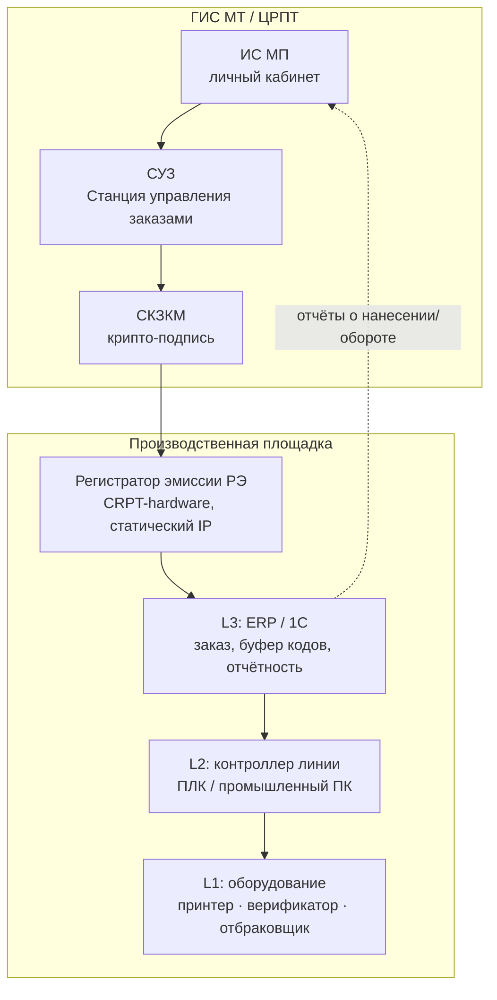
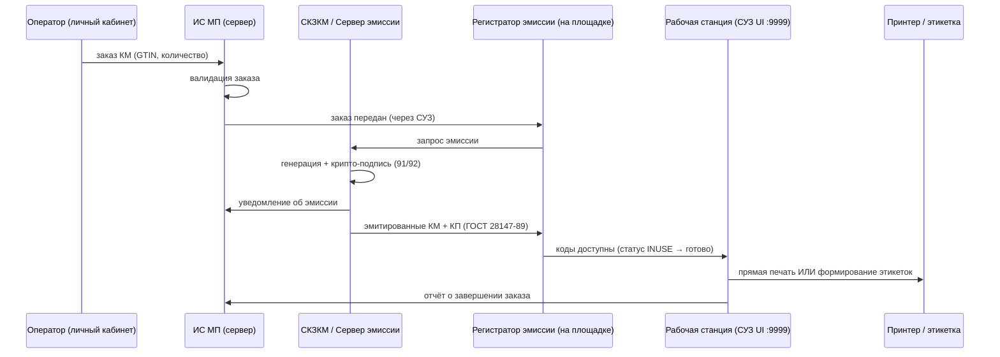
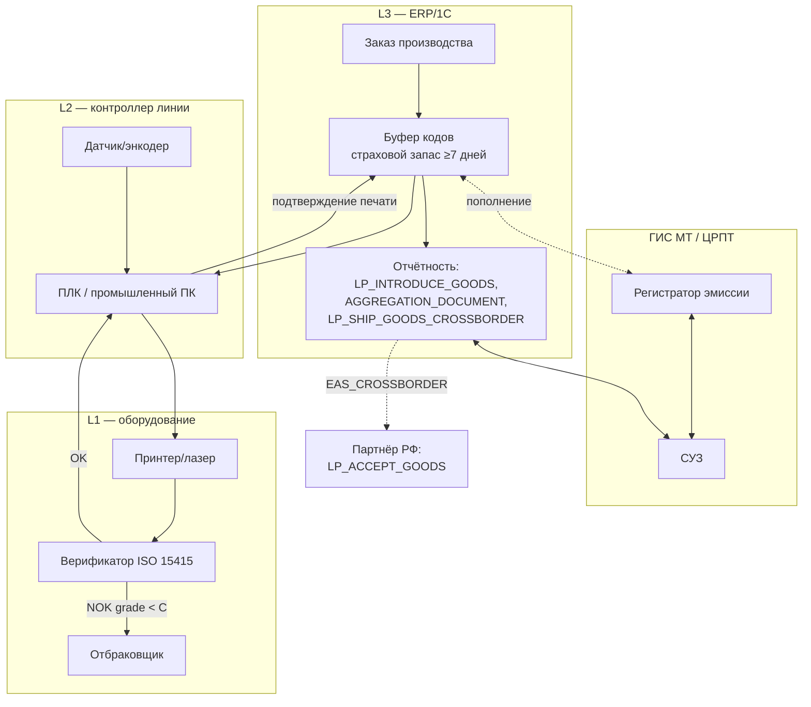

# Техническая архитектура: создание и нанесение кода «Честный Знак» на производстве

> ⚠️ **Черновик `research/`, не канон UrukhaiMark.** Описывает типовую линию **резидента РФ** (ГИС МТ/ЦРПТ: СУЗ, РЭ, L1/L2/L3). MVP UrukhaiMark: коды через datamark.by, отгрузка `/v3/ships/add` — см. [integration-plan.md](../docs/explanation/integration-plan.md), [architecture.md](../docs/explanation/architecture.md). Документ — контекст приёмки в РФ и Slice 7 (CRPT); не подменяет целевую topology системы.
>
> Исследование (сентябрь 2026). Область: типовая инженерная архитектура интеграции производственной линии с ГИС МТ («Честный Знак», оператор ЦРПТ) — от заказа кодов до отчёта о вводе в оборот. Актуально для UrukhaiMark как для стороны, чьи экспортные коды (выпущенные через ГИС «Электронный знак» / datamark.by, label_type=7) верифицируются и учитываются на стороне ГИС МТ при пересечении границы, а также как справочник по устройству любой типовой линии маркировки в РФ/СНГ.
>
> **Дисциплина источников.** Каждый факт помечен: **[Официально]** — docs.crpt.ru, официальный PDF ЦРПТ, markirovka.ru (сайт оператора) или реестр registry.intuot.crpt.ru; **[Интегратор]** — документация вендора/системного интегратора (достоверно описывает практику, но не является нормативным источником); **[Сообщество]** — форумы/блоги (полезно как инженерный опыт, не как политика ЦРПТ). Там, где источники расходятся или факт не подтверждён, это явно указано — документ специально избегает выдумывания цифр там, где их не нашлось.

---

## 1. Обзор: участники и уровни архитектуры



Индустрия (не сам ЦРПТ) использует неформальную, но согласованную у нескольких независимых интеграторов терминологию **L1/L2/L3** [Интегратор — ALEXROVICH.RU, RBS-Group/ENCODE, getmark.ru]:

| Уровень | Что это | Кто отвечает |
|---|---|---|
| **L1 — Оборудование** | Принтер/лазер/CIJ-головка, верификационная камера, аппликатор, механизм отбраковки | Вендор оборудования |
| **L2 — Управление линией** | Промышленный ПК или ПЛК-контроллер, координирующий 1 линию или кластер линий: валидация печати по камере, автоотбраковка, остановка при массовом браке | Интегратор линии |
| **L3 — Предприятие/1С** | Заказ кодов у ГИС МТ, диспетчеризация производственных заданий на L2, приём подтверждений, отчётность, агрегация | ERP-интегратор |

**Важная оговорка [Интегратор]:** это деление — конвенция рынка, а не стандарт ЦРПТ. Официальная схема ЦРПТ (см. §3) описывает только эмиссию кодов и останавливается на моменте «код передан на печать» — всё, что происходит на линии дальше (L1/L2), каждый интегратор проектирует по-своему; единой эталонной схемы линии ЦРПТ не публикует.

---

## 2. Ключевые компоненты и их роль

### СУЗ (Станция Управления Заказами)

**[Официально]** Модуль ГИС МТ, отвечающий за обработку заказов кодов маркировки и их генерацию. Это **инфраструктура оператора** — предприятие не устанавливает СУЗ у себя, а обращается к ней по сети через True API. У СУЗ отдельная область аутентификации в True API (Section 11 «СУЗ authentication» — отдельный токен, отдельный от общего True API auth). Источник: docs.crpt.ru/gismt/True_API/, markirovka.ru.

### Регистратор эмиссии (РЭ)

**[Официально]** Единственный компонент, который ЦРПТ реально предоставляет предприятию как готовое ПО/железо — «криптографическое программно-аппаратное средство для получения по зашифрованным каналам цифровых кодов и передачи информации об их нанесении». Предоставляется **бесплатно** оператором (ООО «Оператор-ЦРПТ»). Оформление: заявка → договор → анкета оборудования → допуск к использованию, требуется УКЭП (усиленная квалифицированная электронная подпись). РЭ ставится на площадке предприятия, имеет статический публичный IP, и его веб-интерфейс оператора заданий поднимается локально на `http://<IP_РЭ>:9999/` — список заказов со статусом (`INUSE` и др.), количеством заказанных/напечатанных/доступных кодов, и кнопкой «Напечатать» (выгружает PDF-лист этикеток). Источник: официальный PDF ЦРПТ «Описание работы станции управления заказами и регистратора эмиссии» (2018), markirovka.ru.

### СКЗКМ (Система криптографической защиты кодов маркировки)

**[Официально]** Формирует крипто-подпись (91/92 поля кода — ключ проверки + криптохвост). РЭ запрашивает эмиссию у СКЗКМ через «Сервер эмиссии»; СКЗКМ уведомляет ИС МП об эмиссии и передаёт КМ (с контрольным кодом КП на основе ГОСТ 28147-89) обратно в РЭ.

### ERP/1С-слой (L3)

**[Официально/Интегратор]** Встроенная в 1С:УНФ / 1С:Бухгалтерия / 1С:УТ интеграция с ИС МП: заказ кодов, регистрация событий производства/оборота, приём статусов. Отдельно — «Локальный модуль Честный Знак» (ЛМ ЧЗ), устанавливаемый на ПК/сервер и открывающий локальный REST (обычно `127.0.0.1:5995` или `:8080`) — но это **розничный** инструмент офлайн-проверки на кассе, не инструмент производителя (см. §10.5). Источник: официальный PDF ЦРПТ §2, its.1c.ru, getmark.ru.

### Именованные продукты уровня L2/L3 (реально найдены и проверены)

| Продукт | Разработчик | Слой | Что делает | Источник |
|---|---|---|---|---|
| **ENCODE Track** (Line / Core / Mobile) | ЭНКОД (encode.one) | L2 (Line, Node.js, real-time) + L3/L4 (Core, на платформе 1С:Предприятие) | Полный стек от мобильных терминалов через управление линией до 1С-отчётности; интегрирует термотрансфер, drop/piezo-инкджет, лазер. Именует реальное оборудование: принтер **TSC 640**, принтер-аппликатор **ALX924**, верификатор **Cognex DMR-260QX** | encode.one, markirovka.ru (официальный раздел интеграторов) |
| **S-Box / S-Box.Soft** | Альбига (albiga.ru) | L1-handshake → L2 → L3 | Модульный программно-аппаратный комплекс: шкаф управления + промышленный ПК + сенсорный экран + сканер. Один шкаф координирует 3–5 линий. Отбраковка через **сухой контакт реле**, остановка линии после настраиваемого числа подряд идущих бракованных кодов | albiga.ru, официальный мануал PDF |
| **RBS-Group / Кластер Маркировка** | rbs-id.ru | Интегратор поверх ENCODE Track Line (L2) + собственный L3-модуль лицензирования | Turnkey-посты: промышленный ПК, шкаф управления, сигнальная башня, камера **Hikrobot**, принтер, сканер. Экспорт в MES/ERP по документированному протоколу или через приложение **RBS Control** | rbs-id.ru |
| **BIT.MDT** | БИТ (1С-модуль) | L3 | Детальный механизм «страхового запаса марок» — см. §10.4 | support.bit-erp.ru |
| **КомЛайн: Цифровая маркировка** | КомЛайн | L2/L3-интегратор | Инлайн-камерная верификация каждого кода, автоотбраковка кодов ниже грейда C, резервирование кодов из локального стока под задание, авто-повтор при сбое отправки отчёта | 1ccl.ru |
| **Cleverence** («Кировка», «Склад 15») | cleverence.ru | Только L3 / ТСД-клиент | **Не** линия-контроллер — мобильные терминалы для агрегации/сканирования на упаковочных постах и настройка обмена 1С/ГИС МТ. Важно не путать с продуктом уровня линии | cleverence.ru |
| **SimpleMAS** | markirovka.by (Беларусь) | Самоорганизующийся принтер-контроллер («умный» комплекс) | Настраивается один раз по USB/локальной сети, затем работает автономно без постоянного соединения с ПК; экспорт отчётов в CSV | markirovka.by |

**[Интегратор, негативный результат]** Название «Малахит» как продукт маркировки **не подтверждено** — повторные поиски не нашли такой системы под этим именем в данной области; не использовать как реальную ссылку.

**Официальный реестр интеграторов** [Официально/полуофициально]: `markirovka.ru/knowledge/integrators/integrator-solutions/` перечисляет 38 именованных решений (ГК МАСТ, Сканпорт DataMobile, Utrace, Промис, Alviga S-BOX, ID-Russia ID-Mark&Trace, Энкод ENCODE Track, ИТ Кластер 1С, Клеверенс, ТрекМарк и др.) — лучшая отправная точка для дальнейшей проверки конкретных вендоров.

---

## 3. Поток данных: эмиссия кодов (заказ → получение)

**[Официально]**, по официальной схеме ЦРПТ 2018 г. (Рисунок 2 исходного документа):



**Важный вывод архитектуры:** эмиссия и крипто-подпись кодов — процесс **полностью отдельный и предшествующий** физической петле печать→верификация→отбраковка на линии. СУЗ/РЭ гарантируют только то, что у вас есть валидная подписанная пачка кодов в очереди; вопрос «какой код физически ушёл на какое изделие» ГИС МТ не регламентирует вовсе — это целиком зона ответственности L2 (см. §5–6).

### Формат кода (напоминание, детали — в reference/datamatrix-spec.md проекта)

`[FNC1] 01{GTIN14} 21{Serial} <GS> 91{Key4} <GS> 92{Crypto44}` — КИ (код идентификации, 31 символ без крипто) + крипто-хвост = КМ (код маркировки).

---

## 4. Поток данных: заказ кодов со стороны производства (L3)

Инженерная задача L3 — не звонить в СУЗ синхронно на каждое изделие (это медленно и создаёт единую точку отказа), а поддерживать **локальный буфер** уже выпущенных кодов, из которого линия расходует их в реальном времени.

**[Интегратор — BIT.MDT]**, конкретный документированный алгоритм пополнения буфера («страховой запас марок»):

- Фоновая задача `БИТ.MDT. Обеспечение страхового запаса` следит за остатком кодов с **сроком действия ≥ 7 дней**
- Размер партии дозаказа: `Квант = Цел(ТребуемоеКоличество / (30 − ДнейДоИстеченияСрокаЖизни) × 2)`
- Лимит на один заказ дозаказа: **100 000 кодов**
- Заказы пополнения выполняются с **более низким приоритетом**, чем срочные производственные заказы
- Производственные задания с флагом «использовать страховой запас» берут коды напрямую из локального пула, не дожидаясь СУЗ

**[Интегратор — getmark.ru]** Ориентировочные параметры заказа: минимальный практический заказ ~50–60 кодов; до **150 000 кодов на GTIN** и до **10 GTIN** на один заказ; не более **100 заказов** одновременно в обработке; окно действия кода (эмитирован, но ещё не применён) — порядка **4 месяцев** (вероятно зависит от товарной группы, цифра ориентировочная).

**[Интегратор]** Рекомендуемый ЦРПТ (по неофициальным источникам, не подтверждено первичным документом ЦРПТ) уровень буфера — **запас на 7 дней производства**; это совпадает с независимо выбранным порогом BIT.MDT (7 дней до истечения), что косвенно подтверждает цифру как практический консенсус, а не выдумку одного вендора.

---

## 5. Поток данных и оборудование: уровень L2 (линия)

### 5.1 Два архитектурных паттерна

**Паттерн А — ПЛК-оркестрация.** Центральный контроллер владеет всей state machine: запрашивает код из буфера, формирует команду печати, таймирует триггер по сигналу датчика/энкодера, сверяет напечатанное со считанным. Принтер и камера — «глупая» периферия, которой командует ПЛК.

**[Интегратор, реальный документированный кейс]** — молочная линия с контроллером **ОВЕН ПЛК210** (kip.su, интегратор «РостАгроКомплекс», внедрение под маркировку молочной продукции 2021 г.):

- Контроллер: ОВЕН ПЛК210 + блок питания ОВЕН БП30Б + сигнальные лампы MEYERTEC
- Датчики: **два дискретных оптических датчика** на цифровых входах ПЛК — один перед принтером, один перед сканером (не непрерывное энкодерное слежение, а двухточечная фотоэлементная схема)
- Источник кода: оператор вводит товар/количество на панели оператора → ПЛК запрашивает **MS SQL** базу → БД пишет файл штрихкода на **FTP-сервер** → ПЛК забирает и кэширует на **SD-карту**
- Триггер печати: по срабатыванию оптодатчика ПЛК **формирует ZPL-команду** и отправляет принтеру по **Ethernet**
- Верификация: второй датчик срабатывает при подходе изделия к сканеру; сканер возвращает считанный код ПЛК, который **сравнивает напечатанный и считанный код** и логирует результат на SD-карту
- **Незадокументированный разрыв**: источник не раскрывает, что происходит при несовпадении (нет описания отбраковщика/повторной постановки в очередь) — это ограничение конкретного описания, а не доказательство отсутствия механизма

**Паттерн Б — «умные» интегрированные комплекты принтер+верификатор.** Оркестрацию print-verify-reject берёт на себя собственное ПО вендора оборудования, линия получает уже готовый сигнал OK/NOK.

**[Интегратор — getmark.ru]** Именованные примеры: **Videojet + ПО Laetus**, **Domino R-Series**, **Markem-Imaje + ПО CoLOS** (лицензионный портал CoLOS подтверждён как реальный активный продукт: markem-imaje.com/ru/services-support/software-licensing). Такие комплекты продаются как единый узел (₽500 000–3 000 000 по данным getmark.ru) и обычно встречаются в **greenfield/turnkey**-поставках, тогда как ПЛК-оркестрация чаще встречается в **ретрофите** на уже существующую линию (как в кейсе ОВЕН — маркировка добавлялась на линию, работавшую до введения обязательной маркировки).

### 5.2 Энкодерная синхронизация (когда нужна точность позиционирования)

**[Интегратор, инженерная статья]** «Лаки Принт» приводит рабочий пример расчёта: при разрешении энкодера **500 имп/м** и требуемом шаге метки **100 мм** → **50 импульсов на метку**. Дополнительно документированы: набор управляющих линий Start/Stop/E-Stop/Alarm, обмен данными по **ПЛК, OPC UA, Ethernet/IP**, задержка триггер→печать настраиваемая с шагом **1–5 мс**, хранение рецептов и логирование по сети; пусконаладка проверяется на **50%/75%/100%** скорости линии с замером позиционной погрешности, доли брака и времени реакции E-Stop.

**[Интегратор, менее верифицировано]** Отдельная статья (tandemprom.ru) описывает более требовательный вариант: абсолютный поворотный энкодер **≥23 бит**, связь контроллер↔привод по **CANopen/EtherCAT**, сервоприводы вместо асинхронных двигателей + частотников, точность останова **±0.5 мм**, фотобарьеры на зоне маркировки, **IoT-шлюз по OPC UA** для сбора данных с принтера и фоторегистратора, и предиктивное обслуживание (при деградации контраста кода — автоматическая чистка головы или переключение на резервный принтер). Конкретная линия/бренд не названы — трактовать как правдоподобное описание паттерна, не как проверяемый кейс.

### 5.3 ПЛК-бренды, реально встречающиеся в этом контексте

| Бренд | Подтверждение |
|---|---|
| **ОВЕН (Owen)** | Подтверждено реальным кейсом (ПЛК210, молочная линия, выше) |
| **Siemens (S7-1200/1500, TIA Portal)** | Обширная общая документация по энкодерной интеграции в промышленной автоматизации РФ в целом; кейса именно под маркировку не найдено |
| **Segnetics** | Упоминается как отечественная альтернатива Owen/Siemens в общих сравнениях ПЛК; маркировочного кейса не найдено |
| **Beckhoff / Wago** | Не подтверждено в этой вертикали — правдоподобно (учитывая упоминание EtherCAT у tandemprom), но именованного внедрения не найдено |

---

## 6. Печать и верификация: оборудование и грейдинг

### 6.1 Требование к качеству печати — единственный формально закреплённый стандарт

**[Официально, реестр интеграторов registry.intuot.crpt.ru]**: «сервис-провайдер» (юрлицо, наносящее коды маркировки на упаковку/этикетки) обязан иметь печатающее оборудование, обеспечивающее нанесение символов не хуже класса **«2.5 (B) по ГОСТ Р ИСО/МЭК 15415-2012»**. Это единственный найденный формально закреплённый (пусть и не сертификационно проверяемый) стандарт качества нанесения для сервис-провайдеров.

**[Интегратор]** На практике для конвейерной инлайн-верификации индустрия обычно ориентируется на **грейд C** как практический минимум для надёжного считывания последующим оборудованием (розница, склад) — ГОСТ 15415-2012/16022-2008 = аналоги ISO/IEC 15415/16022.

### 6.2 Реально найденное верификационное оборудование с ценами (₽, российский рынок)

| Категория | Примеры | Диапазон цен | Источник |
|---|---|---|---|
| Верификаторы (ISO/IEC 15415 грейдинг) | Webscan TruCheck, Axicon 15xxx, REA VeriCube | ₽150 000–500 000 | getmark.ru |
| Стационарные инлайн-сканеры | Datalogic Matrix series, Cognex DataMan 70/150, Zebra FS series | ₽30 000–200 000 | getmark.ru |
| Высокоскоростные ридеры (200+ изд/мин) | Cognex DataMan 370/470, Keyence SR-2000, Sick Lector series, Omron MicroHAWK | ₽200 000–1 500 000 | getmark.ru |
| Интегрированные принтер+верификатор | Videojet+Laetus, Domino R-Series, Markem-Imaje+CoLOS | ₽500 000–3 000 000 | getmark.ru |

Эти цифры в рублях полезно сверить с долларовыми ориентирами из основного каталога оборудования (`research/marking-line-equipment.md`, разделы 1.2, 6.1) — расхождение отчасти объясняется разным охватом функций (верификатор vs просто ридер) и разными каналами продаж (РФ-дистрибьютор vs прямой импорт).

### 6.3 Механика отбраковки

**[Интегратор — S-Box]** Забракованный/некачественный код отбраковывается сигналом **сухого контакта реле** на линию; линия **автоматически останавливается** после настраиваемого числа подряд идущих плохих кодов — самый чётко задокументированный триггер отбраковки из найденных.

**[Интегратор — RBS-Group]** Заявляет «автоматическое удаление брака с линии или маркировку дефектов» + логирование ошибок + «коррекцию статуса кода», подразумевая программное переклеймение статуса, но точная логика перехода статусов не опубликована.

**Честный пробел**: конкретной, задокументированной (не маркетинговой) логики «что происходит с кодом при неудачной печати — возвращается в начало очереди, аннулируется через API или просто физически изымается изделие» **не найдено ни в одном источнике**. Кейс ОВЕН прямо останавливается перед этим шагом. Считать этот вопрос открытым инженерным решением, которое каждый интегратор реализует по-своему (см. варианты в §10.3).

---

## 7. Агрегация

### 7.1 Таксономия кодов упаковки

**[Официально/Интегратор — Kontur, сверено с markirovka.ru]**:

| Код | Что это |
|---|---|
| **КИТУ** | Код идентификации транспортной упаковки — GS1 SSCC (18 цифр, префикс AI `(00)`), однородная упаковка одного GTIN |
| **КИГУ** | Код идентификации групповой упаковки |
| **КИН** | Код идентификации набора («кит», смешанные товары) |
| **АТК** | Агрегированный таможенный код — *виртуальный*, привязан к ТН ВЭД, физически не печатается |

Иерархия многоуровневая: единицы → короб (КИТУ) → **короба тоже агрегируются в паллеты** («Объединяют не только товары поштучно, но и сами агрегированные упаковки, например, короба — в паллеты»). ЦРПТ различает потребительскую / групповую / транспортную упаковку как уровни вложенности.

### 7.2 Подтверждающие документы

**[Официально, docs.crpt.ru/gismt/Exchange/]**: `AGGREGATION_DOCUMENT` (JSON) — формирование упаковки; обратная операция `DISAGGREGATION_DOCUMENT`. XML-варианты обоих сворачиваются к октябрю 2026 (по собственному changelog ЦРПТ).

**[Официально/выведено]** Агрегация возможна, только когда КИ находится в статусе **«нанесён» (APPLIED)** или **«в обороте» (INTRODUCED)** — то есть нельзя агрегировать код, который ещё не подтверждён как физически нанесённый.

**[Интегратор — Kontur]** Практический флоу: менеджер производства создаёт задачу агрегации → агрегационный пост сканирует коды единиц в состав агрегата, валидируя каждое сканирование → менеджер завершает задачу → система **«отправляет отчёт о нанесении в Честный знак для регистрации кодов-агрегатов»**, т.е. закрытие задачи агрегации триггерит отправку документа.

**Лимит на количество единиц в одном агрегате**: авторитетного числа не найдено ни в одном источнике (несколько источников явно фиксируют этот пробел, а не дают цифру). Одна невоспроизведённая при повторной проверке оценка называла «не более 10 000 позиций» — не подтверждено, возможно спутано с общим лимитом в 30 000 кодов на документ API.

---

## 8. Отчётность: жизненный цикл кода и обязательные документы

### 8.1 Состояния кода (по официальной схеме `/codes/check`)

**[Официально, PDF ЦРПТ]** Модель состояний выражена не единым enum, а набором булевых полей:

| Поле | Значение |
|---|---|
| `utilised` | КИ нанесён на физическую единицу |
| `realizable` | КИ в статусе «В обороте» |
| `sold` | КИ продан в рознице |
| `isBlocked` / `ogvs` | продажа заблокирована госорганом (РАР, ФТС, ФНС, Россельхознадзор, Роспотребнадзор, МВД, Росздравнадзор) |
| `verified` | крипто-подпись КМ подтверждена |

Практический порядок: `utilised` → `realizable` → `sold` (нанесение предшествует обороту, оборот предшествует продаже).

### 8.2 Типы документов (True API), релевантные экспорту БЕЛ→РФ

**[Официально, docs.crpt.ru/gismt/Exchange/]**:

| Документ | Назначение |
|---|---|
| `LP_INTRODUCE_GOODS` (+CSV/XML) | Ввод в оборот. Производство РФ |
| `LP_ACCEPT_GOODS` | Приёмка отгрузки из ЕАЭС — **это документ, которым партнёр-получатель в РФ подтверждает получение экспортной партии от UrukhaiMark** |
| `LP_SHIP_GOODS_CROSSBORDER` | Отгрузка из ЕАЭС |
| `EAS_CROSSBORDER_EXPORT` | Новый тип документа для экспорта из РФ в ЕАЭС |
| `EAS_CROSSBORDER` | Отгрузка из ЕАЭС **с признанием КИ** — вероятно, именно этот механизм признаёт код, выпущенный datamark.by, внутри ГИС МТ без повторной эмиссии |
| `LK_REMARK` | Перемаркировка (обязателен `last_uin`) |

**Схема полей `EAS_CROSSBORDER` не найдена** — подтверждено существование и название типа документа, но не его точная структура; требует отдельного целевого поиска, если понадобится реализовать интеграцию напрямую.

### 8.3 Живое доказательство трансграничного моста с Беларусью

**[Официально, PDF ЦРПТ, дословная цитата]** Спецификация `/codes/check` документирует `errorCode: 8` — **«КМ не прошел верификацию в стране эмитента»** — и приводит буквальный пример тела ошибки:

```json
{ "code": 5000, "description": "Transgran BY internal error", "codes": [] }
```

с инструкцией: при этой ошибке **не** заносить CDN-узел в чёрный список (сбой не локальный), повторить попытку один раз, при повторном отказе — «продавать товар без проверки в режиме онлайн». Также для товаров из Беларуси поля `producerInn` и `variableExpirations` **не возвращаются** в ответе — специальная обработка BY-кодов.

**Инженерный вывод**: ГИС МТ имеет отдельный, именованный, синхронно вызываемый мост «Трансгран» именно к системе Беларуси (`BY`) — это прямое подтверждение, что коды datamark.by не переэмитируются в РФ, а признаются через этот отдельный межсистемный вызов, со своей обработкой ошибок и graceful degradation (продажа без онлайн-проверки при недоступности моста).

### 8.4 Сроки отчётности (пример)

**[Официально]** Для пива/слабоалкогольных напитков отчёт о нанесении обязателен **в течение одного календарного дня** с момента производства — конкретный пример SLA, которым должна ограничиваться любая архитектура отложенной/буферизированной отчётности (см. §10.5).

---

## 9. Ограничения и лимиты (сводная таблица)

| Параметр | Значение | Источник |
|---|---|---|
| Макс. кодов маркировки в одном документе API | **30 000** | docs.crpt.ru/gismt/True_API/ |
| Макс. размер документа | **30 МБ** | docs.crpt.ru/gismt/True_API/ |
| Частота запросов | **≤ 50 запросов/сек на ИНН участника** | docs.crpt.ru/gismt/True_API/ |
| TTL токена True API | **≤ 10 часов** (расходится с оценкой одного вендора в 10 минут для сертификатного флоу `/auth/cert/key` — не устранено, возможно два разных типа токена) | docs.crpt.ru/gismt/True_API/ vs getmark.ru |
| МОД (места деятельности) на запрос | **≤ 100** | docs.crpt.ru/gismt/True_API/ |
| ИНН на запрос (фильтры) | **≤ 100** | docs.crpt.ru/gismt/True_API/ |
| `doc/list` pageSize | **≤ 1000** | docs.crpt.ru/gismt/Exchange/ |
| `/codes/check` (розница) — SLA ответа | **1.5 сек** | PDF ЦРПТ §1.4.3, со ссылкой на ППРФ 1944 |
| `/codes/check` — правило блокировки CDN-узла | 3 подряд отказа → узел недоступен 15 мин, переключение | PDF ЦРПТ §1.4.3 |
| `/codes/check` — область применения | **только предпродажная розничная проверка** (ППРФ 1944 п.13) — НЕ endpoint для производственной отчётности | PDF ЦРПТ §1.5 |
| Заказ: макс. кодов на GTIN | ~150 000 (ориентировочно) | getmark.ru [Интегратор] |
| Заказ: макс. GTIN на заказ | ~10 | getmark.ru [Интегратор] |
| Заказ: параллельных заказов | ≤ 100 | getmark.ru [Интегратор] |
| Окно действия эмитированного кода | ~4 месяца (ориентировочно, вероятно зависит от товарной группы) | getmark.ru [Интегратор] |
| Стоимость кода | ~0.50 ₽/шт (нетто) | forum.infostart.ru [Сообщество] |
| Стоимость перемаркировки испорченного кода | ~0.60 ₽/шт | cleverence.ru [Интегратор] |
| Бесплатная повторная печать (не перемаркировка) | окно **2 суток** с момента получения последнего кода заказа | markirovka.ru [Официально] |
| Отчёт о нанесении (пиво/САН) | в течение **1 календарного дня** после производства | docs.crpt.ru [Официально] |
| ЛМ ЧЗ (розница) — автономная работа без сети | до **72 часов** | docs.jupiter.systems / markirovka.ru |

Отдельно: у datamark.by (Беларусь, «Электронный знак») — свои, документированные в основном каталоге проекта лимиты (≤1000 кодов/заказ, ≤10 000 КМ отчёт о производстве, ≤30 000 КМ отгрузка, token TTL ~20 мин) — **не путать с лимитами ГИС МТ выше**, это разные API разных операторов.

---

## 10. Инженерные задачи и варианты решения

### 10.1 Потеря GS-разделителей (ASCII 29)

**Проблема.** Разделитель между полями DataMatrix (после serial, перед 91 и 92) — управляющий байт, невидимый и легко удаляемый неаккуратной обработкой текста.

**[Официально, kb.belblank.by — Беларусь, наиболее релевантно для UrukhaiMark]** Семь конкретных задокументированных механизмов порчи: пропуск GS после переменного поля; лишний GS после поля фиксированной длины (например, после `(01)` GTIN); **буквальный текст «GS» вместо байта**; **буквальный текст «FNC1» вместо символа функции**; посторонние пробелы/пустые строки; и, критично для производственного ПО — **«программы или алгоритмы печати, непоправимо искажающие информацию»**, т.е. драйверы/софт печати, которые трактуют управляющий байт как «лишний» и обрезают его.

**[Официально, markirovka.ru]** Отдельное предупреждение: не использовать сторонние GS1-генераторы — многие подставляют FNC1 вместо GS, ломая парсинг полей.

**Варианты решения:**

1. **Бинарно-безопасное хранение** — код как raw bytes (`bytea` в БД), никогда как обычная текстовая строка через слои, которые могут нормализовать whitespace.
2. **Исключить Excel/CSV из пути кода полностью** — только API/БД-путь (уже зафиксировано как правило в architecture.md проекта).
3. **Проверка перед печатью в редакторе, отображающем control characters** (Notepad++ с включённым показом непечатаемых символов) — практика, прямо рекомендованная белорусским оператором для диагностики.
4. **Использовать только официальный канал генерации** кода (личный кабинет / True API), не сторонние DataMatrix-генераторы.
5. Если экспорт со сканера верификации выглядит повреждённым — проверить **настройки самого сканера** (задокументированная белорусским оператором отдельная причина, не только принтер).

Конкретных названий чекбоксов в диалогах драйверов Zebra/Sato, вызывающих порчу, не найдено — задокументирован класс проблемы, не конкретная настройка.

### 10.2 Синхронизация «код ↔ физический объект»

**Проблема.** Гарантировать, что код, который система считает выделенным для изделия N, действительно оказался напечатан именно на изделии N, а не на N-1 или N+1 (пропуск печати, двойная печать, дрожание конвейера).

**Варианты решения (см. §5.2 для деталей):**

- **Двухточечная фотоэлементная схема** (датчик перед принтером + датчик перед сканером, без непрерывного позиционного трекинга) — проще, дешевле, реализовано в задокументированном кейсе ОВЕН, но не даёт субмиллиметровой точности позиции между двумя точками.
- **Энкодерное позиционирование** (импульсы/метр → импульсы на метку, пример: 500 имп/м, шаг 100 мм → 50 имп/метку) — точнее, необходимо при высокой скорости линии или плотной раскладке изделий.
- **Handshake print-confirm**: принтер физически подтверждает успешную печать сигналом, прежде чем код «списывается» из очереди как использованный — предотвращает ситуацию «код считается напечатанным, а на деле не напечатан».

### 10.3 Петля печать → верификация → отбраковка (что происходит при сбое)

**Проблема.** Код провалил верификацию (не считался или грейд ниже порога) — что делать физически и в БД.

**Задокументированные фрагменты решения:**

- **Сухой контакт реле** на отбраковщик + автостоп линии после N подряд плохих кодов (S-Box).
- **Инлайн-отбраковка ниже грейда C** как встроенная функция (КомЛайн).
- Различение **«дубль КМ»** (код ещё частично читаем → повторная печать того же кода, без нового заказа, без доплаты) vs **«перемаркировка»** (код физически уничтожен/нечитаем → старый код аннулируется в ЧЗ с причиной «Испорчен/утрачен», заказывается новый код ~0.6₽, изделие возвращается в оборот) — задокументировано Cleverence как реальный операционный процесс.
- **Метод исключения для идентификации повреждённой единицы**: сканируются все целые изделия партии/паллеты, сканированный набор сравнивается с ожидаемым списком кодов заказа — единственный отсутствующий код и есть код повреждённой единицы. Позволяет точечно списать/перемаркировать нужный код вместо угадывания.
- Формальный регламент повторной печати (totalcrm.ru): **записывать причину** реprинта, печатать **строго нужное количество**, **физически уничтожать** бракованные этикетки, чтобы они не попали повторно на линию или не были отсканированы дважды.
- **Журнал брака** — фиксация причины по каждой партии с браком, корректировка настроек — как аудиторская дорожка.

**Незакрытый вопрос (честно):** автоматическая логика «код физически не нанёсся → он возвращается в начало очереди программно, или аннулируется через API, или изделие просто физически изымается вручную» — нигде не задокументирована как единый стандарт; каждый интегратор решает по-своему, и это одна из точек, которую стоит спроектировать явно при реализации UrukhaiMark (рекомендация: код, не подтверждённый print-handshake, должен автоматически возвращаться в очередь на переиспользование именно в БД, а не молча теряться — иначе накапливаются «осиротевшие» эмитированные, но не применённые коды, требующие ручного списания, см. §10.4).

### 10.4 Управление буфером кодов (эмиссия впрок)

**Проблема.** Сколько кодов держать в запасе, чтобы линия не встала, но и не эмитировать слишком много (каждый код стоит денег и имеет срок действия).

**Решение (см. §4 для деталей алгоритма BIT.MDT):** таргетировать запас на **7 дней** производства, автопополнение с приоритетом ниже срочных заказов, партия дозаказа считается формулой с учётом оставшегося срока действия уже имеющихся кодов.

**Что происходит с неиспользованными кодами:**

- **[Официально]** Формальное **списание** через документ «Списание кодов маркировки» (процедура публикуется по товарным группам) → статус «Выбыл»/«Списан». Это бухгалтерская операция внутри ГИС МТ, отдельная от списания в собственном учёте предприятия.
- **[Сообщество]** Списание **не возвращает деньги** за код — прямая невозвратная потеря (~0.5₽/код документирован на примере списания партии в 20 000 кодов). Процедура слабо покрыта API, часто выполняется вручную через интерфейс.
- **Отличие от «повторной печати»**: бесплатная повторная печать доступна только **2 суток** с момента получения последнего кода заказа — не путать со списанием/перемаркировкой уже нанесённых кодов.

### 10.5 Оффлайн-режим и отказоустойчивость

**Проблема.** Что делать, если связь с ГИС МТ/СУЗ пропала, а линия должна продолжать работать.

**Ключевое разграничение, которое легко перепутать:**

- **ЛМ ЧЗ (Локальный модуль Честный Знак)** — розничный/кассовый инструмент, официально до **72 часов** автономной работы без обновления — но это инструмент **точки продажи**, не производителя. Использовать его как аргумент «у производства есть 72 часа» — ошибка.
- Для **производственной/эмиссионной** стороны официального grace-периода, аналогичного розничным 72 часам, **не найдено**. Реальное решение индустрии — не «переживать офлайн», а **никогда не оказываться в ситуации, когда линия физически зависит от живого запроса к СУЗ**: держать буфер кодов (§10.4) на несколько дней вперёд, чтобы кратковременная недоступность сети вообще не была видна производству.
- **[Интегратор — КомЛайн]** На стороне отчётности: неудачные попытки отправки отчёта по линии/партии триггерят **автоматические повторные попытки**, не блокируя весь производственный прогон — до вмешательства администратора при затяжном сбое.
- **Жёсткое ограничение, которое буферизация не отменяет**: сроки отчётности по некоторым товарным группам (пример — пиво, 1 календарный день, §8.4) — архитектура отложенной отчётности должна укладываться в эти рамки, а не откладывать бесконечно.

### 10.6 Идемпотентность и повторные попытки (retry)

**Проблема.** Как безопасно повторить запрос к API ГИС МТ после таймаута, не создав дублирующий заказ или конфликтующий отчёт.

**Честно: формального контракта идемпотентности (ключ идемпотентности, заголовок дедупликации) в официальной документации ЦРПТ не обнаружено.** Инструкция ЦРПТ по работе с API описывает аутентификацию (УКЭП, `omsId`/`omsConnection`, динамические сессионные токены) и рекомендует Postman/Swagger для тестирования, но не описывает семантику повтора запросов. Ранее встречавшееся упоминание заголовка `X-Request-Id` **не подтверждено** первичным источником — не использовать как факт.

**Что реально задокументировано как рабочий паттерн:**

- **Дедупликация на уровне идентификатора документа**: повторная отправка документа с тем же именем файла/`ИдФайл` возвращает **ошибку 4** «документ уже зарегистрирован» — даже если оригинал был впоследствии аннулирован. Правильный паттерн — новый документ с новым идентификатором, а не слепой повтор.
- **Ошибка 63** «дублирующая дата счёта-фактуры» — при повторной отправке УПД с идентичными данными уже обработанного документа. Верный паттерн: исходный УПД → документ аннулирования → новый УПД, никогда не слепой resend.
- **Рекомендуемая практика** (Kontur): проверять статус кода/документа через оператора ЭДО **до** подписания/повторной отправки, а не «повторить и посмотреть».
- **Rate-limit поведение** (форум 1С-разработчиков): при превышении ~100 элементов на запрос к `api/v2/light/orders` — HTTP 400 с явным счётчиком «осталось менее N секунд». Рекомендация — батчить меньшим числом более крупных запросов с задержкой, а не слать много мелких.

**Практический вывод для UrukhaiMark:** реализовать идемпотентность на своей стороне (как уже заложено в architecture.md проекта — «Idempotent operations»), не полагаясь на встроенный механизм ГИС МТ: собственные клиент-генерируемые ID документов, проверка статуса перед повтором, retry с backoff вместо немедленного resend.

### 10.7 Целостность аудита

**Проблема.** Каждый код должен иметь прослеживаемую историю: выделен → напечатан → верифицирован (грейд) → отчитан → (если короб) агрегирован → отгружен — что нужно для регуляторного аудита и для диагностики инцидентов.

**Решение:** append-only audit log (уже заложено в architecture.md проекта: `audit_log` таблица, `km_sha256` вместо полного кода в логах по соображениям безопасности) + state machine с явными переходами, зеркалирующими булевы поля ГИС МТ (`utilised`/`realizable`/`sold`) из §8.1.

### 10.8 Выбор архитектуры L2: ПЛК-оркестрация vs «умный» комплект

**Инженерный компромисс (см. §5.1 для деталей обоих паттернов):**

| Критерий | ПЛК-оркестрация | «Умный» комплект (принтер+верификатор со своим ПО) |
|---|---|---|
| Типичный сценарий | Ретрофит на существующую линию | Greenfield/turnkey поставка |
| Гибкость логики | Высокая — вся state machine видна и настраиваема инженером предприятия | Ограничена тем, что позволяет ПО вендора (Laetus/CoLOS/R-Series) |
| Стоимость интеграции | Требует ПЛК-программирования, датчиков, кабельной обвязки | Меньше интеграционной работы — комплект «из коробки» выдаёт OK/NOK |
| Вендорская зависимость | Низкая — оборудование и ПО можно менять по отдельности | Выше — логика печать-верификация завязана на софт конкретного вендора |
| Стоимость оборудования | Дешевле по железу, дороже по инженерингу | ₽500 000–3 000 000 за комплект (дороже железо, дешевле интеграция) |

Для UrukhaiMark (MVP, первая линия, ограниченный бюджет и команда) практичнее начинать с **паттерна Б** (интегрированный комплект) — меньше своей инженерной работы на старте; переход к ПЛК-оркестрации имеет смысл при масштабировании на несколько линий, когда стоимость гибкости начинает перевешивать стоимость интеграции.

### 10.9 Типичные ошибки отчётности — таблица кодов ошибок

**[Интегратор — getmark.ru, каталог реальных numbered error codes]**:

| Код | Причина | Решение |
|---|---|---|
| 4 | Повтор документа с тем же именем/ID, даже если оригинал аннулирован | Новый документ с новым идентификатором |
| 14 | Недопустимый статус КМ для операции (ожидаемый жизненный цикл: Производитель → Регистрация → Склад → Розница → Потребитель) | Проверить статус кода через API/ЛК до операции, не после ошибки |
| 22 | Код «не найден» — опечатка/регистр/лишние символы | Проверить структуру кода перед отправкой |
| 23 | Отправитель не владеет отправляемыми кодами | Сверить владение кодом vs тип операции |
| 24 | Код не в статусе «в обороте» | Проверить статус; выполнить ввод в оборот заранее |
| 46 | Некорректный XML — нет `ИдФайл` или ID отправителя/получателя | Убедиться, что имя файла = `ИдФайл`, все обязательные теги на месте |
| 60 | GTIN не зарегистрирован/невалиден | Проверить 14-значный GTIN и его регистрацию |
| 63 | Дублирующая дата счёта-фактуры (повтор УПД) | Исходный УПД → аннулирование → новый УПД |
| 102 | Один документ смешивает несовместимые товарные группы | Разделить на документы по категориям |
| 190 | Некорректное выражение ОСУ / дробное количество там, где нужно целое | Формат `02[GTIN]37[количество]`, только целые |

**[Интегратор — Kontur, дополнительно]**: сбои подключения УКЭП/крипто-провайдера (токен не подключён, истёкший CSP, отсутствует плагин браузера); карточка товара не найдена/доступ запрещён (черновик, неверный GTIN, нет прав, дублирующий GTIN); ошибки размещения кода (код только на съёмной упаковке, плохое место сканирования — рекомендация: автоматическая верификация + списание брака).

### 10.10 Синхронизация скорости печати и скорости линии

**Проблема** (выведено из общей логики §5.2, не отдельный источник): DPI принтера должен соответствовать минимальному размеру модуля DataMatrix, необходимому для нужного грейда при данной скорости сканирования — это прямая связь с исследованием оборудования из основного каталога проекта (`marking-line-equipment.md`, §1.1–1.2): чем выше требуемая скорость линии, тем важнее либо повышать DPI, либо увеличивать физический размер кода, либо переходить с TIJ на лазер/CIJ, дающие стабильный контраст на высокой скорости без риска смазывания.

---

## 11. Сводная типовая схема (все уровни)



---

## 12. Оборудование — сводка по слоям (со ссылками на основной каталог)

| Слой | Категория | Подробный каталог |
|---|---|---|
| L1: печать/нанесение | Принтеры, принтеры-аппликаторы, лазеры, CIJ/TIJ | `marking-line-equipment.md`, §1.1 |
| L1: верификация | Верификаторы ISO 15415, инлайн-считыватели | `marking-line-equipment.md`, §1.2, §6.1 (китайские альтернативы) |
| L1: короб/паллета | Print-and-apply, тоннельные сканеры, RFID | `marking-line-equipment.md`, §2, §3, §6.2 |
| L2: контроллер | ОВЕН ПЛК210 (подтверждённый кейс), Siemens S7, Segnetics | этот документ, §5.3 |
| L2: интегрированные комплекты | Videojet+Laetus, Domino R-Series, Markem-Imaje+CoLOS, S-Box | этот документ, §5.1, §2 |
| L3: ПО | 1С-модули, BIT.MDT, ENCODE Track Core, КомЛайн, Cleverence (ТСД-слой) | этот документ, §2 |
| Обязательное: РЭ | Регистратор эмиссии (бесплатно от ЦРПТ) | этот документ, §2 |

---

## 13. Источники

Основные первичные источники: `docs.crpt.ru/gismt/True_API/`, `docs.crpt.ru/gismt/Exchange/`, `docs.crpt.ru/gismt/Инструкция_по_работе_с_API/`, `docs.crpt.ru/gismt/Отчёт_о_нанесении_кодов/`, официальный PDF ЦРПТ «Описание работы станции управления заказами и регистратора эмиссии» (2018, зеркало weilandt-elektronik.ru), официальный реестр `registry.intuot.crpt.ru`, `markirovka.ru` (сайт-оператор, раздел knowledge + community + integrators).

Интеграторы/вендоры (не официальные, но технически содержательные): encode.one, albiga.ru (S-Box), rbs-id.ru, kip.su (кейс ОВЕН), лакипринт.рф, tandemprom.ru, getmark.ru / getmark.omnidesk.ru, alexrovich.ru, its.1c.ru, cleverence.ru, support.bit-erp.ru (BIT.MDT), 1ccl.ru (КомЛайн), kontur.ru/markirovka, kkm.solutions, rd.incotexkkm.ru, docs.jupiter.systems, totalcrm.ru, habr.com, markem-imaje.com, markirovka.by (Беларусь), kb.belblank.by (Беларусь).

Сообщество: forum.infostart.ru (1С-разработчики).

**Список честно незакрытых вопросов** (не выдумано, а явно оставлено открытым — см. соответствующие разделы для деталей): точная схема полей `EAS_CROSSBORDER`; официальный лимит буфера/grace-период для производителей (в отличие от розничных 72 ч); формальный контракт идемпотентности True API; лимит единиц на один агрегат; автоматическая логика повторной постановки в очередь при неудачной печати; названия конкретных настроек драйверов принтеров, вызывающих потерю GS.
